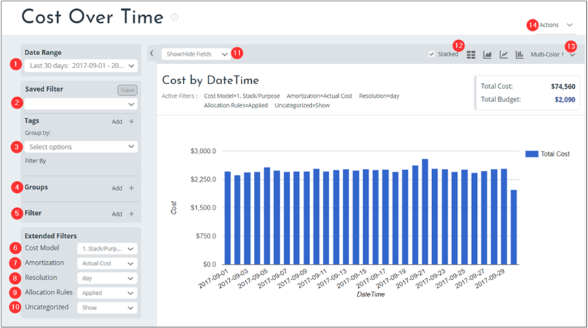
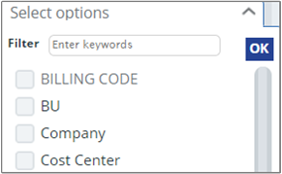
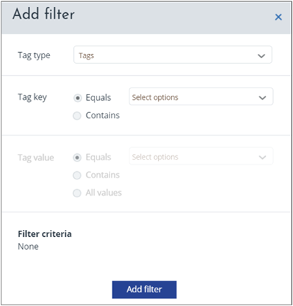

# Understanding cost reports

This article helps you understand Cloudyn reports basic structure and functions. Most Cloudyn reports are intuitive and have a uniform look and feel. After you read this article, are ready to use all the reports. Many standard features are available throughout the various reports, allowing you to navigate the reports with ease. Reports are customizable, and you can select from several options to calculate and display results.

## Report fields and options

Here's a look at an example of the Cost Over Time report. Most Cloudyn reports have a similar layout.

Each numbered area in the preceding image is described in detail in the following information:

1. **Date Range**

    Use the Date Range list to define a report time interval using a preset or custom.
2. **Saved Filter**

    Use the Saved Filter list to save the current groups and filters that are applied to the report. Saved filters are available across cost and performance reports, including:

      - Cost Analysis
      - Allocation
      - Asset Management
      - Optimization

  Type a filter name and the click **Save**.

3. **Tags**

    Use the Tags area to group by tag categories. Tags listed in the menu are Azure department or cost center tags or they are Cloudyn's cost entity and subscription tags. Select tags to filter results. You can also type a tag name (keyword) to filter results.

    

    Click **Add** to add a new filter.

    

    Tag grouping or filtering does not relate to Azure resources or resource group tags.

    Cost allocation tag grouping and filtering are available in the **Groups** menu option.

4. **Groups in reports**

    Use groups in Cost Analysis reports to show standard, itemized categories from billing data in your report.  However, groups in Cost Allocation reports show view tag-based categories. Tag-based categories are defined in the cost allocation model and standard itemized categories from billing data.

    

    

    In Cost Allocation Reports, groups in tag-based group categories might include:
      - Tags
      - resource group tags
      - Cloudyn cost entity tags
      - Subscription tag categories for cost allocation purposes

  Examples might include:
     - Cost center
     - Department
     - Application
     - Environment
     - Cost code

5. **Filters**

    Use single or multi-select filters to set ranges to selected values. To set a filter, click **Add** and then select filter categories and values.

6. **Cost Model**

    Use Cost Model to select a cost model that you previously created with Cost Allocation 360. You might have multiple Cloudyn cost models, depending on your cost allocation requirements. Some of your organizational teams might have cost allocation requirements that differ from others. Each team can have their own dedicated cost model.

    For information about creating a cost allocation model definition, see [Use custom tags to allocate costs](tutorial-manage-costs.md#use-custom-tags-to-allocate-costs).

7. **Amortization**

    Use Amortization in Cost Allocation reports to view non-usage based service fees or one-time payable costs and spread their cost over time evenly during their lifespan. Examples of one-time fees might include:
    - Annual support fees
    - Annual security components fees
    - Reserved Instances purchase fees
    - Some Azure Marketplace items.

  Under Amortization, select **Amortized cost** or **Actual Cost**.

8. **Resolution**

    Use Resolution to select the time resolution within the selected date range. Your time resolution determines how units are displayed in the report and can be:
    - Daily
    - Weekly
    - Monthly
    - Quarterly
    - Annual

9. **Allocation rules**

    Use Allocation Rules to apply or disable the cost allocation cost recalculation. You can enable or disable the cost allocation recalculation for billing data. The recalculation applies to the selected categories in the report. It allows you to assess the cost allocation recalculation impact against raw billing data.

10. **Uncategorized**

    Use Uncategorized to include or exclude uncategorized costs in the report.

11. **Show/hide fields**

    The Show/hide option does not have any effect in reports.

12.   **Display formats**

    Use Display formats to select various graph or table views.

    

13. **Multi-color**

    Use Multi-color to set the color of charts in your report.

14. **Actions**

    Use Actions to save, export, or schedule the report.

## Next steps

- If you haven't already completed the first tutorial for Cost Management, read it at [Review usage and costs](tutorial-review-usage.md).
