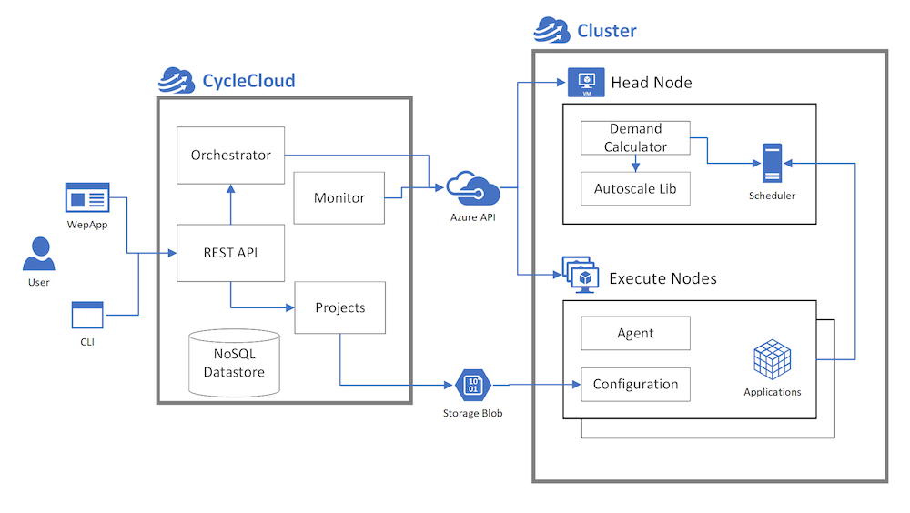

# CycleCloud Clusters

In CycleCloud, the term *cluster* is used to describe a group of connected computers (*nodes*) working together as a single system. Clusters can be nested; for example a compute cluster consisting of a Grid Engine scheduler headnode and compute nodes may mount a BeeGFS cluster consisting of several metadata and storage servers, with both compute and storage clusters coalescing under a single parent HPC cluster or system.

## Nodes and Node Arrays

Clusters fundamentally comprise of nodes, each of which perform a specific role in the HPC system. The terms *node* and *VM* are used interchangeably occasionally but are semantically separate in CycleCloud. *Nodes* that make up a cluster are in essence virtual machines on Azure that have completed the preparation and configuration process. In other words, *VMs* are provisioned from the Azure infrastructure service layers, and their end states are *nodes* of an HPC cluster after going through software installation and configuration steps.

There are two separate incarnations of nodes in CycleCloud. The first as a standalone node and the second as a nodearray, which is a collection of identically configured nodes (The node vs nodearray distinction follows the DevOps Pets vs Cattle analogy in spirit). Broadly but not strictly speaking, standalone nodes are constructed from single VMs on Azure while nodearrays map to Virtual Machine scale sets (VMSS).

There are however crucial differences between nodearrays and VM scale sets, the primary one being that a single nodearray can comprise of multiple VM scale sets. This enables a single nodearray to be build from VMs of difference sizes, or even different VM families, with the only constrain being that all nodes in a nodearray perform the same role in the cluster, for example, providing resources to a single queue of a scheduler.

## Cluster Templates

The topology, or how nodes are organized in a CycleCloud cluster, are defined in text templates that lay out the relationships among nodes of a cluster, and in the case of nested clusters, the parent-child relationship of clusters. The templates also provide the means of defining the role each node play. 

Cluster templates are defined in an [INI format](https://en.wikipedia.org/wiki/INI_file). Sections, delineated using square brackets `[`,`]`, are used to define clusters, nodes, and nodearrays. The basic element of INI files are key-value pair assertions that provide the configuration details of each section. These configuration details provide contextual information used to create each node of a cluster, from the virtual machine image used to boot the VM to the subnet that the VM is to be provisioned in. [Read more about the CycleCloud cluster templates](~/how-to/cluster-templates.md)

## Node Preparation and Configuration

CycleCloud provisions VMs from base VM images defined in the cluster template, and through a series of steps managed by the CycleCloud agent ([Jetpack](~/jetpack.md)) during the boot process, initializes and configures the OS on the VM to convert it into a working HPC node. These steps range from scripts to install and configure the scheduling software, to last-mile configuration for mounting a file system.

Defined in the configuration section of each node are *cluster-init specs* -- specifications provided to each booting VM that are used to prepare it for a specific role in the cluster. CycleCloud utilizes [Chef](https://www.chef.io) as the infrastructure automation platform for preparing and configuring each node. In essence, each *cluster-init spec* maps to one of more [Chef Roles](https://docs.chef.io/roles.html) and/or [Cookbook Recipes](https://docs.chef.io/recipes.html) that need to be executed on the booting VM. 

CycleCloud utilizes Chef in a stand-alone mode that does not rely on a centralized Chef server. Instead, the entire set of Chef Cookbooks needed to prepare each VM are downloaded from an Azure Storage Account belonging to the user during the VM bootup phase. This set of Cookbooks are cached from the CycleCloud application server into the Storage Account during the cluster creation phase. 

After these Cookbooks are downloaded, Chef processes the list of Recipes defined in the node's *cluster-init specs*, triggering a preparation and configuration phase that converts the VM into a working HPC node.

Specs are authored as logical collections called *Projects*. For example, a project for a batch scheduler such as Slurm comprises of a minimum of two specs: one for the scheduler head nodes, and the other for the compute nodes. [Read more about the CycleCloud Projects](~/how-to/projects.md) 

## Node Orchestration

Depending on the scheduler and services used in a cluster, CycleCloud at times need to orchestrate the preparation phase of nodes in a cluster through the coordination of different nodes. For example, some schedulers require that each compute node register themselves against the scheduler daemon, which not only necessitate the compute nodes be aware of the address of the headnode, but are also able to recognize that the headnode is fully prepared and wait if it's not.

This element of [Service Discovery](https://en.wikipedia.org/wiki/Service_discovery) is also used for File System server-client relationships and is a feature in CycleCloud.

## Further Reading

* Create a [Cluster Template](~/how-to/cluster-templates.md)
* [Start a Cluster](~/how-to/start-cluster.md)
* [Auto Scaling](~/how-to/configure-autoscaling.md)
* [Terminate a Cluster](~/how-to/terminate-cluster.md)
* [Node Configuration Reference](~/cluster-references/configuration-reference.md)

> [!div class="nextstepaction"]
> [Continue to Scheduling Concepts](./scheduling.md)
