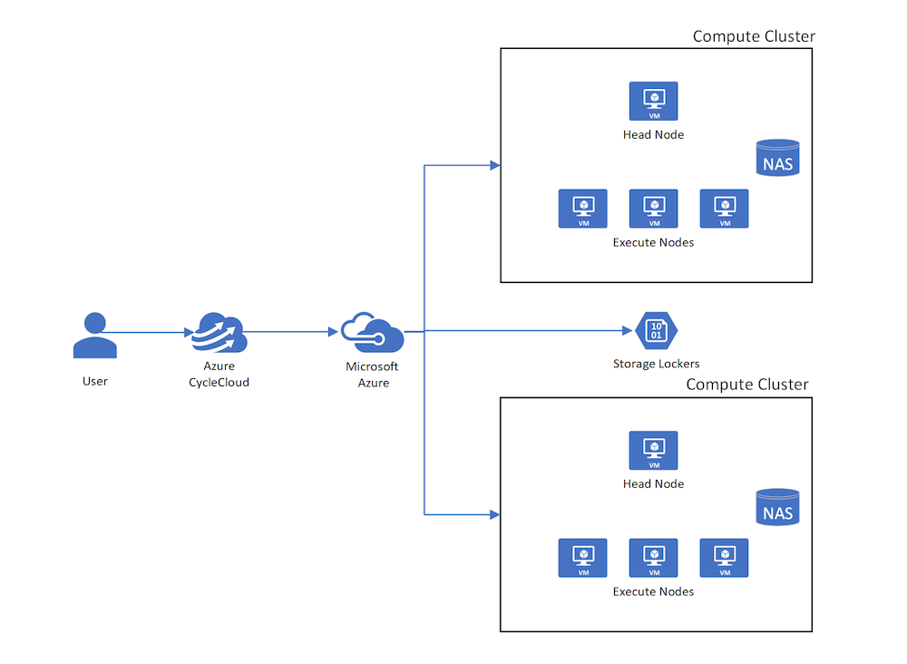
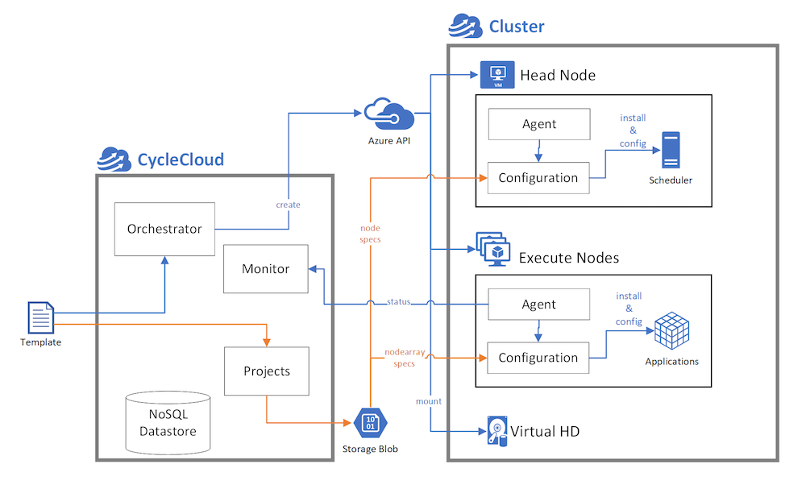

# CycleCloud clusters

In CycleCloud, the term *cluster* describes a group of connected computers (*nodes*) working together as a single system. Clusters can be nested. For example, a compute cluster consisting of a Grid Engine scheduler headnode and compute nodes can mount a BeeGFS cluster consisting of several metadata and storage servers. Both compute and storage clusters coalesce under a single parent HPC cluster or system.

## Nodes and node arrays

Clusters fundamentally comprise nodes, each of which performs a specific role in the HPC system. The terms *node* and *VM* are occasionally used interchangeably but are semantically separate in CycleCloud. *Nodes* that make up a cluster are virtual machines on Azure that complete the preparation and configuration process. In other words, you create *VMs* from the Azure infrastructure service layers. After you install the software and complete the configuration steps, the *VMs* are *nodes* of an HPC cluster.

CycleCloud has two types of nodes: standalone nodes and node arrays. A node array is a collection of identically configured nodes. The node vs node array distinction follows the DevOps Pets vs Cattle analogy. Standalone nodes are constructed from single VMs on Azure. Node arrays map to virtual machine scale sets.

However, there are crucial differences between node arrays and virtual machine scale sets. A single node array can comprise multiple virtual machine scale sets. This configuration enables a single node array to be built from VMs of different sizes or even different VM families. The only constraint is that all nodes in a node array perform the same role in the cluster. For example, all nodes provide resources to a single queue of a scheduler.

## Cluster templates

Define the topology, or how nodes are organized in a CycleCloud cluster, in text templates. The templates lay out the relationships among nodes of a cluster. If there are nested clusters, the templates define the parent-child relationship of clusters. The templates also define the role of each node.

Define cluster templates in the [INI format](https://en.wikipedia.org/wiki/INI_file). Use sections delineated with square brackets `[`and `]` to define clusters, nodes, and node arrays. The basic elements of INI files are key-value pair assertions that provide the configuration details of each section. These configuration details provide contextual information to create each node of a cluster, such as the virtual machine image to boot the VM and the subnet for the VM. For more information, see [CycleCloud cluster templates](~/articles/cyclecloud/how-to/cluster-templates.md).

## Node preparation and configuration

CycleCloud provisions VMs from base VM images defined in the cluster template. Through a series of steps managed by the CycleCloud agent ([Jetpack](~/articles/cyclecloud/jetpack.md)) during the boot process, it initializes and configures the OS on the VM to convert it into a working HPC node. These steps range from scripts to install and configure the scheduling software, to last-mile configuration for mounting a file system.

You can control how nodes are customized on boot by creating a custom *cluster-init project*. A project contains the scripts and other files needed to customize a node, separated into *specs* for the different kinds of roles in a cluster. For example, a project for a batch scheduler such as Slurm comprises a minimum of three specs: one for the scheduler head nodes, one for the compute nodes, and another for the login nodes. [Read more about the CycleCloud projects](~/articles/cyclecloud/how-to/projects.md).

In the node definition, you reference the specs that should run on that node. Jetpack uses these specs on boot to prepare a node for its role in the cluster. The spec files come from the user's Blob Storage Account, and are staged from the CycleCloud application server into the storage account before nodes are started.

> [!NOTE]
> The specs for built-in templates (such as the Slurm cluster type) are stored in GitHub. CycleCloud automatically downloads them to the user's storage account when the node starts.

When a node boots, Jetpack downloads the specs defined on the node with the `[[[cluster-init]]]` section and processes them in order to *converge* the node to a working state (for instance, to be a compute node).

## Node orchestration

Depending on the scheduler and services used in a cluster, CycleCloud sometimes needs to orchestrate the preparation phase of nodes in a cluster by coordinating different nodes. For example, some schedulers require that each compute node registers itself with the scheduler daemon. This requirement means that the compute nodes must be aware of the address of the head node. The compute nodes must also recognize that the head node is fully prepared and wait if it's not.

CycleCloud uses this element of [Service Discovery](https://en.wikipedia.org/wiki/Service_discovery) for file system server-client relationships.

## More information

* Create a [Cluster Template](../how-to/cluster-templates.md)
* [Start a Cluster](../how-to/start-cluster.md)
* [Auto Scaling](../how-to/configure-autoscaling.md)
* [Terminate a Cluster](../how-to/terminate-cluster.md)
* [Node Configuration Reference](../cluster-references/configuration-reference.md)

> [!div class="nextstepaction"]
> [Continue to Scheduling Concepts](./scheduling.md)
