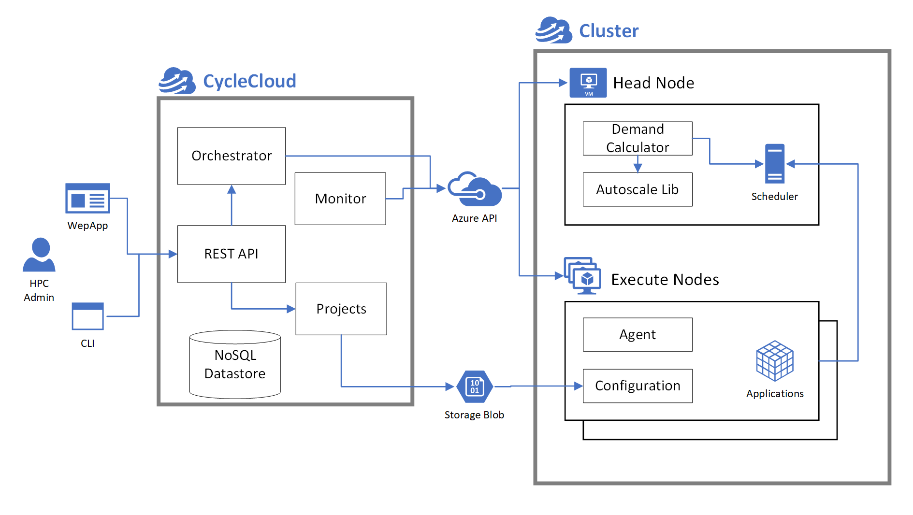

# CycleCloud: Core concepts

At its most basic, a High Performance Computing (HPC) system is a pool of computational resources backed by performant file systems and interconnected by low-latency networks. HPC schedulers, software applications that schedule jobs, usually manage these computational resources.

Building individual HPC systems on Azure from basic infrastructure units such as virtual machines, disks, and network interfaces can be cumbersome, especially if these resources are ephemeral — existing only for the time required to solve the HPC task. Additionally, you might want to create multiple, separate HPC environments tailored to various business units, research teams, or individuals. Managing these multiple HPC systems can be operationally complex.

## What is CycleCloud?

Azure CycleCloud is a tool that helps construct HPC systems on Azure. It orchestrates these systems so that they size elastically according to the HPC tasks, without the hassle of managing basic Azure building blocks. A team of experienced HPC professionals designed CycleCloud for HPC administrators and users, particularly users who want to build HPC systems in Azure that resemble their internal HPC infrastructure.

Operationally, CycleCloud is an application server that you install in a Linux VM on Azure, or on an on-premises server that has access to Azure APIs and resources. CycleCloud acquires and provisions Azure VMs to construct CycleCloud clusters that can integrate schedulers and user applications. CycleCloud also provides autoscaling integrations for a number of HPC schedulers and a CycleCloud agent that runs on Azure VMs.

### Application server

This application server provides:

* A REST API for creating and managing HPC systems on Azure.
* A graphical user interface that you use to manage and monitor HPC systems.
* A CLI that facilitates integration of CycleCloud into existing workflows.
* An internal NoSQL datastore that caches cluster and node state.
* An allocation and orchestration system that acquires and manages Azure VMs.
* A node monitoring system for existing VMs that alerts of status changes.

### Integrations

CycleCloud also provides integrations into common schedulers and the Azure VMs. These integrations provide:

* A node preparation and configuration system for converting a provisioned VM into an HPC node.
* Autoscaling for HPC schedulers that translate HPC scheduler task requirements into Azure resources.

### What CycleCloud can do

CycleCloud is targeted at HPC operators (administrators and users) who are deploying HPC systems on Azure. They want to replicate infrastructure they're running internally, from the HPC scheduler to file-system mount points for application installs and data access. These users particularly look for support for applications, workflow engines, and computational pipelines without having to retool their internal processes.

CycleCloud provides a rich and declarative templating syntax that enables you to describe your HPC system. You can define the cluster topology, which includes the number and types of cluster nodes, mount points, and applications that you deploy on each node. CycleCloud is designed to work with HPC schedulers such as PBSPro, Slurm, IBM LSF, Grid Engine, and HT Condor. You can create different queues in each scheduler and map them to compute nodes of different VM sizes on Azure. Additionally, the autoscale plugins are integrated with the scheduler head nodes. They listen to job queues in each system and size the compute cluster by interacting with the autoscale REST API running on the application server.

Besides provisioning and creating HPC nodes, CycleCloud also provides a framework for preparing and configuring a virtual machine. It provides a system for converting a bare VM into a functional component of an HPC system. Through this framework, you can do last-mile configuration on a VM.

Additionally, CycleCloud provides the following features:

- **User access**

    CycleCloud has built-in support for creating local user accounts on each node of an HPC system. With this system, you can control user access through a single management plane without deploying a directory service.

- **Monitoring**

    Node-level metrics are collected and displayed in the CycleCloud UI. These metrics are useful for monitoring the load on the system. You can hook them into reporting and alerting services.

- **Logging**

    CycleCloud provides a system for logging activities and events at the node and application server level.

- **Portability**

    The system doesn't mandate that you use a specific VM image or operating system. CycleCloud supports the major Windows and Linux operating systems on HPC nodes. Additionally, you can build your own VM image and use it in your HPC system.

- **Infrastructure as code**

    Since everything created in CycleCloud is defined in templates and configuration scripts, you can make HPC systems deployed through CycleCloud repeatable and portable. This approach provides consistency for operators deploying HPC systems in different environments: Sandbox, Development, Test, and Production. Operators can also deploy identical HPC systems for different business groups or teams to separate accounting concerns.

- **Loosely coupled or tightly coupled workloads**

    HPC clusters created by CycleCloud are designed to support not only loosely coupled or embarrassingly parallel jobs where scale (the size of the cluster) is the primary concern. CycleCloud clusters are also designed with Azure's InfiniBand backbone in mind, supporting tightly coupled or MPI-based workloads where node proximity and network latency are critical. These scale-out and tightly coupled concepts are ingrained in the scheduler integrations that CycleCloud supports.

> [!div class="nextstepaction"]
> [Continue to Cluster & Node Concepts](./clusters.md)
