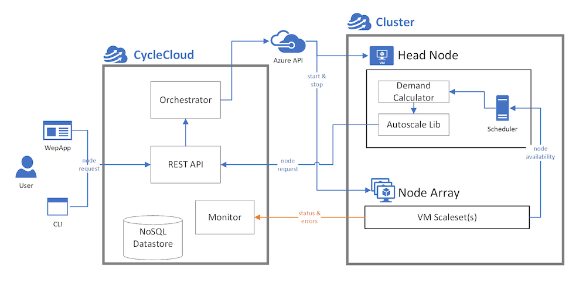

# CycleCloud Scheduling and Autoscaling Concepts

CycleCloud is not a scheduler, but rather a platform that enables users to deploy their own scheduler on Azure, to manage and distribute jobs into a cluster of nodes. Additionally, CycleCloud provides a REST API and a Python library for developing autoscaling adapters for schedulers, enabling these managed clusters to size up or down according to the length of job queues and governance policies.

## Schedulers

A scheduler is a software that accepts a list of jobs (or tasks) and distributes these tasks into pools of available resources, taking into consideration the resource requirements of the jobs as well as inter-job dependencies and priorities. These lists of jobs are commonly referred to as queues.

CycleCloud comes with built-in support for a number of commonly used schedulers (PBS Professional OSS, Slurm, IBM LSF, Grid Engine, and HT Condor), providing templates for deploying these schedulers on Azure. These templates are default topologies, representing best practices for building HPC clusters on Azure that leverage unique specialized features such as [low-latency InfiniBand networking](/azure/virtual-machines/workloads/hpc/enable-infiniband).

Additionally, [Projects](~/how-to/projects.md) are created for each scheduler, and used to install and initialize scheduler daemons on headnodes and compute nodes.

## Scheduler Adapters

Adapters created for each type of scheduler play two primary roles: 1) aggregate resource requirements from scheduler queues, and 2) translate the resource requirements into allocation requests for sets of Azure VM sizes. These allocation requests are constructed with certain constraints in mind, for example VM quotas, limits to the size of the cluster, and limits imposed by the InfiniBand network topology (for appropriate VM sizes). In certain aspects these adapters resemble a broker that negotiates demand and supply from multiple parties.

## Monitor

The monitor is a process that runs in the CycleCloud application server and periodically polls the Azure services for resource availability in the Azure subscription. This monitor provides these information to the scheduler adapters for demand brokering.

## Node Allocator

The node allocator runs in the CycleCloud application server. It receives the allocation request from the scheduler adapters through a REST API, provisions the Azure resources required to fulfill the request, and presents the provisioned resources back to the scheduler adapters as sets of nodes.

> [!NOTE]
> While the underlying concepts above are common among the schedulers, the implementation details differ between schedulers. See the individual scheduler pages for more in-depth information about each implementation.
> * [OpenPBS](../openpbs.md)
> * [Slurm](../slurm.md)
> * [LSF](../lsf.md)
> * [HTCondor](../htcondor.md)
> * [GridEngine](../gridengine.md)
