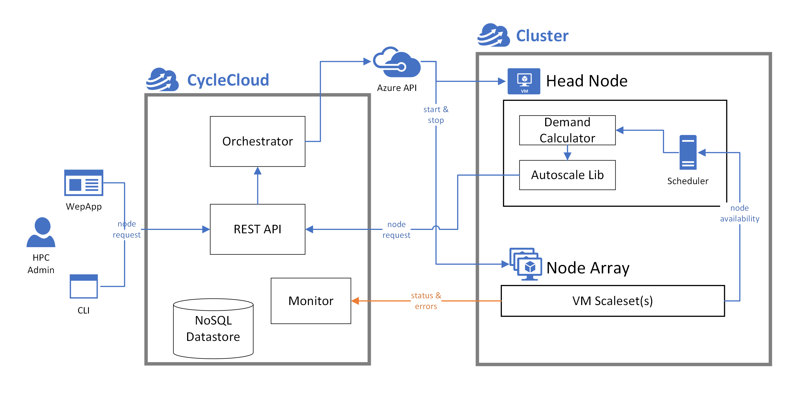

# CycleCloud scheduling and autoscaling concepts

CycleCloud isn't a scheduler, but rather a platform that enables you to deploy your own scheduler on Azure. The scheduler manages and distributes jobs into a cluster of nodes. CycleCloud provides a REST API and a Python library for developing autoscaling adapters for schedulers. With these adapters, managed clusters size up or down according to the length of job queues and governance policies.

## Schedulers

A scheduler is software that accepts a list of jobs (or tasks) and distributes these tasks into pools of available resources. It considers the resource requirements of the jobs, inter-job dependencies, and priorities. These lists of jobs are commonly referred to as queues.

CycleCloud comes with built-in support for many commonly used schedulers (PBS Professional OSS, Slurm, IBM LSF, Grid Engine, and HT Condor). It provides templates for deploying these schedulers on Azure. These templates are default topologies that represent best practices for building HPC clusters on Azure. They use unique specialized features such as [low-latency InfiniBand networking](/azure/virtual-machines/workloads/hpc/enable-infiniband).

Additionally, [Projects](~/articles/cyclecloud/how-to/projects.md) are created for each scheduler. Use the projects to install and initialize scheduler daemons on headnodes and compute nodes.

## Scheduler adapters

Adapters created for each type of scheduler play two primary roles. One role aggregates resource requirements from scheduler queues. The other role translates the resource requirements into allocation requests for sets of Azure VM sizes. Construct these allocation requests for certain constraints. These constraints can include VM quotas, limits to the size of the cluster, and limits imposed by the InfiniBand network topology for appropriate VM sizes. In certain aspects, these adapters resemble a broker that negotiates demand and supply from multiple parties.

## Monitor

The monitor is a process that runs in the CycleCloud application server and periodically polls the Azure services for resource availability in the Azure subscription. This monitor provides this information to the scheduler adapters for demand brokering.

## Node allocator

The node allocator runs in the CycleCloud application server. It receives the allocation request from the scheduler adapters through a REST API, provisions the Azure resources required to fulfill the request, and presents the provisioned resources back to the scheduler adapters as sets of nodes.

> [!NOTE]
> While the underlying concepts are common among the schedulers, the implementation details differ between schedulers. For more information about each implementation, see the individual scheduler pages:
> * [OpenPBS](../openpbs.md)
> * [Slurm](../slurm.md)
> * [LSF](../lsf.md)
> * [HTCondor](../htcondor.md)
> * [GridEngine](../gridengine.md)
