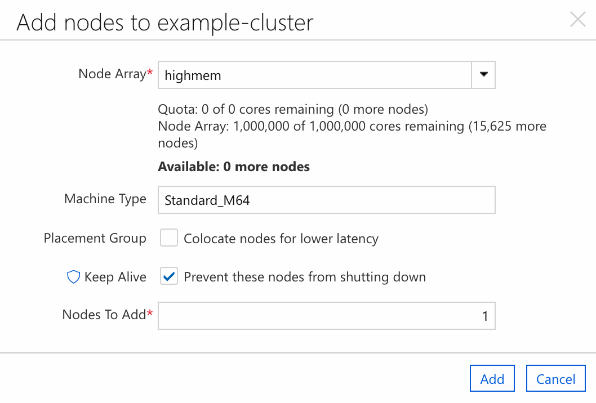

# Add a node array to a cluster

Use node arrays to define how the cluster creates and deletes nodes of a certain type as it scales up and down. Each node array has a name, a set of attributes that you apply to each node in the array, and optional attributes that describe how the array scales, such as limits, placement groups, and scale set configuration.

This article shows you how to add a node array to an existing cluster by using a template file. [Read more about node arrays.](../concepts/clusters.md#nodes-and-node-arrays)

## Edit the cluster template

To add a node array, you need a [template file](~/articles/cyclecloud/how-to/cluster-templates.md) for your cluster. Edit this file and add a new `[[nodearray]]` section under the `[cluster]` section. Give the node array a unique name within the cluster.

For example, the following template contains a node array named `highmem` that uses Standard_M64 VMs instead of the value specified in the node defaults (Standard_D4_v2):

```ini
# hpc-template.txt

[cluster hpc]

    [[node defaults]]
    Credentials = $Credentials
    ImageName = cycle.image.centos7
    SubnetId = my-subnet
    Region = USEast2
    MachineType = Standard_D4_v2

    [[node scheduler]]

    [[nodearray highmem]]
    MachineType = Standard_M64


[parameters Cluster Parameters]

    [[parameter Credentials]]
    ParameterType = Cloud.Credentials
    Label = Credentials

    [[parameter Region]]
    ParameterType = Cloud.Region
    Label = Region
    DefaultValue = westus2

    [[[parameter SubnetId]]]
    ParameterType = Azure.Subnet
    Label = Subnet
    Required = true
```

## Reimport the modified cluster template

To apply the cluster template changes and create the new node array, use the [CycleCloud CLI](../cli.md) to import the template. You must specify the name of the cluster to modify and include the `--force` flag to tell the CLI to overwrite values in the existing cluster.

The following command applies the changes to a cluster named `example-cluster`:

```CycleCloud CLI
cyclecloud import_cluster example-cluster -f hpc-template.txt -c hpc --force
```

To test your new node array, go to the web UI and select **Add node**. Select the `highmem` array and select **Add** to create a new node. To make further changes, edit the template file and run the import command again.



## Further reading

* [Node and Node Array Reference](../cluster-references/node-nodearray-reference.md)
