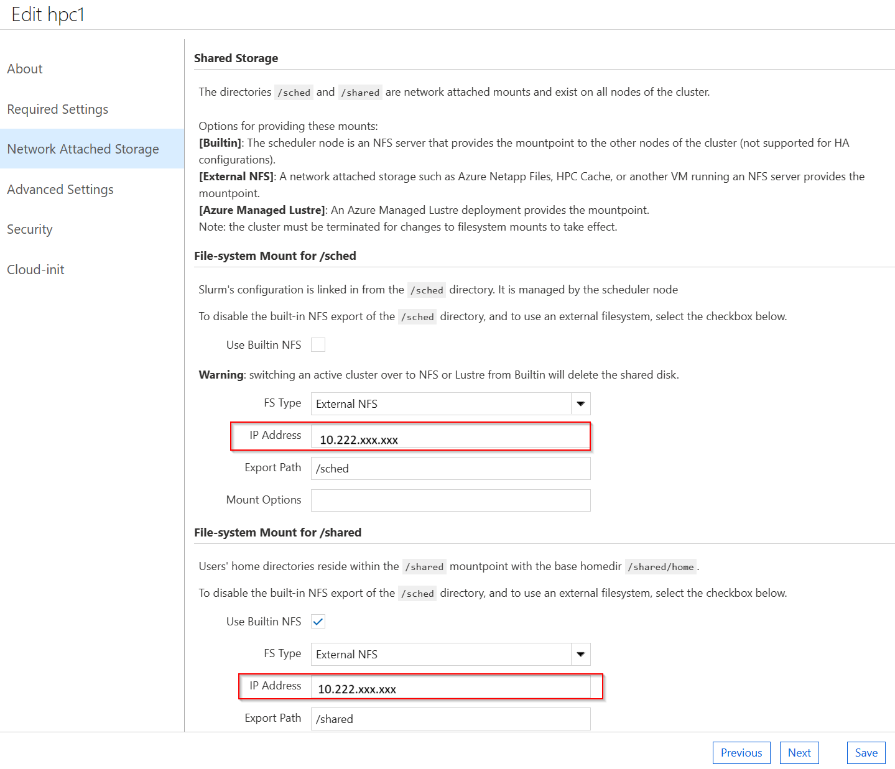
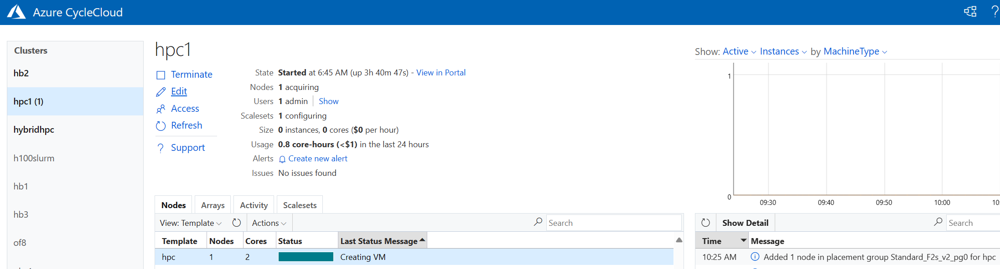

# Setup Instructions

After we have the prerequisites ready, we can follow these steps to integrate the external Slurm Scheduler node with the CycleCloud cluster:

## Importing a Cluster Using the Slurm Headless Template in CycleCloud

- This step must be executed on the **CycleCloud VM**.
- Make sure that the **CycleCloud 8.6.4 VM** is running and accessible via the `cyclecloud` CLI.
- Execute the `cyclecloud-project-build.sh` script and provide the desired cluster name (for example, `hpc1`). This sets a custom project based on the `cyclecloud-slurm-3.0.9` version and import the cluster using the Slurm headless template.
- In the example provided, `<clustername>` is used as the cluster name. Choose any cluster name you like, but same name must be consistently used throughout the entire setup.


```bash
git clone https://github.com/Azure/cyclecloud-slurm.git
cd cyclecloud-slurm/cloud_bursting/slurm-23.11.9-1/cyclecloud
sh cyclecloud-project-build.sh
```

Output:

```bash
[user1@cc86vm ~]$ cd cyclecloud-slurm/cloud_bursting/slurm-23.11.9-1/cyclecloud
[user1@cc86vm cyclecloud]$ sh cyclecloud-project-build.sh
Enter Cluster Name: <clustername>
Cluster Name: <clustername>
Use the same cluster name: <clustername> in building the scheduler
Importing Cluster
Importing cluster Slurm_HL and creating cluster hpc1....
----------
<clustername> : off
----------
Resource group:
Cluster nodes:
Total nodes: 0
Locker Name: cyclecloud_storage
Fetching CycleCloud project
Uploading CycleCloud project to the locker
```

## Slurm Scheduler Installation and Configuration

- A VM should be deployed using the specified **AlmaLinux HPC 8.7** or **Ubuntu HPC 22.04** image. 
- If you already have a Slurm Scheduler installed, you can skip this step. However, it's advisable to review the script to make sure it's compatible with your current setup.
- Run the Slurm scheduler installation script (`slurm-scheduler-builder.sh`) and provide the cluster name (`<clustername>`) when prompted.
- This script sets up the NFS server and installs and configures the Slurm Scheduler.
- If you're using an external NFS server, you can delete the NFS setup entries from the script.

```bash
git clone https://github.com/Azure/cyclecloud-slurm.git
cd cyclecloud-slurm/cloud_bursting/slurm-23.11.9-1/scheduler
sh slurm-scheduler-builder.sh
```
Output: 

```bash
------------------------------------------------------------------------------------------------------------------------------
Building Slurm scheduler for cloud bursting with Azure CycleCloud
------------------------------------------------------------------------------------------------------------------------------

Enter Cluster Name: <clustername>
------------------------------------------------------------------------------------------------------------------------------

Summary of entered details:
Cluster Name: <clustername>
Scheduler Hostname: <scheduler hostname>
NFSServer IP Address: 10.222.xxx.xxx
```

## CycleCloud UI Configuration

- Access the **CycleCloud UI** and navigate to the settings for the `<clustername>` cluster.
- Edit the cluster settings to configure the VM SKUs and networking options as needed.
- In the **Network Attached Storage** section, enter the NFS server IP address for the `/sched` and `/shared` mounts.
- On the Advance setting tab, from the dropdown menu choose the OS: either **Ubuntu 22.04** or **AlmaLinux 8** based on the scheduler VM.
- Once all settings are configured, click **Save** and then **Start** the `<clustername>` cluster.



## CycleCloud Autoscaler Integration on Slurm Scheduler

- Integrate Slurm with CycleCloud using the `cyclecloud-integrator.sh` script.
- Provide CycleCloud details (username, password, and ip address) when prompted.

```bash
cd cyclecloud-slurm/cloud_bursting/slurm-23.11.9-1/scheduler
sh cyclecloud-integrator.sh
```
Output:

```bash
[root@masternode2 scripts]# sh cyclecloud-integrator.sh
Please enter the CycleCloud details to integrate with the Slurm scheduler

Enter Cluster Name: <clustername>
Enter CycleCloud Username: <username>
Enter CycleCloud Password: <password>
Enter CycleCloud IP (e.g., 10.220.x.xx): <ip address>
------------------------------------------------------------------------------------------------------------------------------

Summary of entered details:
Cluster Name: <clustername>
CycleCloud Username: <username>
CycleCloud URL: https://<ip address>

------------------------------------------------------------------------------------------------------------------------------
```

## User and Group Setup (Optional)

- Ensure consistent user and group IDs across all nodes.
- It's advisable to use a centralized User Management system like LDAP to maintain consistent UID and GID across all nodes.
- In this example, we're using the `useradd_example.sh` script to create a test user `<username>` and a group for job submission. (User `<username>` already exists in CycleCloud)

```bash
cd cyclecloud-slurm/cloud_bursting/slurm-23.11.9-1/scheduler
sh useradd_example.sh
```

## Testing the Setup

- Log in as a test user (example, `<username>`) on the Scheduler node.
- Submit a test job to verify that the setup is functioning correctly.

```bash
su - <username>
srun hostname &
```
Output:
```bash
[root@masternode2 scripts]# su - <username>
Last login: Tue May 14 04:54:51 UTC 2024 on pts/0
[<username>@masternode2 ~]$ srun hostname &
[1] 43448
[<username>@masternode2 ~]$ squeue
              JOBID  PARTITION     NAME      USER ST         TIME     NODES     NODELIST(REASON)
                 1       hpc     hostname    <username> CF    0:04      1       <clustername>-hpc-1
[user1@masternode2 ~]$ <clustername>-hpc-1
```


You should see the job running successfully, indicating a successful integration with CycleCloud.

For more information and advanced configurations, see the scripts and documentation within this repository.
