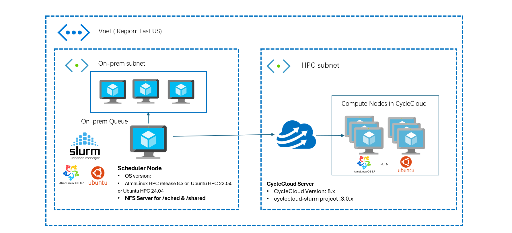

# What is cloud bursting?

Cloud bursting is a configuration in cloud computing that helps your organization handle peaks in IT demand by using a combination of private and public clouds. When the resources in a private cloud reach their maximum capacity, the configuration directs the overflow traffic to a public cloud. This setup ensures there's no interruption in services. Cloud bursting provides flexibility and cost savings, as you only pay for the supplemental resources when there's a demand for them.

For example, an application can run on a private cloud and "burst" to a public cloud only when necessary to meet peak demands. This approach helps you avoid the costs associated with maintaining extra capacity that isn't always in use.

You can use cloud bursting in various scenarios, such as enabling on-premises workloads to be sent to the cloud for processing, known as hybrid HPC (High-Performance Computing). It allows you to optimize your resource utilization and cost efficiency while accessing the scalability and flexibility of the cloud.

## Overview

This document offers a step-by-step guide on installing and configuring a Slurm scheduler to burst computing resources into the cloud using Azure CycleCloud. It explains how to create a hybrid HPC environment by extending on-premises Slurm clusters into Azure, allowing for seamless access to scalable and flexible cloud computing resources. The guide provides a practical example of optimizing compute capacity by integrating local infrastructure with cloud-based solutions.

## Requirements to Set Up Slurm Cloud Bursting Using CycleCloud on Azure

## Azure subscription account
You must have an Azure subscription or be assigned the Owner role for a subscription.

* To create an Azure subscription, see [Create a Subscription](/azure/cost-management-billing/manage/create-subscription#create-a-subscription).
* To access an existing subscription, go to the [Azure portal](https://portal.azure.com/).

## Network infrastructure
To create a Slurm cluster entirely within Azure, deploy both the head nodes and the CycleCloud compute nodes within a single Azure Virtual Network (VNET). 

To create a hybrid HPC cluster with head nodes on your on-premises corporate network and compute nodes in Azure, set up a [Site-to-Site](/azure/vpn-gateway/tutorial-site-to-site-portal) VPN or an [ExpressRoute](/azure/expressroute/) connection. This setup links your network to the Azure VNET. The head nodes must be able to connect to Azure services online. You might need to work with your network administrator to set up this connection.

## Network ports and security
To enable communication between the primary node, CycleCloud server, and compute nodes, configure the following NSG rules.

| **Service**                        | **Port**        | **Protocol** | **Direction**    | **Purpose**                                                            | **Requirement**                                                                 |
|------------------------------------|-----------------|--------------|------------------|------------------------------------------------------------------------|---------------------------------------------------------------------------------|
| **SSH (Secure Shell)**             | 22              | TCP          | Inbound/Outbound | Secure command-line access to the Slurm primary node                   | Open on both on-premises firewall and Azure NSGs                                |
| **Slurm Control (slurmctld, slurmd)** | 6817, 6818   | TCP          | Inbound/Outbound | Communication between Slurm primary and compute nodes                  | Open in on-premises firewall and Azure NSGs                                     |
| **Munge Authentication Service**   | 4065            | TCP          | Inbound/Outbound | Authentication between Slurm primary and compute nodes                   | Open on both on-premises network and Azure NSGs                                 |
| **CycleCloud Service**             | 443             | TCP          | Outbound         | Communication between Slurm primary node and Azure CycleCloud            | Allow outbound connections to Azure CycleCloud services from the Slurm primary node |
| **NFS ports**                      | 2049            | TCP          | Inbound/Outbound | Shared filesystem access between primary node and Azure CycleCloud       | Open on both on-premises network and Azure NSGs                                 |
| **LDAP port** (Optional)           | 389             | TCP          | Inbound/Outbound | Centralized authentication mechanism for user management                | Open on both on-premises network and Azure NSGs

See [Slurm Network Configuration Guide](https://slurm.schedmd.com/network.html).

## Software requirements

- **OS version**: AlmaLinux release 8.x or Ubuntu 22.04
- **CycleCloud version**: 8.x or later
- **CycleCloud-Slurm project version**: 3.0.x

## NFS file server
A shared file system between the external Slurm scheduler node and the CycleCloud cluster. You can use Azure NetApp Files, Azure Files, NFS, or other methods to mount the same file system on both sides. In this example, use a scheduler VM as an NFS server.

## Centralized user management system (LDAP or AD)
In HPC environments, maintaining consistent user IDs (UIDs) and group IDs (GIDs) across the cluster is critical for seamless user access and resource management. A centralized user management system, such as LDAP or Active Directory (AD), ensures that UIDs and GIDs are synchronized across all compute nodes and storage systems.

> [!Important]
> 
> For more information on how to set up a centralized user management system, see the blog post about [Slurm Cloud Bursting Using CycleCloud on Azure](https://techcommunity.microsoft.com/blog/azurehighperformancecomputingblog/setting-up-slurm-cloud-bursting-using-cyclecloud-on-azure/4140922).

### Next steps

* [GitHub repo - cyclecloud-slurm](https://github.com/Azure/cyclecloud-slurm/tree/master)
* [Azure CycleCloud Documentation](../../overview.md)
* [Slurm documentation](https://slurm.schedmd.com/documentation.html)
