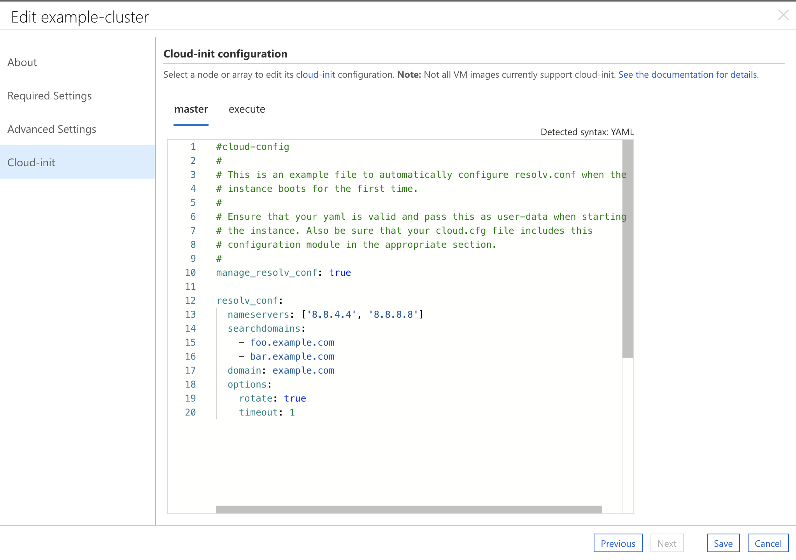

# Cloud-Init

CycleCloud supports [cloud-init](/azure/virtual-machines/linux/using-cloud-init) as a way of configuring a virtual machine (VM) on first boot **before** any other CycleCloud specific configuration occurs on the VM. Using cloud-init is an effective way to configure aspects of a VM (such as networking, yum/apt mirrors, etc.) prior to any software managed by CycleCloud (HPC schedulers) being installed.

Below is a simple example of specifying a bash script to run on boot using the `CloudInit` attribute in a cluster template:

```ini
[node scheduler]
CloudInit = '''#!/bin/bash
echo "cloud-init works" > /tmp/cloud-init.txt
'''
```

> [!NOTE]
> Triple quoted strings can be used in a cluster template to specify a multiline string, such as a bash or YAML script.

> [!WARNING]
> Not all OS images in Azure support cloud-init. Please refer to [cloud-init support for virtual machines in Azure](/azure/virtual-machines/linux/using-cloud-init) for details on which images support cloud-init and the timeline for when broader support will be available.

## Setting Cloud-Init using the UI

The CycleCloud UI has support for cloud-init editing. When creating or editing any cluster a new tab named "Cloud-Init" will allow you to edit the cloud-init script for each node in your cluster. The editor in the CycleCloud UI will allow any text input. Syntax highlighting is enabled for Python, Shell scripts or YAML.



## Cloud-Init Ordering and Error Handling

For CycleCloud nodes with `CloudInit` specified, CycleCloud will provision the VM and wait until cloud-init has run to completion **before** any other configuration takes place. If `CloudInit` is specified on the node and CycleCloud does not detect cloud-init support for the OS, the node will go into an error state and the reason will be relayed to CycleCloud. If the `CloudInit` script fails to execute (e.g. due to a scripting error or syntax error), the node will go into an error state and the error reported by cloud-init will be relayed to CycleCloud. 

Once cloud-init has run to completion with no errors, CycleCloud will continue to configure the VM as usual.

> [!IMPORTANT]
> CycleCloud will **not** automatically merge cloud-init scripts. If a `[node defaults]` specifies a cloud-init as well as a node inheriting from defaults, the cloud-init script in `[node defaults]` will be overwritten. Merging scripts manually is suggested when code needs to be shared. Alternatively, an [include file user-data format](https://cloudinit.readthedocs.io/en/latest/topics/format.html#include-file) can be used to include a list of URLs to to be processed by cloud-init.
