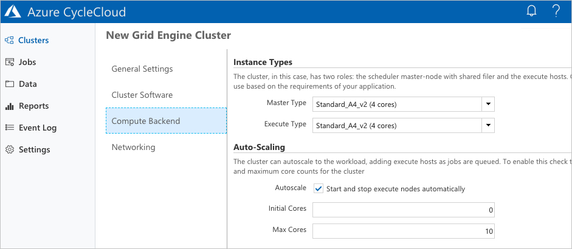
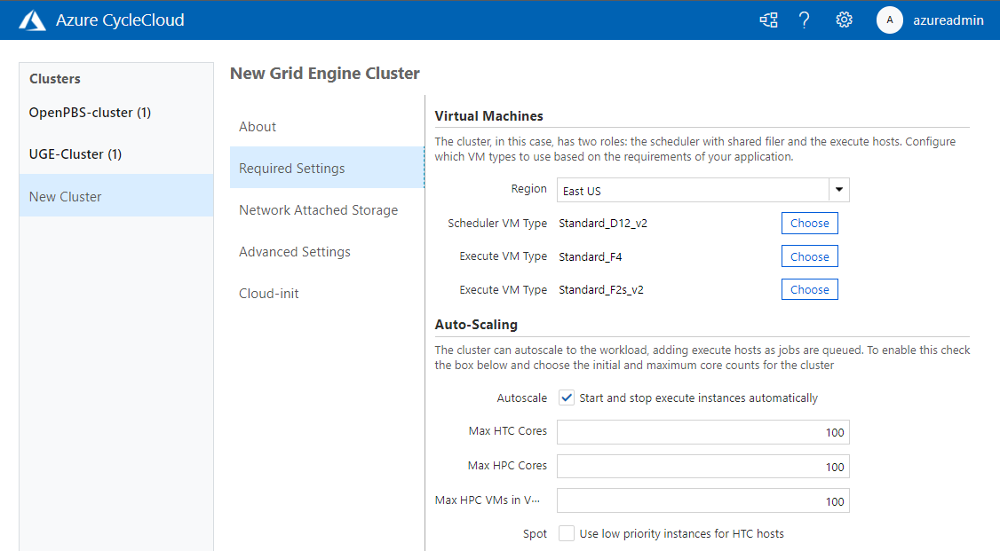

# AutoScale Your Clusters

*Scaling* is the ability to easily increase or decrease a resource to accommodate heavier or lighter loads. In Azure CycleCloud, jobs can be easily scaled up when the load increases, or scaled down to conserve cost. This can be done automatically or manually.

## Auto-Scaling

When creating a new cluster via the GUI, the **Compute Backend** tab allows you to choose to auto-scale your cluster and add execute hosts as required. Check the box to allow CycleCloud to start and stop execute nodes as required, and set the number of initial and maximum cores allowed.

::: moniker range="=cyclecloud-7"

::: moniker-end

::: moniker range=">=cyclecloud-8"

::: moniker-end

Setting a **Max Cores** number will limit the number of nodes started to ensure your workload does not run unfetted. You can also set up an [usage alert](~/concepts/usage-tracking.md) when submitting your job to ensure a budget is not exceeded.

## Auto-Scaling in Cluster Template

By default, auto-scaling is disabled for all new clusters. To enable it, add the following to your [cluster template](cluster-templates.md):

``` ini
Autoscale = true
...
MaxCoreCount = xx
```

## Further Reading

* Create a [Cluster Template](cluster-templates.md)
* [Start a Cluster](start-cluster.md)
