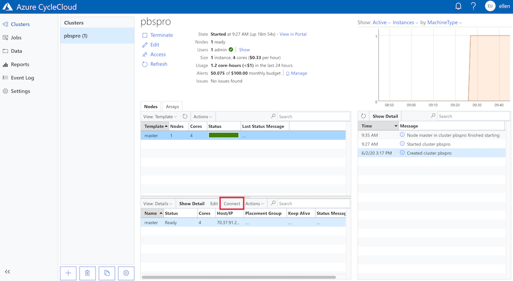
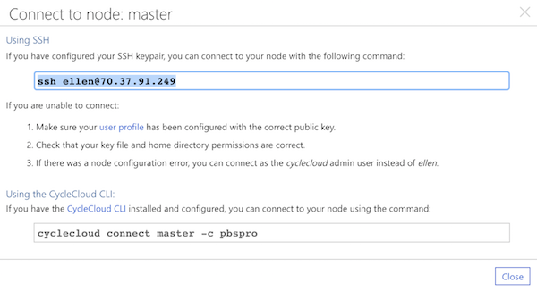
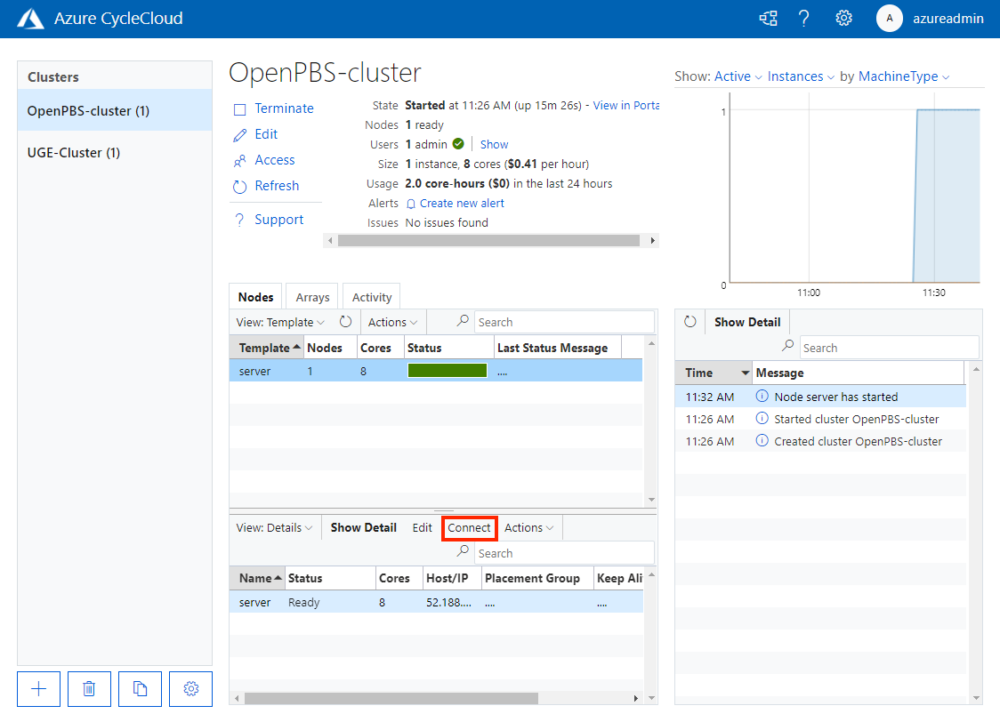
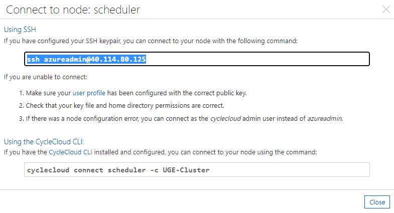

# Connecting to cluster nodes

You can remotely access a cluster node using SSH for Linux nodes and RDP for Windows nodes. 

::: moniker range="=cyclecloud-7"
The **Connect** button in the cluster management pane provides a connection string for accessing the node. For example, to access a cluster head node, select the primary node in the cluster management pane and select **Connect**:



The pop-up window shows the connection string you use to connect to the cluster:



Copy the appropriate connection string and use either your SSH client or the CycleCloud CLI to connect to the primary node. 
::: moniker-end

::: moniker range=">=cyclecloud-8"
The **Connect** button in the cluster management pane gives you a connection string to access the node. For example, to access a cluster head node, select the scheduler node in the cluster management pane and select the **Connect** button:



The pop-up window shows the connection string you use to connect to the cluster:



Copy the connection string and use either your SSH client or the CycleCloud CLI to connect to the primary node.
::: moniker-end


## Accessing cluster nodes in a private subnet

To access nodes within a private subnet of your virtual network, use either `cyclecloud connect` or raw SSH client commands. These instructions assume you're using SSH with public-key authentication, which is typical for Linux nodes. For Windows nodes, you can use this method to set up an RDP tunnel.

First, make the private key accessible to the target node. The simplest way is to run an SSH agent on your personal machine.

> [!WARNING] 
> Never share your private key outside your personal machine. In the
> following examples, your private key stays on your machine. The agent uses
> your private key to respond to authentication challenges sent by the remote node.

From your local machine, start the agent with the `ssh-agent` command:

``` script
exec ssh-agent bash
```

If the private key isn't your default key (`~/.ssh/id_rsa` or `~/.ssh/identity`), add it to the agent:

``` script
ssh-add PATH_TO_KEYPAIR
```

You only need to run these commands once (or after you reboot).

### Using `cyclecloud connect`

You can connect to a node through a bastion server by specifying the IP address on the command line:

``` CLI
cyclecloud connect htcondor-scheduler --bastion-host 1.1.1.1
```

This command uses `cyclecloud` as the username, `22` as the port, and loads your default SSH key. To customize these values, see the `--bastion-*` help options for the [`cyclecloud` CLI command](~/articles/cyclecloud/cli.md#cyclecloud-connect).

Alternatively, the CycleCloud CLI can detect the bastion host for you if you add the following directive to your `~/.cycle/config.ini`:

``` ini
[cyclecloud]
bastion_auto_detect = true
```

With this directive, you can run `cyclecloud connect htcondor-scheduler` without specifying any details about the bastion server.

You can also use `cyclecloud connect` to connect a Windows VM. When you run the following command, it creates an RDP connection over an SSH tunnel. It also starts the Microsoft RDP client on macOS and Windows:

``` CLI
cyclecloud connect windows-execute-1
```

> [!NOTE] 
> CycleCloud picks an unused ephemeral port for the tunnel to the Windows VM.

You can set up the `cyclecloud` command to use one bastion host for all your connections with this command:

``` ini
[cyclecloud]
bastion_host = 1.1.1.1
bastion_user = example_user
bastion_key = ~/.ssh/example_key.pem
bastion_port = 222
```

### Using raw SSH commands

You can connect to a private server through the bastion server by using agent forwarding:

``` CLI
ssh -A -t cyclecloud@BASTION_SERVER_IP ssh -A cyclecloud@TARGET_SERVER_IP
```

This command connects to the bastion server and then immediately runs SSH again, so you get a terminal on the target VM. You might need to specify a user other than
`cyclecloud` on the VM if you configured your cluster differently. The `-A` argument forwards the agent connection so your private key on your local machine is used automatically. Agent forwarding works as a chain, so the second SSH command also includes `-A` to ensure that any subsequent SSH connections initiated from the target VM also use your local private key.

### Connecting to services on the target VM

You can use the SSH connection to connect to services on the target VM, such as a Remote Desktop, a database, and more. For example, if the target VM is Windows, you can create a Remote Desktop tunnel by connecting to the target VM with an SSH command similar to the following example, using the `-L` argument:

``` CLI
ssh -A -t cyclecloud@BASTION_SERVER_IP  -L 33890:TARGET:3389 ssh -A cyclecloud@TARGET_SERVER_IP
```

This command tunnels port 3389 on the target to port 33890 on your local machine. When you connect to `localhost:33890`, you actually connect to the target VM.

