# Create Entra App Registration for use with CycleCloud **(PREVIEW)**

[Microsoft Entra ID](/entra/fundamentals) is a cloud-based identity and access management service that enables your employees access to external resources. If your organization requires the use of Entra ID, CycleCloud provides a native integration to Entra ID for user management, authorization, and authentication.

> [!NOTE]
> Users permissioned for a given App Registration are granted the assigned access and Role for all CycleCloud installations that use that App Registration. To segregate users between multiple CycleCloud installations, create a separate App. Registration for each CycleCloud. 

## Creating the CycleCloud App Registration

> [!NOTE]
> If you are using a service principal for CycleCloud that was generated by the CLI, it will not have an associated Enterprise Application required for Entra ID.

1. In the Azure Portal, click the **Microsoft Entra ID** icon in the navigation frame or type "Microsoft Entra ID" in the search bar and select "Microsoft Entra ID" from the Services category in the results. 
1. Navigate to the **App registrations** tab. 
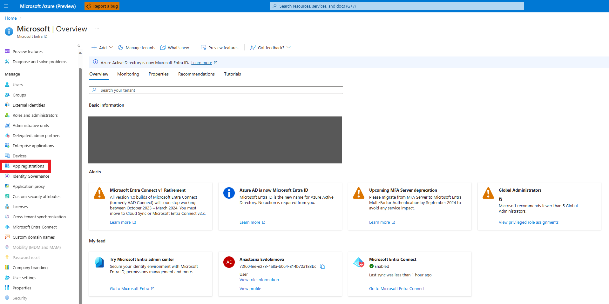
1. Choose **New registration** from the top menu and configure your application. You don’t need to set the redirect URI right now
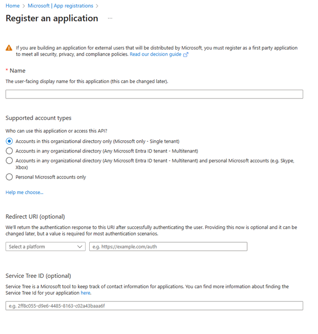
1. On the **Overview** page of your newly created application, note down the **Application (client) ID** and **Directory (tenant) ID** fields – you will need them later to configure Entra authentication in CycleCloud.
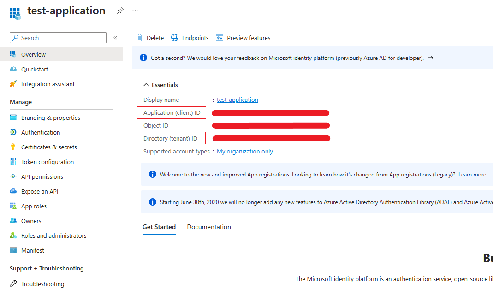
1. On the **Expose an API** page of your app, select **Add a scope**. This is required to expose your app registration as an API for which Access Tokens can be generated. In the pop-up, leave the Application ID URI as the default value, which should look like "api://{ClientID}".
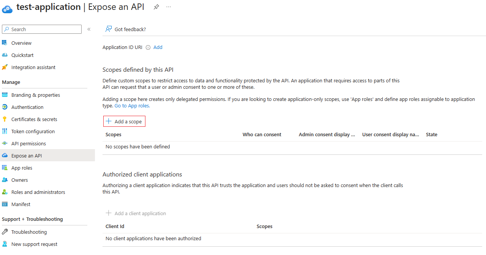
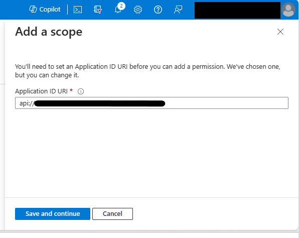
1. After clicking **Save and Continue**, you will be asked to configure the new scope.   Enter “user_access” as the Scope name, configure all the other fields the way you want, but don’t forget to set **State** to Enabled. After you save the scope, it should show up in the Scopes table 
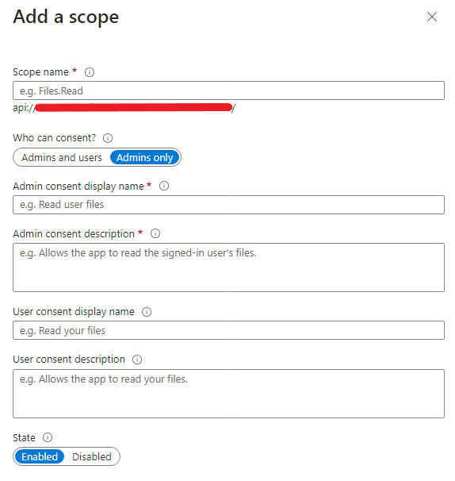
1. Navigate to the **API Permissions** page and select **Add a permission**. In the **Request API permissions** menu, navigate to **My APIs** and choose the name of your application. From there, choose **Delegated permissions** and select the scope you just created and, finally, click **Add permission**. Your new permission should now appear in the **Configured permissions** table. 
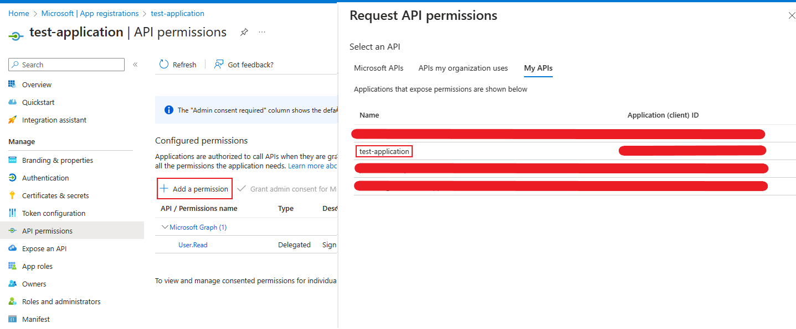
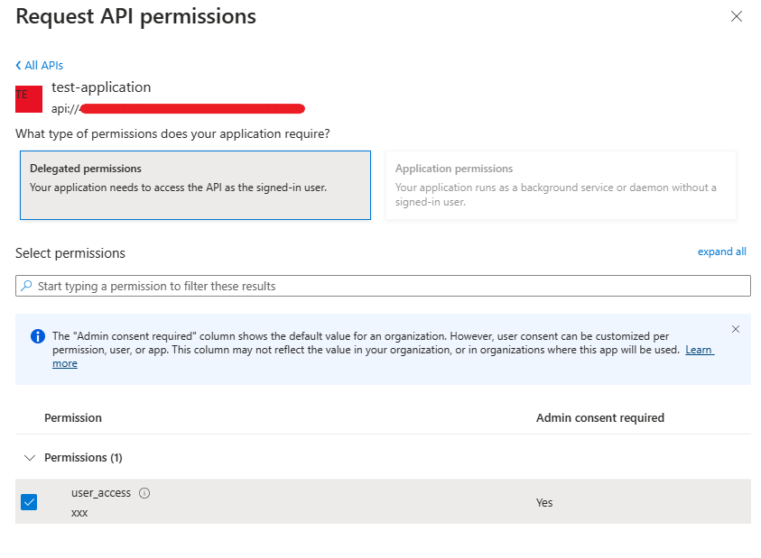
1. On the **Authentication** page, select **Add a platform** and choose **Single-page application**. If you intend to use the CycleCloud CLI with Entra ID, you must also set **Allow public client flows** to **true**
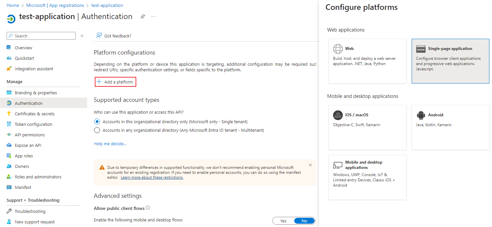
1. Under the **Configure single-page application** menu, configure **Redirect URI** to be "https://{your_cyclecloud_IP_or_DOMAIN_NAME}/home". You can leave the rest of fields blank.
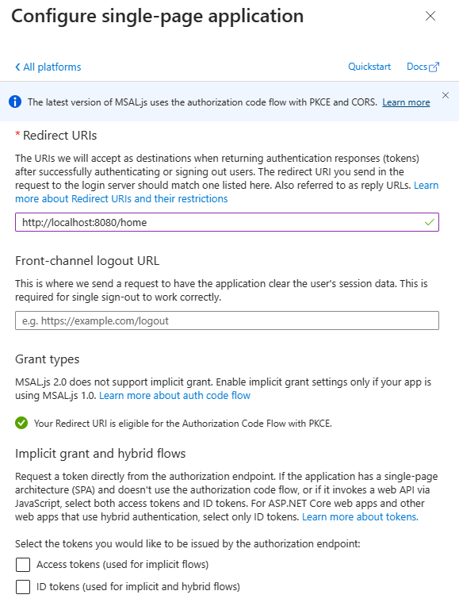
1.	Under **Configure single-page application** menu, configure **Redirect URI** to be "http://localhost". This URI is required.  See [Redirect URI (reply URL) restrictions and limitations](/entra/identity-platform/reply-url). Make sure to also include both "https://{your_cyclecloud_IP_or_DOMAIN_NAME}/home" and "https://{your_cyclecloud_IP_or_DOMAIN_NAME}/login" as allowed redirect URLs. You can leave the rest of fields blank.
1.  If you wish to allow multiple CycleCloud installations or multiple URIs for the same CycleCloud to access this **Application Registration**, you can configure additional URIs on the same **Authentication** page – just select **Add URI** to create a field, enter the additional URI in the new field and click on Save. 
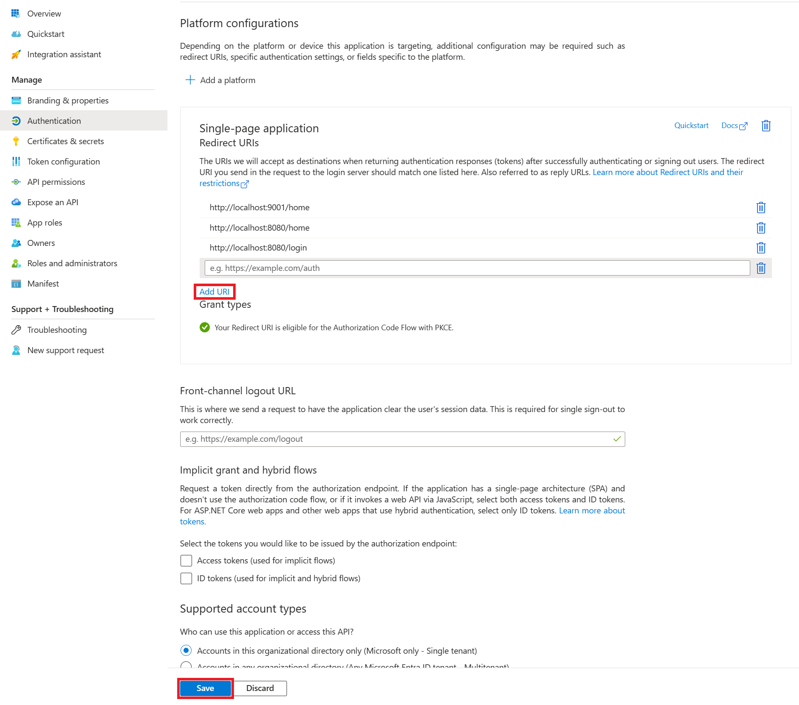
1.	To enable the CycleCloud CLI to authenticate against the new Application Registration, you must also add the **Mobile and desktop applications** platform.  To do that, return to the **Authentication** page, select **Add a platform** again.  Select **Mobile and desktop applications** in the **Configure Desktop + Devices** pop-up, add a **Custom Redirect URI** with value "http://localhost".

    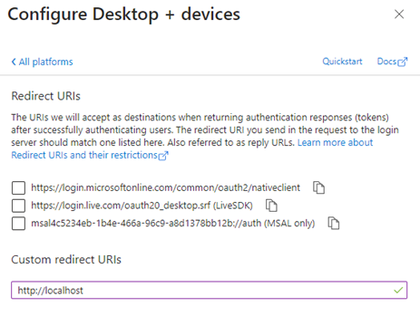
    
    After clicking **Configure**, you may also **Add URI** for **https://localhost**
    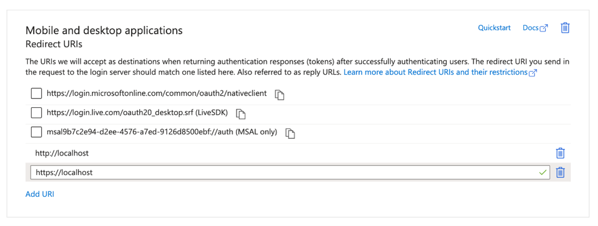
1.	Next, you can must add the user roles for CycleCloud under **App roles** by selecting **Create app role**. While the **Display name** field can be set to anything you want, **Value** must match the built-in CycleCloud role for this to work. 
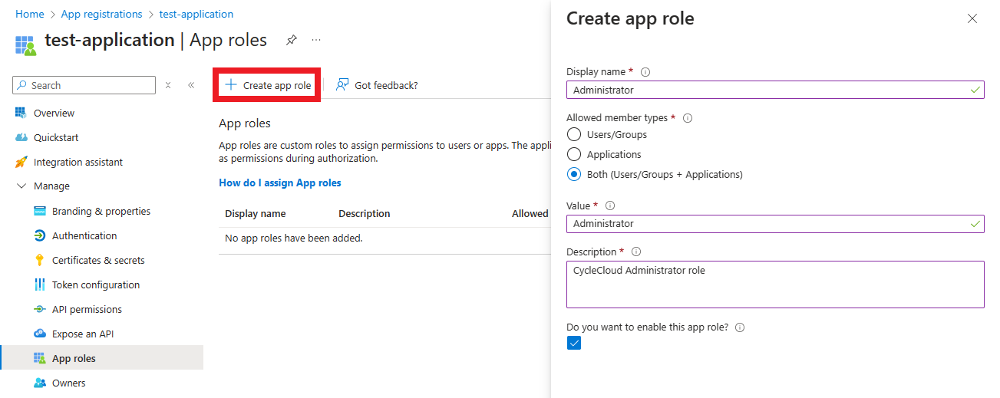
    > [!NOTE]
    > Since Entra ID does not allow roles to have spaces in them and some of the in-built CycleCloud roles include spaces (e.g. “Cluster Administrator”), you should replace any spaces in the role names you define in Entra ID with a dot (e.g. “Data Admin” will become “Data.Admin”) and rename any roles defined in CycleCloud to not feature dots. Role definitions in Entra ID are case insensitive.

    At a minimum, add the following roles:
    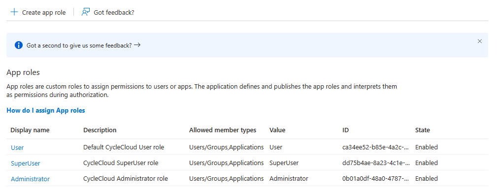
1. By default, the app registration issues access tokens v2.0, which are currently not supported by CycleCloud. To configure the issuing of tokens v1.0, you should select **Manifest**, locate the property **accessTokenAcceptedVersion** in the manifest, and change the value of that property to **null**. Once you changed the token version, select **Save**.
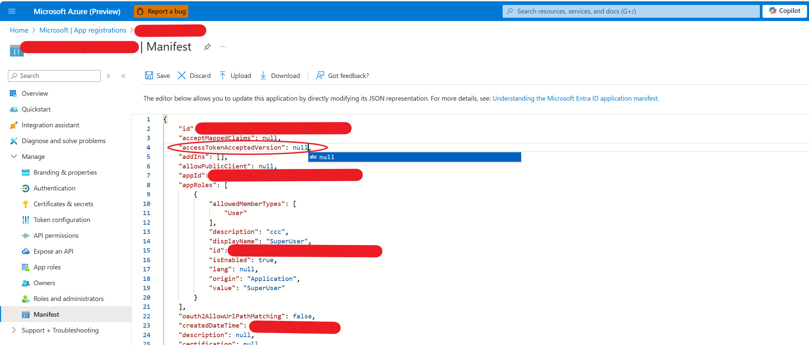
## Permissioning Users for CycleCloud

1. After you have create the required CycleCloud roles, you may add users and assign roles to them. To do this, navigate to the app’s **Enterprise Application** page. The easiest way to do it is via a helper link located on your App roles page 
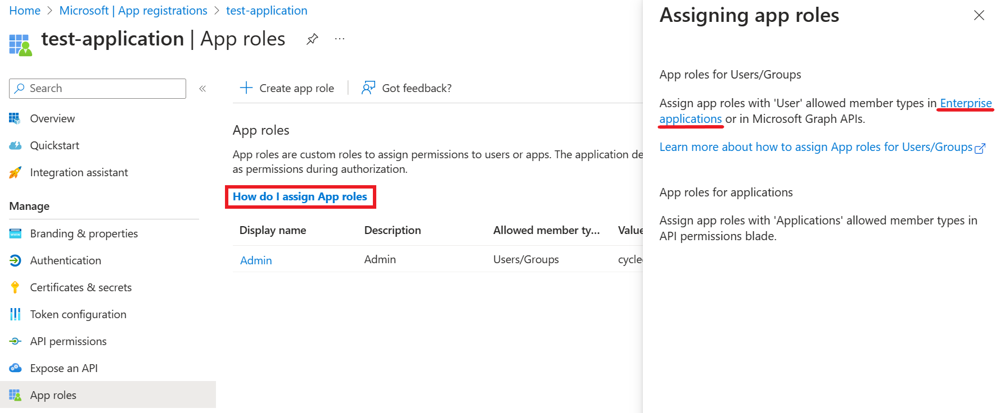
1. To add a user and assign a role, navigate to **Users and groups** page of the Enterprise Application and select **Add user/group**
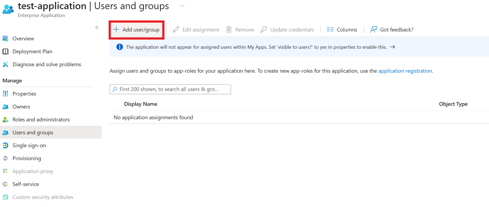
1. On the **Add Assignment** page, select one or more users and the role to be assigned to them. You can use a search bar to filter users (since only one app role was created in the screenshot, it is selected automatically, but the menu for selecting it is similar to how you select users). Only one role can be assigned at a time, so, to add multiple roles to the same user, you will need to go through this process several times.
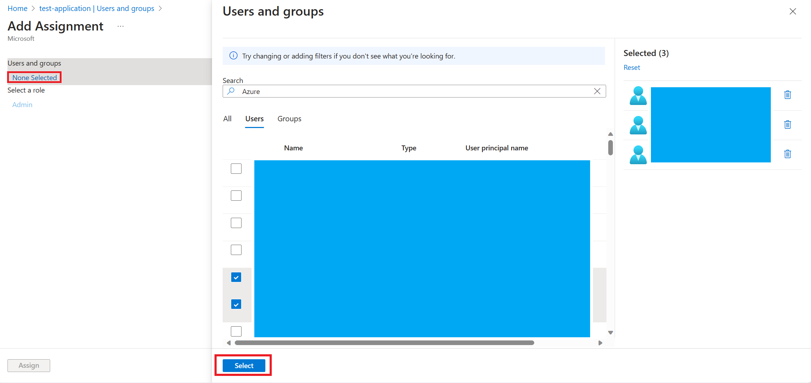
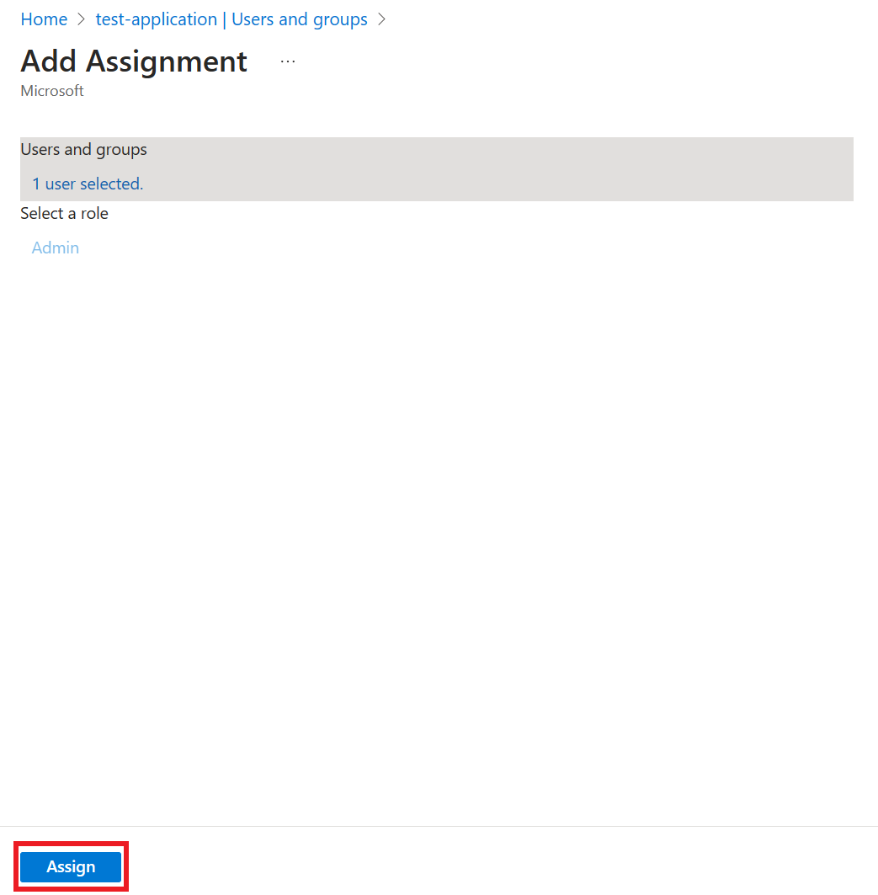
1. After the role is assigned, the user should show up on the **User and groups** page – please note that assigning multiple roles to a single user will result in several entries for that user - one entry per role.
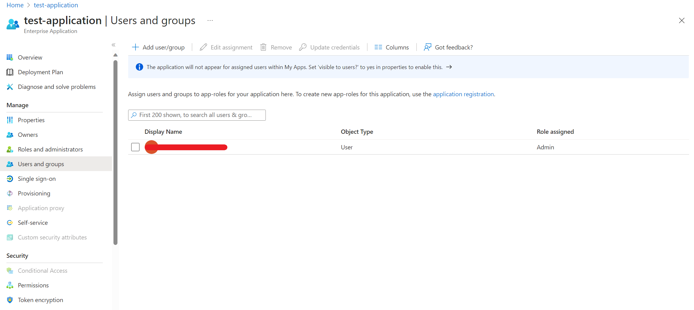
1. RECOMMENDED: If you only want to allow access to CycleCloud for users explicitly added to your App, go to the **Properties of the Enterprise Application** and set **Assignment Required** to **Yes** 
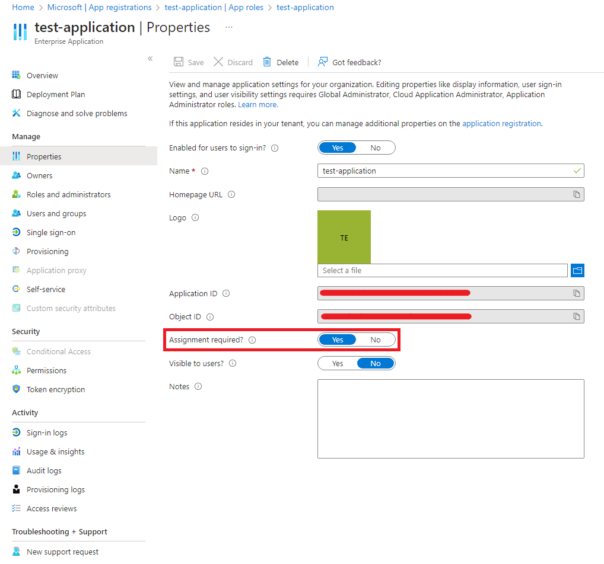