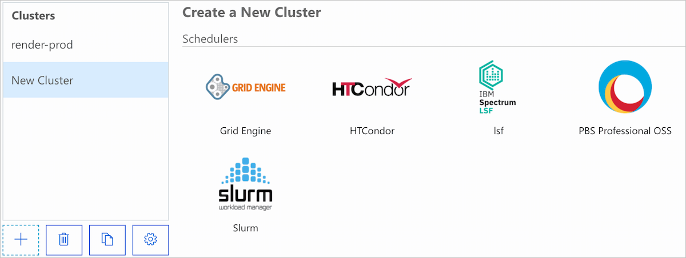
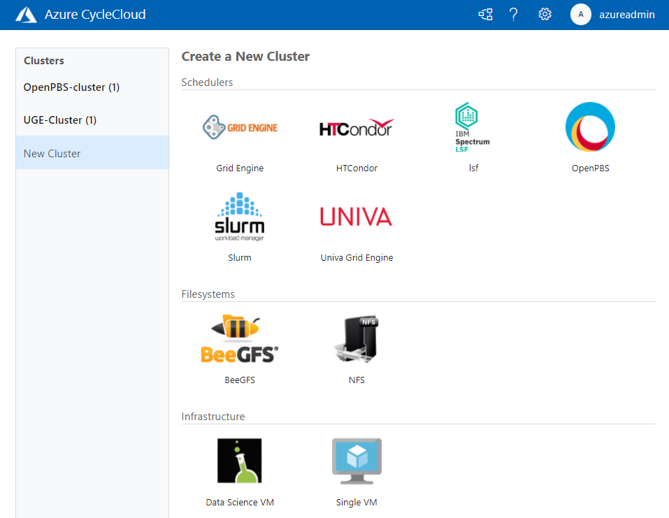
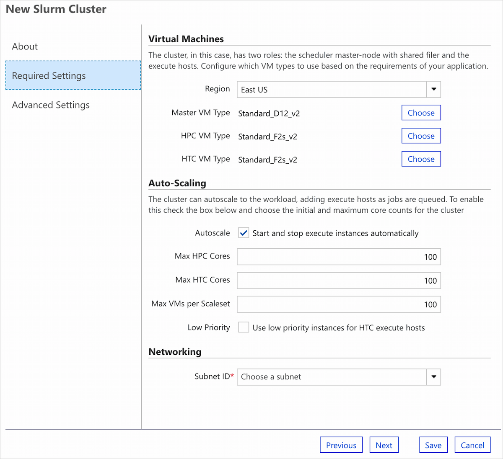
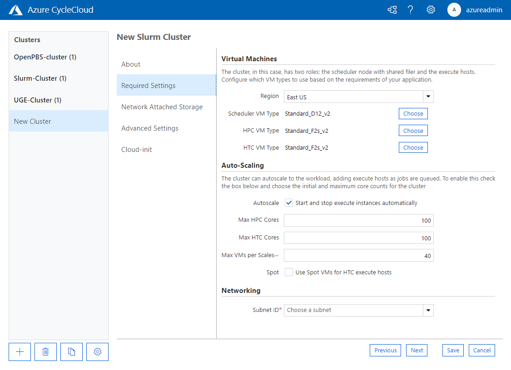
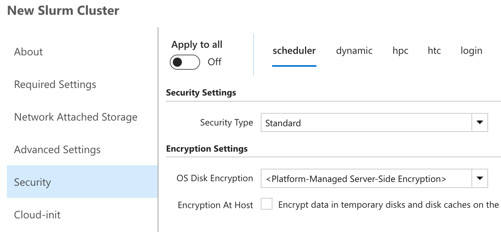
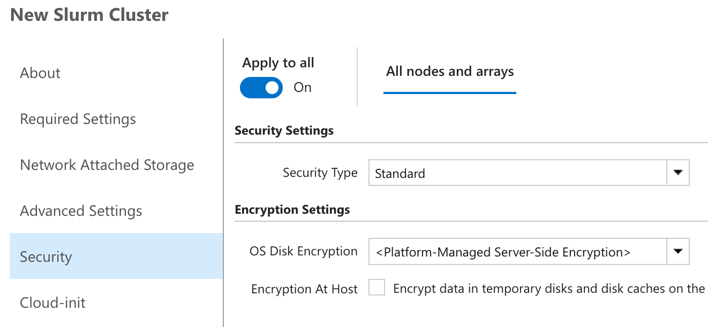

# Create a New Cluster

New clusters can be created through the CycleCloud CLI or a web browser. Clusters are created from [templates](../cluster-references/cluster-template-reference.md), which may be text files on disk or may have been imported into the CycleCloud application server.

This article shows you how to create a new cluster from an existing template. [Read more about CycleCloud cluster templates.](../how-to/cluster-templates.md)

## Using a Web Browser

Click the **Add** button located in the lower left of the clusters page. This will bring up a list of icons, each representing a cluster template from which the new cluster will be created. If you would like to import a new cluster template so that it shows up on this page, see [Importing a Cluster Template](#importing-a-cluster-template) below. Select one of the templates and enter a unique name for the new cluster.

::: moniker range="=cyclecloud-7"

::: moniker-end

::: moniker range="=cyclecloud-8"

::: moniker-end

Fill out the new cluster form and hit **Save** to create the new cluster. You can later change these values using **Edit** on the cluster page, though most changes require the cluster to be terminated first.

::: moniker range=">=cyclecloud-8"

The cluster form itself is based on two things: the [cluster parameters](../how-to/cluster-templates.md#cluster-template-parameters), which are grouped into sections, and automatic sections added by CycleCloud. 

::: moniker-end

### Cluster Parameters

The parameters in the form vary based on the cluster template, but below are some that are commonly required:

- **Region** determines the region of nodes in the cluster. Changing the region may also affect the types of VMs which are available as well as the capacity and quota.

- **Subnet ID** controls the virtual network and subnet in which nodes are started. New subnets may be created through the Azure Portal or CLI and will be automatically detected after a small amount of time.

- **Max Cores** limits the number of nodes which will be autoscaled based on the total number of running cores.

- **Credentials** are associated with a single subscription and may change the values of many of the other cluster options. For example, selecting credentials associated with Azure Government will limit the regions available.

- **Return Proxy** if checked, nodes will communicate back to the CycleCloud application server via a proxy running on the cluster head node. Select this option if direct network access to CycleCloud is blocked from the cluster nodes.

::: moniker range="=cyclecloud-7"

::: moniker-end

::: moniker range=">=cyclecloud-8"

::: moniker-end

::: moniker range=">=cyclecloud-8"

### Standard Cluster Sections

CycleCloud 8 adds standard cluster sections automatically to the **Create** and **Edit** form for every cluster, regardless of type. These are not specified in the cluster template itself, and cannot be imported or exported as parameters.

* CycleCloud 8.0+ includes a Cloud-init section
* CycleCloud 8.5+ includes a Security section

These sections let you edit certain settings for the node arrays and the standalone nodes defined in the cluster template. (It does not include nodes created from the node arrays, such as execute nodes.) 
The default for new clusters is to use the same values across all standalone nodes and node arrays, but there is an option to use different values for each.

**Separate settings for each standalone node and node array:**


**Shared settings used for all standalone nodes and node arrays:**


If the values happen to match across all standalone nodes and node arrays, then **Apply to all** is initially activated.

> [!WARNING]
> Toggling the **Apply to all** setting on and clicking Save will update all standalone nodes and node arrays with the new settings in the form!

::: moniker-end

## Using the CycleCloud CLI

There are two ways to create a cluster from the [CycleCloud CLI](../cli.md): From an imported template and from a template file on disk. In either case, you will need to provide any required cluster parameters as a JSON file.

The easiest way to generate a JSON file for use in the CLI is to create a cluster using your web browser and export its parameters via the `export_parameters` command. [Read more about cluster template parameters.](../how-to/cluster-templates.md#cluster-template-parameters)

To export parameters from a cluster named "existing-cluster", run:

``` CLI
cyclecloud export_parameters existing-cluster > params.json
```

### Creating a new cluster from an imported template

If the cluster template has already been imported into CycleCloud, you can run the `create_cluster` command to create a cluster. To create a new cluster named "new-cluster" from a template named "Example", run:

``` CLI
cyclecloud create_cluster Example new-cluster -p params.json
```

### Creating a new cluster from a template file

If the cluster template exists as a file on disk, you can run the `import_cluster` command to create a cluster. To create a new cluster from a template file named "example-template.txt", run:

``` CLI
cyclecloud import_cluster -f example-template.txt -p params.json
```

This will use the name of the cluster in the template file, but you can specify your own name as well. If the cluster in the file is named "Example", and you would like to create a new cluster named "new-cluster", run:

``` CLI
cyclecloud import_cluster new-cluster -c Example -f example-template.txt -p params.json
```

## Importing a Cluster Template

To create a cluster using a web browser or the `create_cluster` CLI command, you will need to import the template file into CycleCloud. The examples below will use the following template file, named *example-template.txt*:

``` ini
[cluster Example]

    [[node scheduler]]
    ImageName = OpenLogic:CentOS:7.5:latest
    Region = $Region
    MachineType = $MachineType
    SubnetId = $SubnetId
    Credentials = $Credentials

[parameters Settings]

    [[parameter Region]]
    Description = Deployment Location
    ParameterType = Cloud.Region
    DefaultValue = westus2

    [[parameter MachineType]]
    Label = VM Type
    ParameterType = Cloud.MachineType
    DefaultValue = Standard_D12_v2

    [[parameter SubnetId]]
    Label = Subnet ID
    ParameterType = Azure.Subnet
    Required = True

    [[parameter Credentials]]
    ParameterType = Cloud.Credentials
```

To import the "Example" template above, simply run the following command:

``` CLI
cyclecloud import_cluster -t -f example-template.txt
```

The template will now be available for creation using a web browser or the `create_cluster` CLI command. During import, you may also specify a name which is different from the one appearing in the file. To import the template with the name "Contoso" instead of "Example", run:

``` CLI
cyclecloud import_cluster "Contoso" -c Example -t -f ./example-template.txt
```

> [!NOTE]
> Various attributes inside the cluster template will affect how the template appears in the browser. For example, the icon displayed is specified by "IconUrl" and the heading above template uses the "Category" attribute. For a full list of the supported attributes, see [Build a New Cluster Template](~/cluster-references/cluster-reference.md).
