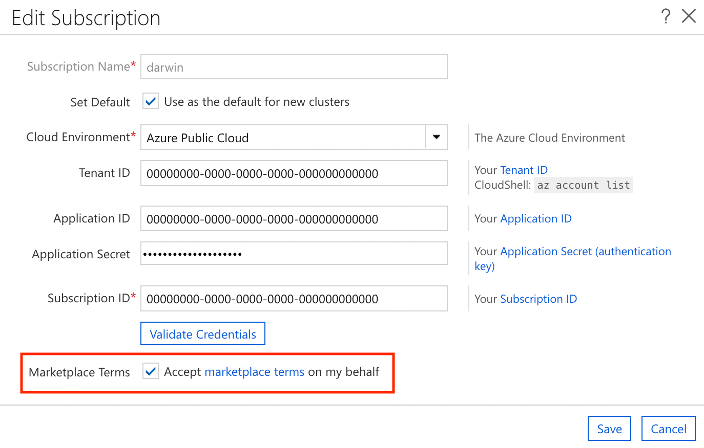

# Custom Images in a CycleCloud Cluster

An Azure CycleCloud installation uses recommended OS images for clusters by default, but the use of Azure Marketplace images, Gallery images (in preview) or custom images in nodes and nodearrays is also supported. Custom images are useful for preinstalled applications in a cluster, or to fulfill business or security requirements.

## Specify a Custom Image via the Cluster UI

Custom and marketplace images are supported in the cluster UI. Instead of selecting a built-in image, check the **Custom Image** box and specify the full _Resource ID_ or _URN_ for the image:


> [!NOTE]
> Customer Image is supported only in CycleCloud versions later than 7.7.0.

## Use a Custom Image in a CycleCloud Template

The `ImageName` attribute is used to specify that a cluster node should use a private Custom Azure image or a Marketplace image. This ID can be found for custom images in the Azure portal as the Resource ID for the image, and generally takes the form:

`/subscriptions/$SUBSCRIPTION-ID/resourceGroups/$RESOURCEGROUPNAME/providers/Microsoft.Compute/images/$CustomImageName`

``` ini
[[node custom]]

  ImageName = /subscriptions/xxxxxxxx-xxxx-xxxx-xxxxxxxxxxxx/resourceGroups/MyResourceGroup/providers/Microsoft.Compute/images/MyCustomImage
```

The URN or Resource ID defines the marketplace image to be used. The easiest way to retrieve URN or ID is through the [Azure CLI](/cli/azure/vm/image#az-vm-image-list).

You can also specify a Marketplace or Gallery image by using the URN:

``` ini
[[node marketplace]]

 ImageName = publisher:offer:sku:version
```

> [!NOTE]
> CycleCloud versions earlier than 7.7.0 [require a different notation](#custom-image-notation-prior-7-7-0).

### Use an Azure Marketplace Image with a Pricing Plan

You can use a Marketplace image with an associated pricing plan but the image must be enabled for programmatic use. To complete this process, locate the desired image in the Marketplace, click **Want to deploy programmatically**, then select **Get Started ->**, fill in the required information, and save your changes.

::: moniker range=">=cyclecloud-8"
To enable CycleCloud to automatically accept license terms on your behalf, enable the "Accept marketplace terms on my behalf" option on your subscription in the web interface:


::: moniker-end

To accept a license terms from the Azure CLI:

```azurecli-interactive
az vm image accept-terms --urn publisher:offer:sku:version
```

or

```azurecli-interactive
az vm image accept-terms --publisher PUBLISHER --offer OFFER --plan SKU
```

### Use a Shared Image Gallery image with a Pricing Plan

Starting with CycleCloud version 8.0.2, custom images derived from those with a pricing plan are supported. This functionality requires the use of a custom template:

``` ini
[[node custom_image]]

 ImageName = /subscriptions/xxxxxxxx-xxxx-xxxx-xxxxxxxxxxxx/resourceGroups/MyResourceGroup/providers/Microsoft.Compute/galleries/MyGallery/images/MyImage/versions/1.0.0
 ImagePlan.Publisher = PUBLISHER
 ImagePlan.Product = PRODUCT (sometimes called OFFER)
 ImagePlan.Name = NAME (sometimes called SKU)
```

If the Shared Image Gallery has the purchase-plan metadata on it, it's used automatically and you don't need to specify the plan details.

## Create a Custom Image

Custom Azure Images can be created by following [this tutorial.](/azure/virtual-machines/image-version-vm-cli#create-an-image-definition)

> [!NOTE]
> Generalized images have been recommended, as specialized images haven't undergone the process to remove machine-specific information and accounts, and they lack the osProfile required by CycleCloud.

<a name="custom-image-notation-prior-7-7-0"></a>
## Custom Images on CycleCloud versions earlier than 7.7.0

Custom and marketplace images are supported in CycleCloud versions earlier than 7.7.0 but they use a different notation. To use a custom image in a CycleCloud template earlier than version 7.7.0, the `ImageId` attribute is used to specify the custom Azure image. This ID can be found in the Azure portal as the Resource ID for the image, and generally takes the form:

`/subscriptions/$SUBSCRIPTION-ID/resourceGroups/$RESOURCEGROUPNAME/providers/Microsoft.Compute/images/$CustomImageName`

For CycleCloud versions earlier than 7.7.0, Marketplace images must be specified explicitly using their Publisher, Offer, SKU, and Version. Also, the `JetpackPlatform` attribute must be defined to ensure the correct Jetpack packages are installed. Accepted values for `JetpackPlatform` include `centos-6`,`centos-7`, `ubuntu-14.04`, `ubuntu-16.04`, and `windows`, and this should align with the operating system of the Azure Marketplace image. The `InstallJetpack` must also be set to true.

``` ini
[[node custom]]
  ImageId = /subscriptions/xxxxxxxx-xxxx-xxxx-xxxxxxxxxxxx/resourceGroups/MyResourceGroup/providers/Microsoft.Compute/images/MyCustomImage
  InstallJetpack = true

[[node marketplace]]
  Azure.Publisher = OpenLogic
  Azure.Offer = CentOS-HPC
  Azure.Sku = 7.4
  Azure.ImageVersion = 7.4.20180301

  # Azure CycleCloud < 7.7.0 jetpack selection attributes
  InstallJetpack = true
  JetpackPlatform = centos-7
```
