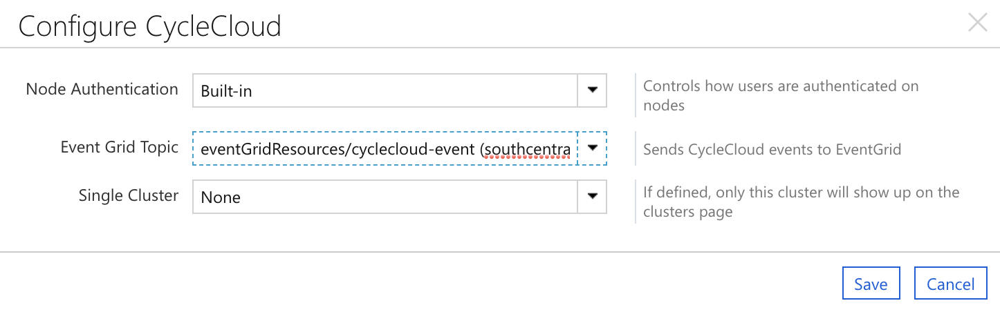

# Using Event Grid

CycleCloud can send cluster and node [events](../events.md) to [Azure Event Grid](/azure/event-grid/). Event Grid accepts events from a producer (in this case CycleCloud) and routes them to one or more destinations. In this document we will be using [Azure Storage Queues](/azure/storage/queues/) as a destination.

First, create a custom Event Grid topic and subscription as outlined in the [Event Grid quickstart](/azure/event-grid/custom-event-to-queue-storage).

Second, configure CycleCloud to publish to the Event Grid topic created above. Click the **Settings** gear icon in the upper left, then double-click the **CycleCloud** item in the list. Select the Event Grid topic from the dropdown and click *Save*.



Third, add a node to the cluster. This will immediately generate two events: a `Microsoft.CycleCloud.ClusterSizeIncreased` event and a `Microsoft.CycleCloud.NodeAdded` event.

Finally, create the script that will process events from the queue. In this case we will be using the [Python 3 SDK](/azure/storage/queues/storage-python-how-to-use-queue-storage?tabs=python).

Create a file named `get_messages.py`:

```python
from azure.storage.queue import QueueClient, TextBase64DecodePolicy
import json, sys, time

connect_str = sys.argv[1]
queue_name = sys.argv[2]

queue_client = QueueClient.from_connection_string(connect_str, queue_name, message_decode_policy=TextBase64DecodePolicy())

while True:
    messages = queue_client.receive_messages(timeout=60, visibility_timeout=5, messages_per_page=32)
    for msg_batch in messages.by_page():
        for msg in msg_batch:
            message_body = json.loads(msg.content)
            data = message_body["data"]

            print("%s %s %s" % (message_body["eventType"], data.get("status"), data.get("message")))
            queue_client.delete_message(msg.id, msg.pop_receipt)
    time.sleep(1)
```

Then invoke this with the information for the queue created above:

```bash
python3 get_messages.py "DefaultEndpointsProtocol=https;AccountName=ACCOUNTNAME;AccountKey=ACCOUNTKEY;EndpointSuffix=core.windows.net" QUEUE_NAME
```

This will pull events from the queue and print out their contents. The process runs until manually ended.

> [!NOTE]
> There are many more properties on events. See the [Events](../events.md) page for more information.
