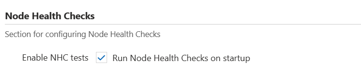
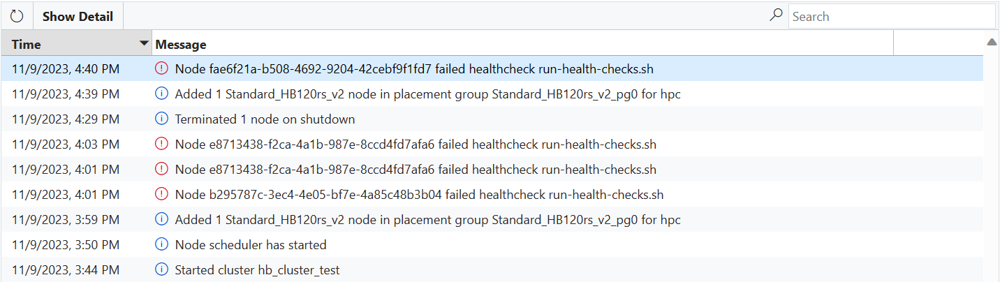
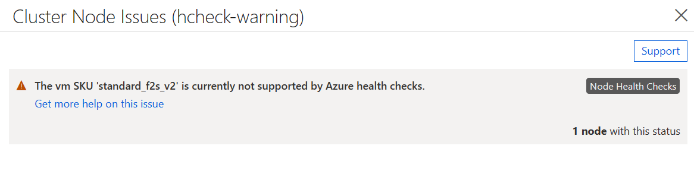

# Health Checks
 
CycleCloud offers two mechanisms for checking the health of VMs: Node Health Checks is newer feature that performs the checks during the provisioning stage and prevents the unhealthy VMs from joining, while HealthCheck runs them periodically after the VM has joined the cluster as a node. 
 
## Node Health Checks
 
Node Health Checks can detect unhealthy hardware before a VM is allowed to join CycleCloud cluster. The current version of this feature will run health check scripts built into the official AzureHPC images that can be found under _/opt/azurehpc/test/azurehpc-health-checks/_. The source for these scripts is located in the [AzureHPC Node Health Checks repository](https://github.com/Azure/azurehpc-health-checks/tree/main), but please note that the version built into your cluster's version of the AzureHPC image may not be the latest one available in the repository.
 
### Requirements
 
The current version of Node Health Checks only supports AzureHPC images released after November 7th, 2023 (containing azurehpc-health-checks version v2.0.6 or greater) and custom images derived from them.
Node Health Checks is currently unsupported in Windows.
 
### Enabling Node Health Checks for Slurm Clusters
 
The Slurm cluster creation form offers a checkbox to enable Node Health Checks located under the **Advanced Settings** tab. Checking the box enables Node Health Checks on the HPC node array of the cluster. If you want to enable Node Health Checks on other node arrays (or for other cluster types), you must use a custom cluster template.
 
Node Health Checks can be disabled on a running cluster by simply unchecking the box. There is no need to scale the node array down for the changes to take effect.
 

 
### Understanding Node Health Checks results
 
After a VM passes health checks, it will move on to the software configuration phase.
 
If a VM fails any of the health check scripts, then an error message will be sent to CycleCloud and the VM will be automatically prevented from joining the cluster.


 
If the VM is started in a NodeArray with over-provisioning enabled (ex. the Slurm hpc Node Array) then the VM should be replaced automatically as part of over-provisioning. In that case, there is no action required and the healthy VMs will be selected to join the cluster (though you will see an error message on your cluster page indicating that one or more VMs failed checks).
 
If the VM is started for a single Node, a Node Array with over-provisioning disabled (ex. the Slurm htc Node Array), or if more VMs fail health checks than are supported by over-provisioning, then the Node will move to the Failed state and allocation will fail. CycleCloud may attempt to re-image the VM to correct the problem, but if the re-image fails then the node will need to be terminated and replaced (manually by an admin or automatically by the autoscaler).
 
> [!NOTE]
> If you have enabled Node Health Checks, but the VM image does not meet the requirements above, then all the VMs will be allowed to join the cluster, but the status will contain a warning indicating that checks are unsupported.
> 
 
## Attribute Reference
 
Attribute | Type | Definition
------ | ----- | ----------
EnableNodeHealthChecks | Boolean | (Optional) Enable on-boot Node Health Checks for this Node or Node Array

## HealthCheck

Azure CycleCloud provides a mechanism for terminating virtual machines (VMs) that are in an unhealthy state called HealthCheck. Both system and user defined scripts (Python and Bash) are run on a periodic basis (5 minutes on Windows, 10 minutes on Linux) to determine the overall health of a VM. HealthCheck allows administrators to define conditions under which VMs should be terminated without having to manually monitor and remediate.

### Built in HealthCheck scripts

CycleCloud enabled VMs come with two default HealthCheck scripts:

* The **converge_timeout** script will terminate an instance that has not finished software configuration within four hours of launch. This timeout period can be controlled with the `cyclecloud.keepalive.timeout` setting (defined in seconds).
* The **scheduled_shutdown** script looks for maker files in _$JETPACK_HOME/run/scheduled_shutdown_ which contain a single line giving a shutdown time in [Unix timestamp seconds](https://en.wikipedia.org/wiki/Unix_time) and an optional second line with an explanation. When the current time is later than the earliest timestamp in the files, the VM is considered unhealthy.

### How it works

The HealthCheck scripts are located in the _$JETPACK_HOME/config/healthcheck.d_ directory. Linux supports both Python and Bash scripts, while Windows supports only Python scripts. The script should determine the health of the VM. If the VM is found to be unhealthy the script should exit with a status of `254`, which indicates to CycleCloud that the VM is unhealthy and should be terminated.

When logged onto a VM that is running HealthCheck you can keep the VM from being shutdown by running the command [jetpack keepalive](../jetpack.md#jetpack-keepalive). On Linux instances you can specify a timeframe in hours or `forever` while on Windows `forever` is the only option.

> [!NOTE]
> When a VM is determined to be unhealthy, the HealthCheck agent will make a request for CycleCloud to terminate the VM, the VM will never be shutdown locally via `shutdown` command. In the event that the VM is unable to communicate with CycleCloud, the VM will stay up even though it is unhealthy until a time at which CycleCloud can be reached.

### Example

As a simple example we will write a HealthCheck script which will ensure that a Linux VM is not active for more than 24 hours. This script could be used to simulate low priority evictions to test how a workflow reacts to an evicted VM. This script would be placed in _/opt/cycle/jetpack/config/healthcheck.d/healthcheck_example.sh_

```bash
#!/bin/bash

# Get the uptime of the system (in seconds) and check to see if it is
# greater than 86,400 (24 hours in seconds). If it is, exit 254 to
# signal that the VM is unhealthy.
if (( $(cat /proc/uptime | awk '{print ($1 > 86400)}'))); then
  exit 254
fi
```

> [!NOTE]
> This script can be placed on a VM via [CycleCloud Project](~/how-to/projects.md) or by adding it directly when [Creating a Custom Image](create-custom-image.md).
