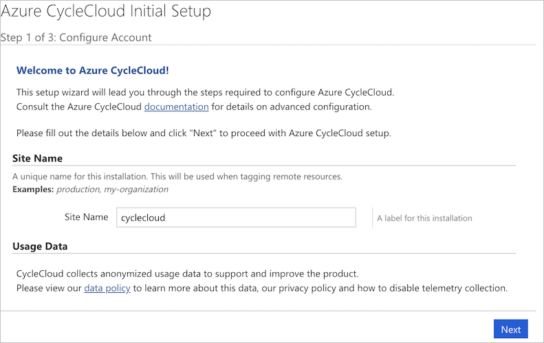

# Manual Installation

Azure CycleCloud can be installed using an [ARM template](~/how-to/install-arm.md), via [Azure Marketplace](~/qs-install-marketplace.md) or using a container in the [Azure Container Registry](~/how-to/run-in-container.md). We recommend installing using the Azure Marketplace image, but for some production situations it may be useful to manually install CycleCloud as outlined below.

> [!NOTE]
> The CycleCloud product encompasses many pieces, including node configuration software known as [Jetpack](~/jetpack.md), and a installable webserver platform called CycleServer. Because of this, you will find CycleServer referenced in many commands and directory names on the machine where the CycleCloud server is installed.

## System Requirements

To install CycleCloud, you must have administrator (root) rights. In addition, your system needs to meet the following minimum requirements:

* A 64-bit Linux distribution
* Java Runtime Environment (version 8)
* At least 8GB of RAM (16GB recommended)
* Four or more CPU cores
* At least 250GB of free disk space

> [!NOTE]
> CycleCloud may be installed on physical or virtualized hardware.

## SSH Key

The default SSH key used in CycleCloud is */opt/cycle_server/.ssh/cyclecloud.pem*. If this does not already exist, it will be automatically generated upon startup (or restart) of CycleCloud.

## Installation

### Installing on Debian or Ubuntu

First, install `wget` and `gnupg2` if its not already installed. This will be used to fetch, and install, the Microsoft signing key.

```CMD
sudo apt update && sudo apt -y install wget gnupg2
```

Next, download the Microsoft signing key and add to Apt's trusted keyring

```CMD
wget -qO - https://packages.microsoft.com/keys/microsoft.asc | sudo apt-key add -
```

Finally, configure a _cyclecloud.list_ file, update the Apt cache, and install CycleCloud.

::: moniker range="<=cyclecloud-7"
```CMD
sudo echo 'deb https://packages.microsoft.com/repos/cyclecloud bionic main' > /etc/apt/sources.list.d/cyclecloud.list
sudo apt update
sudo apt -y install cyclecloud
```
::: moniker-end
::: moniker range="=cyclecloud-8"
```CMD
sudo echo 'deb https://packages.microsoft.com/repos/cyclecloud bionic main' > /etc/apt/sources.list.d/cyclecloud.list
sudo apt update
sudo apt -y install cyclecloud8
```
::: moniker-end

> [!NOTE]
> Although the Apt repository is published for the "bionic" release of Ubuntu, CycleCloud is officially supported on all Ubuntu LTS releases under support by Canonical.

### Installing on Enterprise Linux (RHEL) clones

First, configure a _cyclecloud.repo_ file.

```CMD
sudo cat > /etc/yum.repos.d/cyclecloud.repo <<EOF
[cyclecloud]
name=cyclecloud
baseurl=https://packages.microsoft.com/yumrepos/cyclecloud
gpgcheck=1
gpgkey=https://packages.microsoft.com/keys/microsoft.asc
EOF
```

Finally, install cyclecloud with `yum` or `dnf`.

::: moniker range="<=cyclecloud-7"
```CMD
sudo yum -y install cyclecloud
```
::: moniker-end
::: moniker range="=cyclecloud-8"
```CMD
sudo yum -y install cyclecloud8
```
::: moniker-end

::: moniker range="<=cyclecloud-7"
### Installing from the Microsoft Download center

Download the [Azure CycleCloud install file](https://www.microsoft.com/download/details.aspx?id=57182) from the Microsoft Download Center and install using a package manager.

For the .rpm install file:

```CMD
yum install <filename.rpm>
```

For the .deb install file:

```CMD
dpkg -i <filename.deb>
```

> [!NOTE]
>You must have write permission to the _/opt_ directory. The CycleCloud installer will create a `cycle_server` user and unix group, install into the _/opt/cycle_server_ directory by default, and assign `cycle_server:cycle_server` ownership to the directory.

Once the installer has finished running, you will be provided a link to complete the installation from your browser. Copy the link provided into your web browser and follow the configuration steps.
::: moniker-end

### Insider Builds

CycleCloud insider builds are available for pre-release feature testing. Insider builds may contain unresolved issues.

Enterprise Linux (RHEL) insider builds are located at: [https://packages.microsoft.com/yumrepos/cyclecloud-insiders/](https://packages.microsoft.com/yumrepos/cyclecloud-insiders/)

Debian/Ubuntu insider builds are located at: [https://packages.microsoft.com/repos/cyclecloud-insiders/pool/main/c/cyclecloud8/](https://packages.microsoft.com/repos/cyclecloud-insiders/pool/main/c/cyclecloud8/)

### Notes on Security

The default installation of CycleCloud uses non-encrypted HTTP running on port 8080. We strongly recommend [configuring SSL](ssl-configuration.md) for all installations.

Do not install CycleCloud on a shared drive, or any drive in which non-admin users have access. Anyone with access to the CycleCloud group will gain access to non-encrypted data. We recommend that non-admin users not be added to this group.

> [!NOTE]
> The default CycleCloud configuration may be customized for specific environments using settings in the $CS_HOME/config/cycle_server.properties file.

## Configuration

Once installed, you can configure CycleCloud through your web browser. The login screen will load after the webserver has fully initialized, which can take several minutes.

### Step 1: Welcome

::: moniker range="=cyclecloud-7"

::: moniker-end

::: moniker range=">=cyclecloud-8"

::: moniker-end

Enter a **Site Name** then click **Next**.

### Step 2: License Agreement

::: moniker range="=cyclecloud-7"

::: moniker-end

::: moniker range=">=cyclecloud-8"

::: moniker-end

Accept the license agreement and then click **Next**.

### Step 3: Administrator Account

::: moniker range="=cyclecloud-7"

::: moniker-end

::: moniker range=">=cyclecloud-8"

::: moniker-end


You will now set up the local administrator account for CycleCloud. This account is used to administer the CycleCloud application - it is NOT an operating system account. Enter a **User ID**, **Name** and **Password**, then click **Done** to continue.

> [!NOTE]
> All CycleCloud account passwords must be between 8 and 123 characters long, and meet at least 3 of the following 4 conditions:
> * Contain at least one upper case letter
> * Contain at least one lower case letter
> * Contain at least one number
> * Contain at least one special character: @ # $ % ^ & * - _ ! + = [ ] { } | \ : ' , . ?

### Step 4: Set Your SSH Key

Once you have set up your administrator account, you can set your SSH public key so that you can easily access any Linux machines started by CycleCloud. To set your SSH public key, go to **My Profile** under the user menu in the top right and choose **Edit Profile**. [Learn about creating SSH keys here.](/azure/virtual-machines/linux/mac-create-ssh-keys)

## Update CycleCloud

See the [Update Azure CycleCloud](~/how-to/upgrade-and-migrate.md) page.
