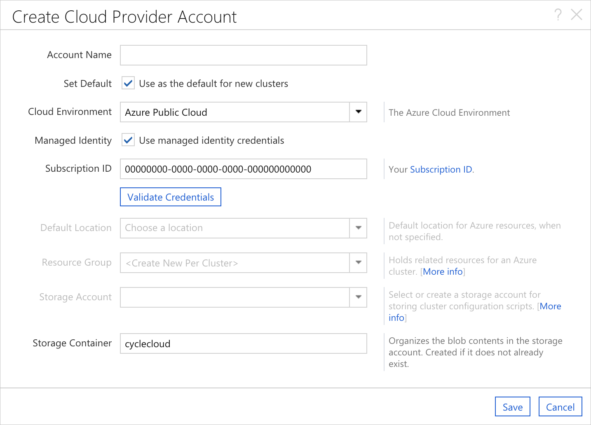

# Using Managed Identities

Azure AD Managed Identities may be used to permission Azure CycleCloud to manage clusters in your subscription (as an alternative to using a [Service Principal](service-principals.md)).  They may also be assigned to CycleCloud VMs to provide access to Azure resources (such as Storage, Key Vault, or Azure Container Registries).

## CycleCloud VM Permissions with Managed Identity

CycleCloud automates many calls to the Azure Resource Manager for the purposes of managing HPC clusters. This automation requires certain permissions to be granted to CycleCloud.   This access may be granted to CycleCloud by configuring a Service Principal or by assigning a [Managed Identity](/azure/active-directory/managed-identities-azure-resources/overview) to the CycleCloud VM.  

It is generally recommended to use either a [System-Assigned](/azure/active-directory/managed-identities-azure-resources/qs-configure-portal-windows-vm#system-assigned-managed-identity) or [User-Assigned Managed Identity](/azure/active-directory/managed-identities-azure-resources/qs-configure-portal-windows-vm#user-assigned-managed-identity) to grant those permissions rather than a Service Principal. 

When Azure CycleCloud has been installed on an Azure VM with a Managed Identity assigned to it, the **Create Cloud Provider Account** dialog will behave slightly differently. There will be a new checkbox for **Managed Identity** and the **Subscription ID** will be pre-populated with the subscription of the host VM.

::: moniker range="=cyclecloud-7"

::: moniker-end

::: moniker range=">=cyclecloud-8"

::: moniker-end

It is still possible to enter the standard set of credentials by simply unchecking the **Managed Identity** checkbox. Upon doing so, the standard fields will be added to the form. Additionally, it is perfectly acceptable to use a separate **Subscription ID**; the provided value is just for convenience.

### Create a custom role and managed identity for CycleCloud

The simplest option (with sufficient access rights) is to assign the Contributor Role for the Subscription to the CycleCloud VM as a System-Assigned Managed Identity.  However, the Contributor Role has a higher privilege level than CycleCloud requires.  A [custom Role](/azure/role-based-access-control/custom-roles) may be created and assigned to the VM.

A sufficient policy for most CycleCloud features is posted below.

```json
{
    "assignableScopes": [
      "/"
    ],
    "description": "CycleCloud Orchestrator Role",
    "permissions": [
      {
        "actions": [
          "Microsoft.Commerce/RateCard/read",
          "Microsoft.Compute/*/read",
          "Microsoft.Compute/availabilitySets/*",
          "Microsoft.Compute/disks/*",
          "Microsoft.Compute/images/read",
          "Microsoft.Compute/locations/usages/read",
          "Microsoft.Compute/register/action",
          "Microsoft.Compute/skus/read",
          "Microsoft.Compute/virtualMachines/*",
          "Microsoft.Compute/virtualMachineScaleSets/*",
          "Microsoft.Compute/virtualMachineScaleSets/virtualMachines/*",
          "Microsoft.ManagedIdentity/userAssignedIdentities/*/assign/action",
          "Microsoft.Network/*/read",
          "Microsoft.Network/locations/*/read",
          "Microsoft.Network/networkInterfaces/read",
          "Microsoft.Network/networkInterfaces/write",
          "Microsoft.Network/networkInterfaces/delete",
          "Microsoft.Network/networkInterfaces/join/action",
          "Microsoft.Network/networkSecurityGroups/read",
          "Microsoft.Network/networkSecurityGroups/write",
          "Microsoft.Network/networkSecurityGroups/delete",
          "Microsoft.Network/networkSecurityGroups/join/action",
          "Microsoft.Network/publicIPAddresses/read",
          "Microsoft.Network/publicIPAddresses/write",
          "Microsoft.Network/publicIPAddresses/delete",
          "Microsoft.Network/publicIPAddresses/join/action",
          "Microsoft.Network/register/action",
          "Microsoft.Network/virtualNetworks/read",
          "Microsoft.Network/virtualNetworks/subnets/read",
          "Microsoft.Network/virtualNetworks/subnets/join/action",
          "Microsoft.Resources/deployments/read",
          "Microsoft.Resources/subscriptions/resourceGroups/read",
          "Microsoft.Resources/subscriptions/resourceGroups/resources/read",
          "Microsoft.Resources/subscriptions/operationresults/read",
          "Microsoft.Storage/*/read",
          "Microsoft.Storage/checknameavailability/read",
          "Microsoft.Storage/register/action",
          "Microsoft.Storage/storageAccounts/read",
          "Microsoft.Storage/storageAccounts/listKeys/action",
          "Microsoft.Storage/storageAccounts/write"
        ],
        "dataActions": [],
        "notActions": [],
        "notDataActions": []
      }
    ],
    "Name": "CycleCloud",
    "roleType": "CustomRole",
    "type": "Microsoft.Authorization/roleDefinitions"
}
```

> [!IMPORTANT]
> The use of a custom role requires an Azure AD Premium P1 license. To find the right license for your requirements, see [Comparing generally available features of the Free, Basic, and Premium editions.](https://azure.microsoft.com/pricing/details/active-directory/)

#### Optional Permissions

To enable CycleCloud to assign Managed Identities to VMs it creates within clusters, add the following ``"actions"``:

```json
          "Microsoft.Authorization/*/read",
          "Microsoft.Authorization/roleAssignments/*",
          "Microsoft.Authorization/roleDefinitions/*",
```

To enable CycleCloud to create and manage Resource Groups per cluster (recommended, if allowed by policy), add the following ``"actions"``:
```json
          "Microsoft.Resources/subscriptions/resourceGroups/read",
          "Microsoft.Resources/subscriptions/resourceGroups/write",
          "Microsoft.Resources/subscriptions/resourceGroups/delete",
```

#### Creating the Role

A role can be created from the role definitions via the [Azure CLI](/azure/active-directory/managed-identities-azure-resources/how-to-manage-ua-identity-cli)
.  Use this role to create a role definition within the Azure Tenant. Once the
role exists in the tenant, assign the role to an identity with proper scope.

Below is the basic flow using the Azure CLI.

``` azurecli-interactive
# Create a custom role definition
az role definition create --role-definition role.json
# Create user identity
az identity create --name <name>
# Assign the custom role to the identity with proper scope
az role assignment create --role <CycleCloudRole> --assignee-object-id <identity-id> --scope <subscription>
```

Now the custom role is assigned and scoped to the identity and can be used with a VM.

## Assigning Roles to Cluster VMs with Managed Identity

It is common for cluster nodes to require access to Azure Resources.   For example, many clusters require access to Azure Storage, Key Vault, or Azure Container Registries to run their workload.  It is strongly recommended to pass the access credentials required using a [User-Assigned Managed Identity](/azure/active-directory/managed-identities-azure-resources/qs-configure-portal-windows-vm#user-assigned-managed-identity) rather than passing secrets/credentials to the node via cluster configuration.

User-Assigned Managed Identities may be configured on the cluster VMs using the ```Azure.Identities``` node property.  The value of the ```Azure.Identities``` property is a comma-separated list of Managed Identity Resource ID strings:

``` ini
[cluster sample]
...
    [[node defaults]]
    ...
    Azure.Identities = $ManagedServiceIdentity
...

[parameters Required Settings]
...
  [[parameter ManagedServiceIdentity]]
  ParameterType = Azure.ManagedIdentity
  Label = MSI Identity
  Description = The resource ID of the Managed Service Identity to apply to the nodes
...
```

