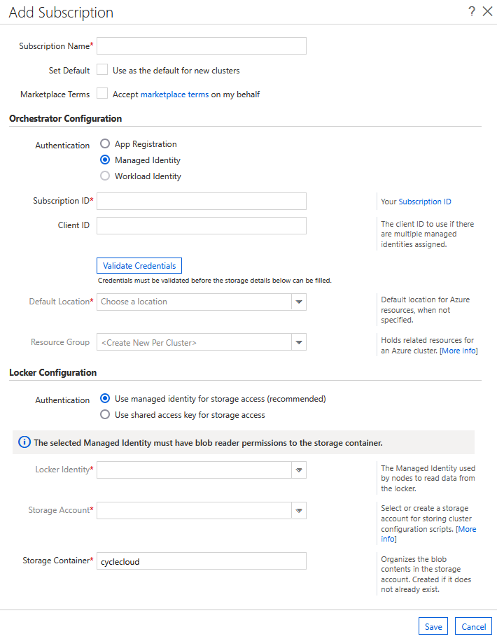

# Using Managed Identities

Azure AD Managed Identities may be used to permission Azure CycleCloud to manage clusters in your subscription (as an alternative to using a [Service Principal](service-principals.md)).  They may also be assigned to CycleCloud VMs to provide access to Azure resources (such as Storage, Key Vault, or Azure Container Registries).

## CycleCloud VM Permissions with Managed Identity

CycleCloud automates many calls to the Azure Resource Manager for the purposes of managing HPC clusters. This automation requires certain permissions to be granted to CycleCloud.   This access may be granted to CycleCloud by configuring a Service Principal or by assigning a [Managed Identity](/azure/active-directory/managed-identities-azure-resources/overview) to the CycleCloud VM.  

It is generally recommended to use either a [System-Assigned](/azure/active-directory/managed-identities-azure-resources/qs-configure-portal-windows-vm#system-assigned-managed-identity) or [User-Assigned Managed Identity](/azure/active-directory/managed-identities-azure-resources/qs-configure-portal-windows-vm#user-assigned-managed-identity) to grant those permissions rather than a Service Principal. 

When Azure CycleCloud has been installed on an Azure VM with a Managed Identity assigned to it, the **Add Subscription** dialog will behave slightly differently. The **Managed Identity** authentication option will be enabled and pre-selected, and the **Subscription ID** will be pre-populated with the subscription of the host VM.

::: moniker range="=cyclecloud-7"

::: moniker-end

::: moniker range=">=cyclecloud-8"

::: moniker-end

It is still possible to enter the standard set of credentials by simply selecting the **App Registration** authentication option. Upon doing so, the standard fields will be added to the form. Additionally, it is perfectly acceptable to use a separate **Subscription ID**; the provided value is just for convenience.

When using a System Assigned Managed Identity, the ClientID field can be left blank. However, when using CycleCloud with a User-Assigned Managed Identity, the ClientID should be set to the ClientID of the specific Managed Identity intended for cluster orchestration.

### Storage Locker Access

In addition to using a Managed Identity for cluster orchestration on the CycleCloud VM, CycleCloud can also be configured to assign a User-Assigned Managed Identity to clusters for Storage Account / Locker access from cluster nodes rather than using SAS tokens derived from the Storage Account's Shared Access Key.

To configure clusters to use a User-Assigned Managed Identity rather than the Shared Access Key, we recommend creating a dedicated User-Assigned Managed Identity with Storage Blob Data Reader access at the Storage Account scope. First, create the Storage Account and User-Assigned Managed Identity in your Azure Subscription. Then in the Storage Locker Configuration section of the "Add Subscription" dialog, select the new Managed Identity from the Locker Identity dropdown and the Storage Account from the Storage Account dropdown.

### Create a custom role and managed identity for CycleCloud

The simplest option (with sufficient access rights) is to assign the `Contributor` and `Storage Blob Data Contributor` roles for the Subscription to the CycleCloud VM as a System-Assigned Managed Identity.  However, the `Contributor` Role has a higher privilege level than CycleCloud requires.  A [custom Role](/azure/role-based-access-control/custom-roles) may be created and assigned to the VM. Similarly, the `Storage Blob Data Contributor` Role may be assigned at the Storage Account scope rather than subscription scope if the Storage Account has already been created.

This role covers all CycleCloud features:

:::code language="json" source="../includes/custom-role.json":::

Make sure to replace `<SubscriptionId>` with your subscription id. This role is scoped to a subscription, but it can be scoped to a single resource group if preferred. Note also that the name must be unique to the tenant.

> [!IMPORTANT]
> The use of a custom role requires an Microsoft Entra ID P1 license. To find the right license for your requirements, see [Microsoft Entra plans and pricing](https://azure.microsoft.com/pricing/details/active-directory/).

#### Optional Permissions

If you are scoping CycleCloud to use a single resource group per cluster, you can remove the following from `actions`:

```json
          "Microsoft.Resources/subscriptions/resourceGroups/write",
          "Microsoft.Resources/subscriptions/resourceGroups/delete",
```

If you are not using CycleCloud to assign Managed Identities to VMs it creates within clusters, you can remove the following from `actions`:

```json
          "Microsoft.Authorization/*/read",
          "Microsoft.Authorization/roleAssignments/*",
          "Microsoft.Authorization/roleDefinitions/*",
```

> [!WARNING]
> Future versions of CycleCloud will require the ability to assign Managed Identities to VMs, so removing these permissions is not recommended.

#### Creating the Role

A role can be created from the role definitions via the [Azure CLI](/azure/active-directory/managed-identities-azure-resources/how-to-manage-ua-identity-cli)
.  Use this role to create a role definition within the Azure Tenant. Once the
role exists in the tenant, assign the role to an identity with proper scope.

Below is the basic flow using the Azure CLI.

``` azurecli-interactive
# Create a custom role definition
az role definition create --role-definition role.json
# Create user identity
az identity create --name <name>
# Assign the custom role to the identity with proper scope
az role assignment create --role <CycleCloudRole> --assignee-object-id <identity-id> --scope <subscription>
```

Now the custom role is assigned and scoped to the identity and can be used with a VM.

## Assigning Roles to Cluster VMs with Managed Identity

It is common for cluster nodes to require access to Azure Resources.   For example, many clusters require access to Azure Storage, Key Vault, or Azure Container Registries to run their workload.  It is strongly recommended to pass the access credentials required using a [User-Assigned Managed Identity](/azure/active-directory/managed-identities-azure-resources/qs-configure-portal-windows-vm#user-assigned-managed-identity) rather than passing secrets/credentials to the node via cluster configuration.

User-Assigned Managed Identities may be configured on the cluster VMs using the ```Azure.Identities``` node property.  The value of the ```Azure.Identities``` property is a comma-separated list of Managed Identity Resource ID strings:

``` ini
[cluster sample]
...
    [[node defaults]]
    ...
    Azure.Identities = $ManagedServiceIdentity
...

[parameters Required Settings]
...
  [[parameter ManagedServiceIdentity]]
  ParameterType = Azure.ManagedIdentity
  Label = MSI Identity
  Description = The resource ID of the Managed Service Identity to apply to the nodes
...
```

