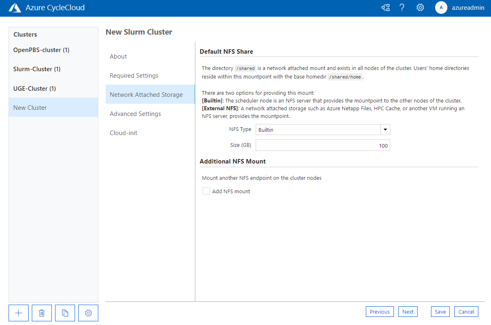

# Configure NFS mounts

Azure CycleCloud provides built-in support for mounting a simple Network File System (NFS).
CycleCloud can manage the NFS as a resource, or the NFS can be an external resource.

::: moniker range=">=cyclecloud-8"
## Default Templates - Network Attached Storage Settings

The default cluster templates for each scheduler include a section for configuring NFS options when creating a cluster.



The `/shared/` directory for each cluster is an NFS share by default. The `NFS Type` dropdown in this configuration section provides options for this NFS share to be either exported from the cluster headnode (the `Builtin` option), or mounted from an NFS server. 

If you select `Builtin`, you create the NFS share on an Azure Managed Disk ([Standard SSD](/azure/virtual-machines/disks-types#standard-ssd)) mounted onto the headnode of the cluster. Use the `Size` option to specify the size of the provisioned disk.

If you specify the `External NFS` option, you see extra fields where you can enter the IP address or hostname of the NFS server and other NFS mount options. Use the `External NFS` option to mount endpoints such as [NFS on Azure Files Storage](/azure/storage/files/storage-files-quick-create-use-linux), [Azure HPC Cache](/azure/hpc-cache/hpc-cache-overview), [Azure NetApp Files](/azure/azure-netapp-files/azure-netapp-files-introduction), or [NFS on Azure Blob Storage](/azure/storage/blobs/network-file-system-protocol-support).


If you need another NFS mount point, such as a `/data` resource for all users, select the `Add NFS Mount` option. You see extra fields where you can add another mount.


::: moniker-end

## Mount an NFS filesystem

To mount an existing NFS filesystem, use the following code:

``` ini
[[[configuration cyclecloud.mounts.nfs_data]]]
type = nfs
mountpoint = /mnt/exports/nfs_data
export_path = /mnt/exports/data
```

The `export_path` is the path on the server. The `mountpoint` is the path where you mount the share on the client. You can export the mounted NFS filesystem from a node in the same CycleCloud cluster, a node in another CycleCloud cluster, or a separate NFS filesystem that allows simple mounts. If a node in the local cluster exports the filesystem, CycleCloud uses search to discover the address automatically. If a node in a different CycleCloud cluster exports the filesystem, you can specify the `cluster_name` attribute in the mount configuration to instruct CycleCloud to search the cluster with that name:

``` ini
[[[configuration cyclecloud.mounts.other_cluster_fs]]]
type = nfs
mountpoint = /mnt/exports/other_cluster_fs
export_path = /mnt/exports/data
cluster_name = filesystem_cluster
```

To specify the location of the filesystem explicitly (required for mounting non-CycleCloud filesystems), add the `address` attribute with the hostname or IP of the filesystem in the mount configuration:

``` ini
[[[configuration cyclecloud.mounts.external_filer]]]
type = nfs
mountpoint = /mnt/exports/external_filer
address = 54.83.20.2
```

## Default shares

By default, most CycleCloud cluster types include at least one shared drive mounted at _/shared_ and _/mnt/exports/shared_. For clusters that need a simple shared filesystem, this mount is often sufficient.

Many cluster types also include a second NFS mount at _/sched_ and _/mnt/exports/sched_ which is reserved for use by the chosen scheduler. In general, applications shouldn't access this mount.

The mount configurations for the default shares reserve filesystem names `cyclecloud.mounts.shared` and `cyclecloud.mounts.sched`. You can modify the default configurations for these shares, but changing them might cause unexpected behavior because many cluster types rely on the default mounts.

## Disabling NFS mounts

You can disable Azure CycleCloud NFS mounts by setting the `disabled` attribute to true. You can also disable the default shares this way:

``` ini
[[[configuration]]]
    cyclecloud.mounts.sched.disabled = true
    cyclecloud.mounts.shared.disabled = true
    cshared.server.legacy_links_disabled = true
```

Many clusters assume a shared storage device is available cluster-wide at _/shared_. If you use these configurations, enable a file server and mount it on each cluster node with:

``` ini
[[[configuration cyclecloud.mounts.external_shared]]]
    type = nfs
    mountpoint = /shared
    export_path = /mnt/raid/export
    address = 54.83.20.2
```

::: moniker range=">=cyclecloud-8"
## Mount an Azure Managed Lustre Filesystem

Azure CycleCloud clusters have built-in support for mounting Azure Managed Lustre.

To create a new Azure Managed Lustre Filesystem (AMLFS) for use in your cluster, see the [AMLFS documentation](/azure/azure-managed-lustre/amlfs-overview).

To mount an existing AMLFS:

``` ini
[[[configuration cyclecloud.mounts.lustre_data]]]
type = lustre
address = 10.4.0.14
mountpoint = /lustre_data
```

The required `address` attribute specifies the hostname or IP of the AMLFS. 
The required `mountpoint` attribute specifies the path to mount the AMLFS on the cluster nodes.


Optionally, use the `export_path` attribute to mount existing subdirectories within the AMLFS. For a newly created AMLFS, the only existing path is `/`. If you don't set `export_path`, it defaults to `tcp:/lustrefs/` (AMLFS mount points must be prefixed with `tcp:/lustrefs`).    

For example, if you create the `/data` path in your Lustre filesystem, you can mount `data` as follows:

``` ini
[[[configuration cyclecloud.mounts.lustre_data]]]
type = lustre
address = 10.4.0.14
mountpoint = /lustre_data
export_path = tcp:/lustrefs/data/
options = noatime, flock
```

Use the optional `options` attribute to add mount options for an AMLFS mount. If you don't specify `options`, it defaults to `noatime, flock`.
::: moniker-end

[!NOTE]
Lustre performs best if nodes unmount the filesystem before shutting down. We strongly recommend that you enable [Termination Notifications](~/articles/cyclecloud/how-to/scheduled-events.md#terminate-notification) for nodes that mount an AMLFS filesystem. CycleCloud registers a shutdown script that cleanly unmounts the filesystem when a node terminates. The script runs if you enable Termination Notifications.


## Mount configuration options

| Option | Definition |
| ------ | ---------- |
| type          | *REQUIRED* Set the type attribute to `nfs` for NFS mounts or `lustre` for AMLFS mounts. This setting differentiates these mounts from volume mounts and other shared filesystem types.   |
| export_path   | Set the location of the export on the remote filesystem. The export_path must already exist on the remote filesystem. If you don't specify an export_path, the mountpoint of the mount is used as the export_path.  |
| mountpoint    | Set the location where the filesystem is mounted after applying any additional configuration. If the directory doesn't already exist, it's created. |
| cluster_name  | Set the name of the CycleCloud cluster that exports the filesystem. If you don't set this option, the node's local cluster is assumed.   |
| address       | The explicit hostname or IP address of the filesystem.  If you don't set this value, the search process tries to find the filesystem in a CycleCloud cluster. |
| options       | Any non-default options to use when mounting the filesystem.    |
| disabled      | If set to `true`, the node doesn't mount the filesystem.  |

> [!NOTE]
> Most schedulers don't support changing the hostname scheme.

## Further Reading

* [How to Mount a Disk](./mount-disk.md)
* [How to Create a File Share and File Server](./create-fileserver.md)
