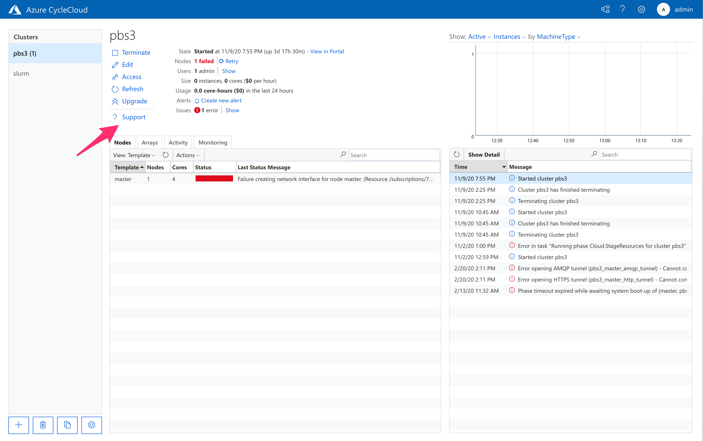
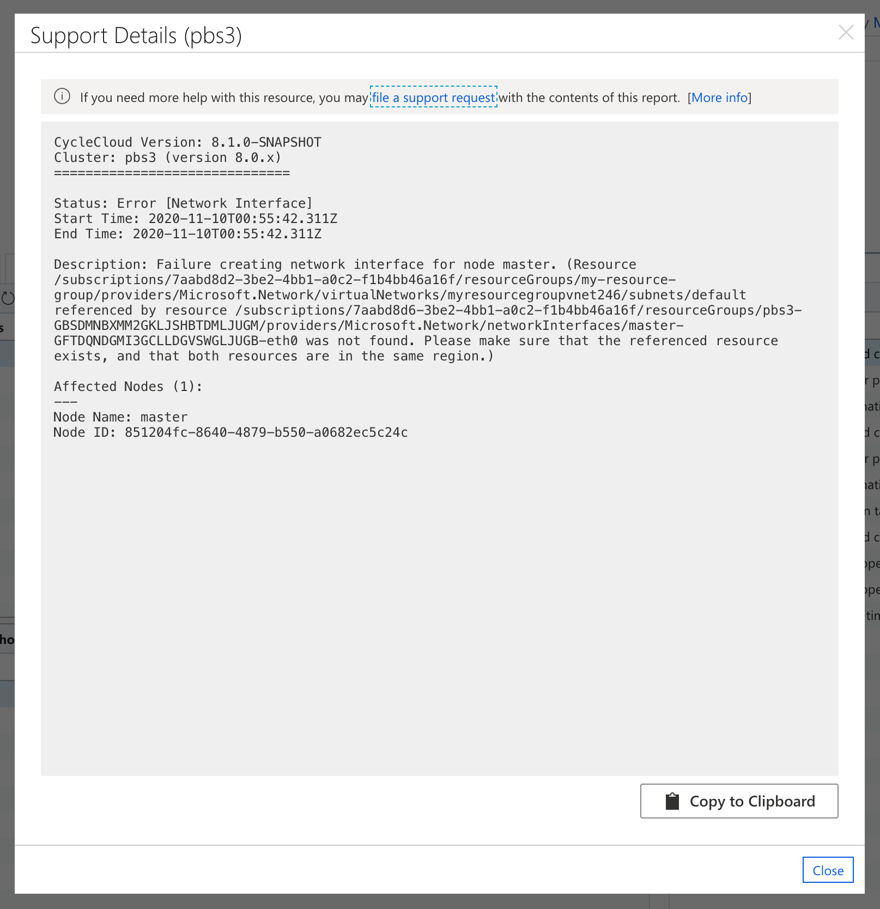

# Reporting Issues with CycleCloud

The process of creating and managing a cluster is inherently very complex. While CycleCloud hides much of the complexity, some issues may unfortunately arise. When they do, CycleCloud attempts to surface them immediately in the user interface (UI) and to guide the user on addressing them.

When an anticipated issue (such as failure to acquire a resource due to misconfiguration) arises, a recommendation instructs users how to remedy it. But even when unanticipated errors occur, CycleCloud includes relevant context to aid in troubleshooting.

> See [common error messages in CycleCloud](../error_messages.md).

In most cases, users should be able to troubleshoot and address the issues by themselves. However, a reporting mechanism allows users to file a support request with Azure CycleCloud.

## Cluster Support

The Cluster page includes a **Support** button for capturing pertinent support data for use in diagnostics:

Pressing the button displays a panel with a cluster report that can be copied and shared. The panel includes a direct link for filing a support request:

When CycleCloud identifies issues with the cluster, the **Issues** status line indicates the number of distinct issues and presents a **Show** link that opens the **Cluster Issues** panel. The panel includes detailed information about node-specific issues and possible remediation steps. The **Support** button displays the same panel with cluster support information ready for sharing.

## Node Status

Node issues appear as one or more status cards that include a short **description** and the **aspect**, as well as a **recommendation**, a **link**, and **detail** (when available).

* **description**: The description of the status
* **aspect**: The phase, stage, or component of node startup being reported on
* **recommendation**: When available, what steps can aid in resolving the issue
* **link**: When available, the relevant document with more details on the type of issue
* **detail**: Any further contextual information, such as script output or stack traces.

The user interface only reports status on errors or on startup phases that are in-progress. In-progress statuses that may be resolved are indicated with a spinner icon. In certain situations during node startup, CycleCloud retries an operation even though it has failed.

## Reporting Issues on a Cluster

To file a support request for a cluster:

1. Open the **Support Details** panel by pressing on the **Support** button
1. Copy the report contents by pressing the **Copy to Clipboard** button
1. Start the support request process by following the **file a support request** link, using the generated details

The following animation shows how to report issues identified by CycleCloud:

## Reporting an Issue For a Specific Node

A node's detail panel provides status information for both in-progress phases as well as any errors that may occur during startup. The panel shows this information prominently as color-coded status cards. Whether or not an error occurs, a **Support** button allows the user to generate a report with pertinent support information. The support panel also lets the user prevent the node from shutting down in order to investigate and troubleshoot. The contents of the report can be used to file a support request.

To file a support request for a specific node:

1. Open **Node Detail** panel by selecting the node and pressing on **Show Detail**, or by double-clicking the node
2. Open the node's **Support Details** panel by pressing on the **Support** button
3. Prevent the node from auto-shutdown by ensuring that the Keep Alive toggle is set to Enabled
4. Copy the report contents by pressing the **Copy to Clipboard** button
5. Start the support request process by opening the **file a support request** link, using the report

The following animation illustrates these steps:
