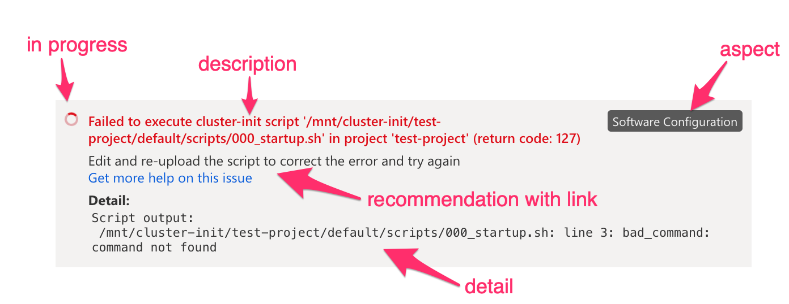

# Reporting issues with CycleCloud

Creating and managing a cluster is a complex process. While CycleCloud hides much of this complexity, some issues can still arise. When they do, CycleCloud surfaces these issues immediately in the user interface (UI) and guides you on how to address them.

When an anticipated issue arises, such as failure to acquire a resource due to misconfiguration, CycleCloud provides a recommendation that instructs you how to fix it. But even when unanticipated errors occur, CycleCloud includes relevant context to aid in troubleshooting.

> See [common error messages in CycleCloud](../error-messages.md).

In most cases, you can troubleshoot and address the issues yourself. However, you can also file a support request with Azure CycleCloud.

## Cluster support

The Cluster page has a **Support** button that captures important support data for use in diagnostics:

When you select the button, it opens a pane with a cluster report that you can copy and share. The pane includes a direct link for filing a support request:

When CycleCloud finds issues with the cluster, the **Issues** status line shows the number of distinct issues and gives a **Show** link that opens the **Cluster Issues** pane. The pane includes detailed information about node-specific issues and possible remediation steps. The **Support** button displays the same pane with cluster support information ready for sharing.

## Node status

Node issues appear as one or more status cards that include a short **description** and the **aspect**, as well as a **recommendation**, a **link**, and **detail** (when available).

* **description**: The description of the status
* **aspect**: The phase, stage, or component of node startup being reported on
* **recommendation**: When available, the steps that resolve the issue
* **link**: When available, the relevant document with more details on the type of issue
* **detail**: Any further contextual information, such as script output or stack traces

The user interface only reports status on errors or on startup phases that are in progress. In-progress statuses that might resolve are indicated with a spinner icon. In certain situations during node startup, CycleCloud retries an operation even though it fails.

## Reporting issues on a cluster

To file a support request for a cluster:

1. Open the **Support Details** panel by selecting the **Support** button.
1. Select the **Copy to Clipboard** button to copy the report contents.
1. Follow the **file a support request** link to start the support request process, using the generated details.

The following animation shows how to report issues identified by CycleCloud:

## Reporting an issue for a specific node

A node's detail panel provides status information for both in-progress phases and any errors that occur during startup. The panel shows this information prominently as color-coded status cards. Whether or not an error occurs, a **Support** button lets you generate a report with pertinent support information. The support panel also lets you prevent the node from shutting down so you can investigate and troubleshoot. Use the contents of the report to file a support request.

To file a support request for a specific node:

1. Open the **Node Detail** panel by selecting the node and pressing **Show Detail**, or by double-clicking the node
1. Open the node's **Support Details** panel by pressing the **Support** button
1. Prevent the node from auto-shutdown by ensuring that the Keep Alive toggle is set to Enabled
1. Copy the report contents by pressing the **Copy to Clipboard** button
1. Start the support request process by opening the **file a support request** link, and use the report

The following animation illustrates these steps:
