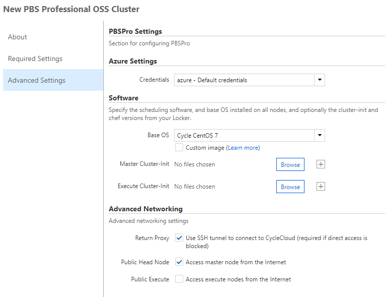
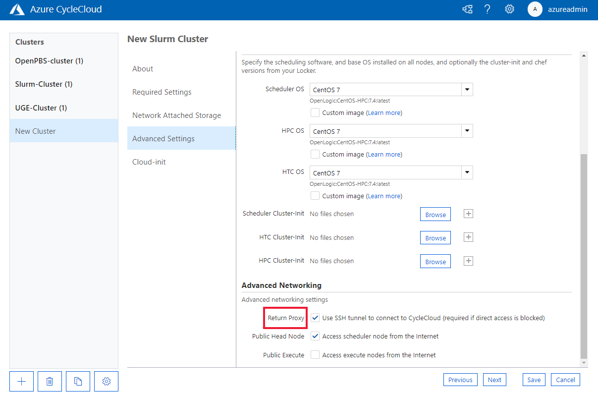

# Enable return proxy

Nodes in a cluster need to communicate with the Azure CycleCloud server to report status, as well as making API requests for auto-scaling and distributed synchronization. Nodes communicate with HTTPS to CycleCloud on its private 9443 port.

If network topology or firewalls prevent communication between the Azure CycleCloud server and cluster nodes, you can designate a node in the cluster as a **return proxy** with the listening port on Azure CycleCloud server forwarded through an SSH tunnel. The cluster nodes then reach the CycleCloud server via port 37140 on the proxy. A typical deployment has the cluster head node designated as the return proxy, but any persistent node can play that same role.

::: moniker range="=cyclecloud-7"

CycleCloud 7 includes an AMQP broker for getting messages from nodes in a cluster, instead of HTTPS.
The AMQP broker listens locally on port 5672. If you use a return proxy, the proxy node forwards port 37141 to port 5672.

::: moniker-end

You can find the settings for enabling or disabling the return proxy in the
Advanced Settings section of the create cluster dialog. 

::: moniker range="=cyclecloud-7"

::: moniker-end

::: moniker range=">=cyclecloud-8"

::: moniker-end

- Azure CycleCloud currently supports only Linux VMs as a return proxy.
- If the CycleCloud VM and the return proxy node reside in different VMs, the
  return proxy node needs a public IP address unless the two [VNETs are
  peered](/azure/virtual-network/virtual-network-peering-overview).


## Custom return proxy node

To mark a node as the return proxy, add the following attributes to the node definition:

``` ini
[[node proxy]]
IsReturnProxy = true  # access to CycleServer is proxied through this node
KeyPairLocation = ~/.ssh/custom-keypair.pem
```

- `IsReturnProxy` - Specifies that the node is the proxy. Only one node should be the designated proxy or the cluster fails to start.
- `KeyPairLocation` - Determines the SSH private key used to start the SSH tunnel. This SSH connection uses the `cyclecloud` user by default.

The return proxy runs in the same Azure virtual network as the nodes of the cluster. By default, the nodes use the private network address of the proxy to communicate with it. However, you can specify that the proxy node's public IP address handles inter-node communication. To do so, include the attribute `ReturnProxyAddress = public` when defining the proxy node.

The `proxy` node in this cluster template only proxies communication from nodes to CycleCloud. It doesn't proxy communication to the larger Internet.
