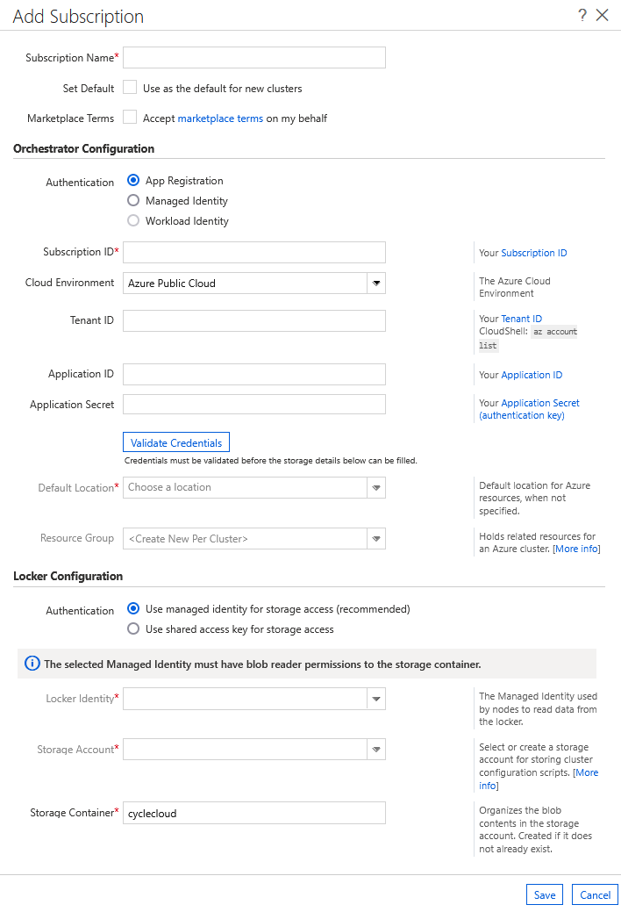

# Using Service Principal

You can use an Azure AD Service Principal to give Azure CycleCloud permission to manage clusters in your subscription. This approach serves as an alternative to using a [Managed Identity](managed-identities.md).

We generally recommend using either a [System-Assigned](/azure/active-directory/managed-identities-azure-resources/qs-configure-portal-windows-vm#system-assigned-managed-identity) or [User-Assigned Managed Identity](/azure/active-directory/managed-identities-azure-resources/qs-configure-portal-windows-vm#user-assigned-managed-identity) to grant these permissions instead of a Service Principal.

## Create a service principal

Azure CycleCloud needs a service principal with rights to manage your Azure subscription. If you don't have a service principal, you can create one with the Azure CLI as shown in the following example.

> [!NOTE]
> Your service principal name **must** be unique. In the following example, *CycleCloudApp* should be replaced with a unique name.
> If you run the command with an existing name, it replaces and invalidates the existing service principal.

```azurecli-interactive
az ad sp create-for-rbac --name CycleCloudApp --years 1
```

The output displays a series of information. Save the `appId`, `password`, and `tenant` values:

``` output
"appId": "xxxxxxxx-xxxx-xxxx-xxxx-xxxxxxxxxxxx",
"displayName": "CycleCloudApp",
"name": "http://CycleCloudApp",
"password": "xxxxxxxx-xxxx-xxxx-xxxx-xxxxxxxxxxxx",
"tenant": "xxxxxxxx-xxxx-xxxx-xxxx-xxxxxxxxxxxx"
```

## Permissions

The simplest option, with sufficient access rights, is to assign the Contributor role for the subscription to the new CycleCloud service principal.
However, the Contributor role has a higher privilege level than CycleCloud requires. Instead, you can create and assign a [custom role](/azure/role-based-access-control/custom-roles) to the VM.

The [Managed Identity Guide](managed-identities.md) has details on creating an appropriate lower-privilege AD Role for the Service Principal.

To use a Service Principle to give permissions to CycleCloud, ensure that you select the **App Registration** option.

::: moniker range=">=cyclecloud-8"

::: moniker-end
