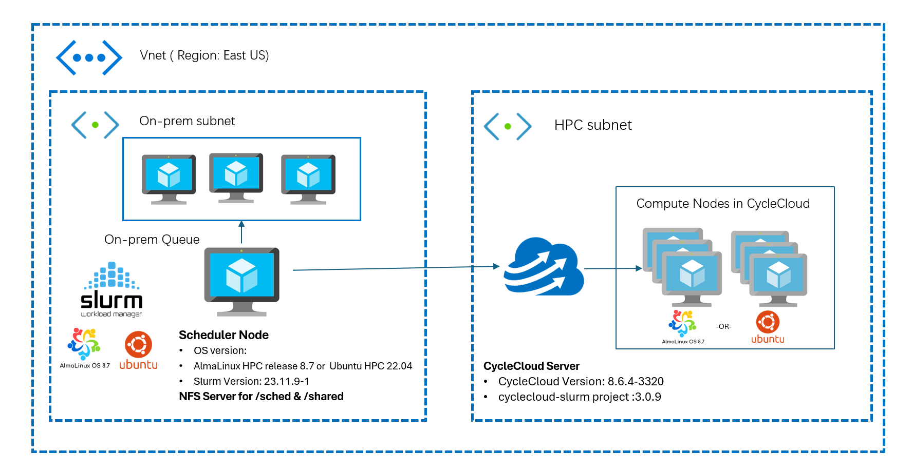
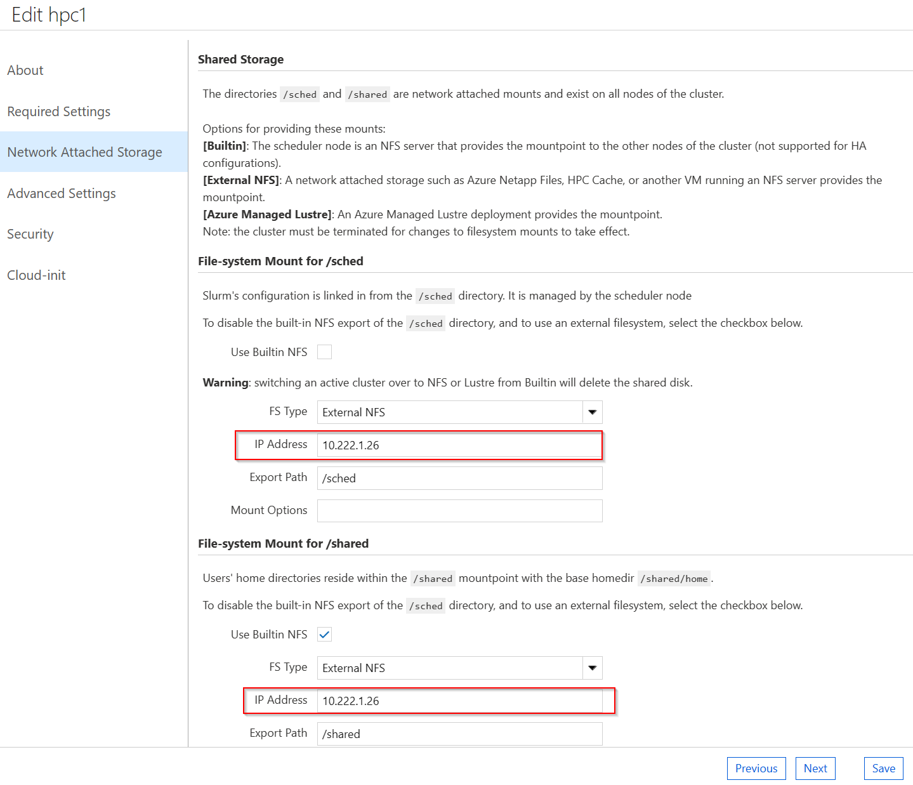

# What is Cloud Bursting?

Cloud bursting is a configuration in cloud computing that allows an organization to handle peaks in IT demand by using a combination of private and public clouds. When the resources in a private cloud reach their maximum capacity, the overflow traffic is directed to a public cloud to ensure there is no interruption in services. This setup provides flexibility and cost savings, as you only pay for the additional resources when there is a demand for them.

For example, an application can run on a private cloud and "burst" to a public cloud only when necessary to meet peak demands. This approach helps avoid the costs associated with maintaining extra capacity that is not always in use

Cloud bursting can be used in various scenarios, such as enabling on-premises workloads to be sent to the cloud for processing, known as hybrid HPC (High-Performance Computing). This allows users to optimize their resource utilization and cost efficiency while accessing the scalability and flexibility of the cloud.

## Requirements to Setup Slurm Cloud Bursting Using CycleCloud on Azure

## Azure subscription account
You must obtain an Azure subscription or be assigned as an Owner role of the subscription.

* To create an Azure subscription, go to the [Create a Subscription](/azure/cost-management-billing/manage/create-subscription#create-a-subscription) site.
* To access an existing subscription, go to the [Azure portal](https://portal.azure.com/).

## Network infrastructure
If you intend to create a Slurm cluster entirely within Azure, you must deploy both the head node(s) and the CycleCloud compute nodes within a single Azure Virtual Network (VNET). 



However, if your goal is to establish a hybrid HPC cluster with the head node(s) located on your on-premises corporate network and the compute nodes in Azure, you will need to set up a [Site-to-Site](/azure/vpn-gateway/tutorial-site-to-site-portal) VPN or an [ExpressRoute](/azure/expressroute/) connection between your on-premises network and the Azure VNET. The head node(s) must have the capability to connect to Azure services over the Internet. You may need to coordinate with your network administrator to configure this connectivity.

## Network Ports and Security
The following NSG rules must be configured for successful communication between Master node, CycleCloud server and Compute nodes.

| **Service**                        | **Port**        | **Protocol** | **Direction**    | **Purpose**                                                            | **Requirement**                                                                 |
|------------------------------------|-----------------|--------------|------------------|------------------------------------------------------------------------|---------------------------------------------------------------------------------|
| **SSH (Secure Shell)**             | 22              | TCP          | Inbound/Outbound | Secure command-line access to the Slurm Master node                     | Open on both on-premises firewall and Azure NSGs                                |
| **Slurm Control (slurmctld, slurmd)** | 6817, 6818   | TCP          | Inbound/Outbound | Communication between Slurm Master and compute nodes                    | Open in on-premises firewall and Azure NSGs                                     |
| **Munge Authentication Service**   | 4065            | TCP          | Inbound/Outbound | Authentication between Slurm Master and compute nodes                   | Open on both on-premises network and Azure NSGs                                 |
| **CycleCloud Service**             | 443             | TCP          | Outbound         | Communication between Slurm Master node and Azure CycleCloud            | Allow outbound connections to Azure CycleCloud services from the Slurm Master node |

Please refer [Slurm Network Configuration Guide](https://slurm.schedmd.com/network.html)

## CycleCloud version and Project version

We are utilizing the following versions:
- **[CycleCloud](/azure/cyclecloud/release-notes/8-6-0?view=cyclecloud-8):** 8.6.0-3223
- **[cyclecloud-slurm Project](https://github.com/Azure/cyclecloud-slurm/releases/3.0.6):** 3.0.6

## Slurm and OS version

* Slurm Version: 23.02.7-1
* OS version in Scheduler and execute nodes: Alma Linux release 8.7 (almalinux:almalinux-hpc:8_7-hpc-gen2:latest)

## NFS File server.
A shared file system between the external Slurm Scheduler node and the CycleCloud cluster. You can use Azure NetApp Files, Azure Files, NFS, or other methods to mount the same file system on both sides. In this example, we are using a Scheduler VM as an NFS server.

## Steps

After we have the prerequisites ready, we can follow these steps to integrate the external Slurm Scheduler node with the CycleCloud cluster:

### 1. On CycleCloud VM:

* Ensure CycleCloud 8.6 VM is running and accessible via `cyclecloud` CLI.
* Clone this repository and import a cluster using the provided CycleCloud template (`slurm-headless.txt`).
* We are importing a cluster named `hpc1` using the `slurm-headless.txt` template.
    ```sh
    git clone https://github.com/user/slurm-cloud-bursting-using-cyclecloud.git
    cyclecloud import_cluster hpc1 -c Slurm-HL -f slurm-cloud-bursting-using-cyclecloud/templates/slurm-headless.txt
    ```
    Output:
    ```
    [user@cc86 ~]$ cyclecloud import_cluster hpc1 -c Slurm-HL -f slurm-cloud-bursting-using-cyclecloud/cyclecloud-template/slurm-headless.txt
    Importing cluster Slurm-HL and creating cluster hpc1....
    ----------
    hpc1 : off
    ----------
    Resource group:
    Cluster nodes:
    Total nodes: 0
    ```

### 2. Preparing Scheduler VM:

* Deploy a VM using the specified AlmaLinux image (If you have an existing Slurm Scheduler, you can skip this).
* Run the Slurm scheduler installation script (`slurm-scheduler-builder.sh`) and provide the cluster name (`hpc1`) when prompted.
* This script will install and configure Slurm Scheduler.
    ```sh
    git clone https://github.com/user/slurm-cloud-bursting-using-cyclecloud.git
    cd slurm-cloud-bursting-using-cyclecloud/scripts
    sh slurm-scheduler-builder.sh
    ```
    Output:
    ```
    ------------------------------------------------------------------------------------------------------------------------------
    Building Slurm scheduler for cloud bursting with Azure CycleCloud
    ------------------------------------------------------------------------------------------------------------------------------

    Enter Cluster Name: hpc1
    ------------------------------------------------------------------------------------------------------------------------------

    Summary of entered details:
    Cluster Name: hpc1
    Scheduler Hostname: masternode2
    NFSServer IP Address: 10.222.1.26
    ```

### 3. CycleCloud UI:

* Access the CycleCloud UI, edit the `hpc1` cluster settings, and configure VM SKUs and networking settings.
* Enter the NFS server IP address for `/sched` and `/shared` mounts in the Network Attached Storage section.
* Save & Start `hpc1` cluster.



### 4. On Slurm Scheduler Node:

* Integrate External Slurm Scheduler with CycleCloud using the `cyclecloud-integrator.sh` script.
* Provide CycleCloud details (username, password, and URL) when prompted. (Try entering the details manually instead of copy and paste. The copy & paste might contain some whitespaces and it might create issues in building the connection.)
    ```sh
    cd slurm-cloud-bursting-using-cyclecloud/scripts
    sh cyclecloud-integrator.sh
    ```
    Output:
    ```
    [root@masternode2 scripts]# sh cyclecloud-integrator.sh
    Please enter the CycleCloud details to integrate with the Slurm scheduler

    Enter Cluster Name: hpc1
    Enter CycleCloud Username: user
    Enter CycleCloud Password:
    Enter CycleCloud URL (e.g., https://10.222.1.19): https://10.222.1.19
    ------------------------------------------------------------------------------------------------------------------------------

    Summary of entered details:
    Cluster Name: hpc1
    CycleCloud Username: user
    CycleCloud URL: https://10.222.1.19
    ------------------------------------------------------------------------------------------------------------------------------
    ```

### 5. User and Group Setup:

* Ensure consistent user and group IDs across all nodes.
* Better to use a centralized User Management system like LDAP to ensure the UID and GID are consistent across all the nodes.
* In this example, we are using the `users.sh` script to create a test user `user` and group for job submission. (User `user` exists in CycleCloud)
    ```sh
    cd slurm-cloud-bursting-using-cyclecloud/scripts
    sh users.sh
    ```

### 6. Testing & Job Submission:

* Log in as a test user (`user` in this example) on the Scheduler node.
* Submit a test job to verify the setup.
    ```sh
    su - user
    srun hostname &
    ```
    Output:
    ```
    [root@masternode2 scripts]# su - user
    Last login: Tue May 14 04:54:51 UTC 2024 on pts/0
    [user@masternode2 ~]$ srun hostname &
    [1] 43448
    [user@masternode2 ~]$ squeue
                 JOBID PARTITION     NAME     USER ST       TIME  NODES NODELIST(REASON)
                     1       hpc hostname    vinil CF       0:04      1 hpc1-hpc-1
    [user@masternode2 ~]$ hpc1-hpc-1
    ```
A new node is created in hpc1 cluster.


### Next Steps

* [GitHub repo - slurm-cloud-bursting-using-cyclecloud](https://github.com/vinil-v/slurm-cloud-bursting-using-cyclecloud)
* [Azure CycleCloud Documentation](https://learn.microsoft.com)
* [Slurm documentation](https://slurm.schedmd.com)
