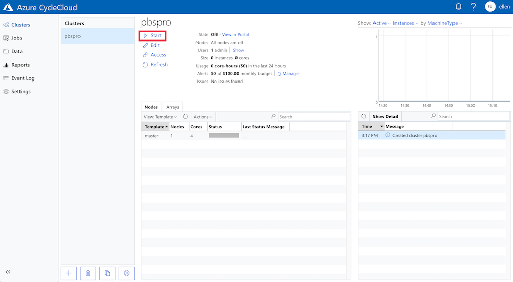
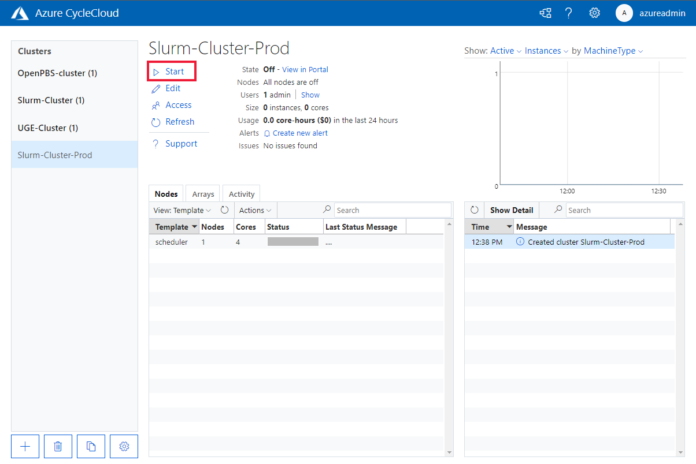

# Start a Cluster

Once a cluster has been created via the UI or is imported, it can be started either through the UI or the CycleCloud CLI. Starting a cluster will acquire instances from Azure, configure the instances as defined in the cluster template and notify CycleCloud once the node is ready for use.

## Starting via CycleCloud GUI

Select the cluster you want to start in the sidebar, click on **Start** and then confirm. The cluster nodes will move into the *Acquiring* state and will work their way through the orchestration phases. If a node encounters an error during orchestration and has failed, the error will be logged in
the event log on the Clusters page. You can edit your node settings and retry the operation.

::: moniker range="=cyclecloud-7"

::: moniker-end

::: moniker range=">=cyclecloud-8"

::: moniker-end

## Starting via CycleCloud CLI

The CycleCloud CLI can also [start clusters](~/cli.md#cyclecloud-start_cluster):

```bash
cyclecloud start_cluster my_cluster_name
```

## Node Orchestration

When the cluster is started, CycleCloud runs through the orchestration sequence for each node defined in the cluster: it requests a virtual machine from the cloud provider, waits for the VM to be acquired, configures the VM as defined in the cluster template, and executes the initialization sequence specified in the project. When the orchestration sequence is complete, the node is in the `Started` state. If an unhandled or unknown error happens during this process, the node will be in the `Error` state.

There are several intermediate states a node moves through once started:

- *Off*: No virtual machine is active or being acquired.
- *Acquiring*: The virtual machine is being requested from the cloud provider.
- *Preparing*: The virtual machine is being configured.
- *Ready*: The virtual machine is up and running.
- *Deallocated*: The virtual machine has been stopped and the VM has been deallocated.
- *Terminated*: The virtual machine for this node has been deleted
- *Failed*: An orchestration phase has failed during starting or terminating the node.

Azure will not start billing you for a VM while it is being acquired. If a VM that meets your requirements is not available, you may wait indefinitely for one to be provisioned. Billing for resources typically begins when the instance enters the `Preparing` phase, while CycleCloud is installing your software and configuring the instance to run your workloads. You may [connect to a node](connect-to-node.md) that is in the `Preparing` or `Ready` phase.
