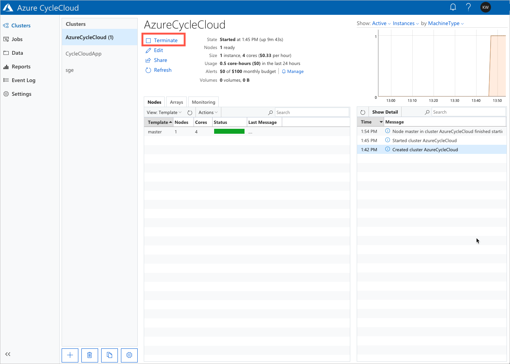
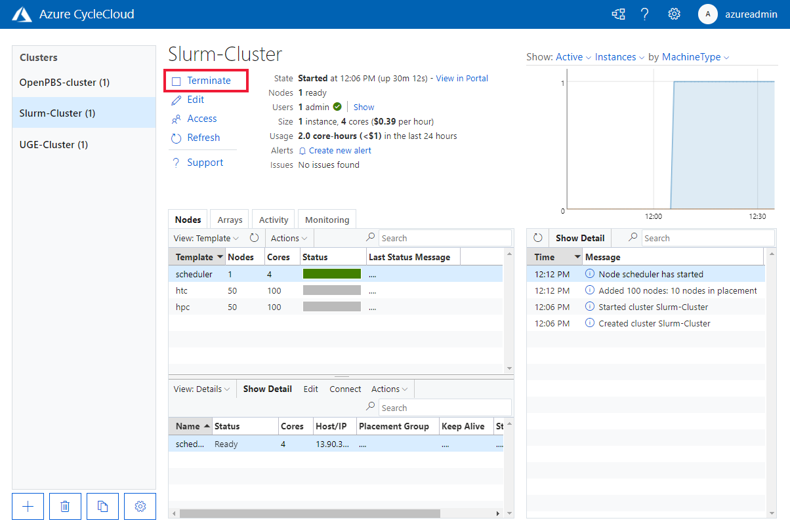

# Terminate a Cluster

You can terminate a cluster when it has completed all the submitted jobs and the cluster is no longer needed. Terminating the cluster will stop and remove the virtual machines and delete any non­-persistent volumes in the cluster. Nodes that originate from a nodearray are removed, while other nodes remain in the cluster in the `Off` state.

Terminating is an orchestration process. Cluster nodes will move into the `Terminating` state and then to `Off` if the termination was successful. If there is an error during the process, that node will be marked as `Failed`, and can be retried.

## Terminate via CycleCloud GUI

Click **Terminate** in the CycleCloud GUI to shut down all of the cluster's infrastructure. All underlying Azure resources will be cleaned up as part of the cluster termination, which may take several minutes.

::: moniker range="=cyclecloud-7"

::: moniker-end

::: moniker range=">=cyclecloud-8"

::: moniker-end

## Terminate via CycleCloud CLI

The CycleCloud CLI can also [terminate clusters](~/cli.md#cyclecloud-terminate_cluster):

```bash
cyclecloud terminate_cluster my_cluster_name
```

## Delete a Resource Group

To remove the resources no longer needed, you can simply delete the resource group. Everything within that group will be cleaned up as part of the process:

```azurecli-interactive
az group delete --name "{RESOURCE GROUP}"
```

::: moniker range=">=cyclecloud-8"
## Force-Delete VMs

CycleCloud 8.2.1 supports the **Force Delete** option for VMs, which can provide faster delete times at the risk of possible data loss on the disks. This can be enabled separately for standalone VMs (such as scheduler head nodes) or scaleset VMs (execute nodes). To enable it, go to the **Settings** page in the upper right corner, and **Configure CycleCloud**.


This setting affects all VMs managed by CycleCloud, but can be changed at any time.

> [!WARNING]
> This feature is not recommended for VMs whose data disks contain critical data!
::: moniker-end