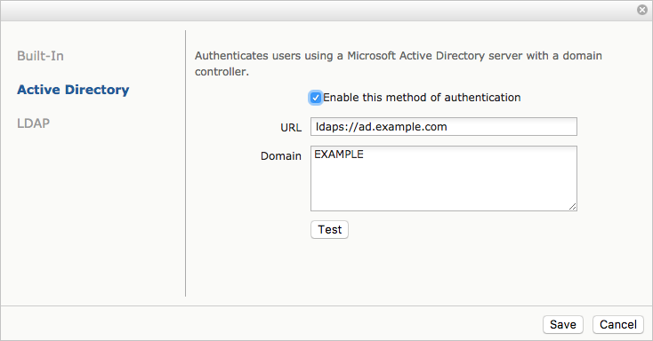

# User Authentication

Azure CycleCloud offers three methods of authentication: a built-in database with encryption, Active Directory, or LDAP. To select and setup your authentication method, open the **Settings** page from the Admin menu (top right of your screen) and double-click on **Authentication**. Choose your preferred authentication method and follow the instructions below.

## Built-In

By default, CycleCloud uses a simple database authorization scheme. The passwords are encrypted and stored in the database, and users authenticate against their stored username and password. To select this method, click the check box for Built-In on the Authentication page.

You can test a user's credentials by entering the username and password then clicking **Test** to verify the information.

## Active Directory

> [!CAUTION]
> It is possible to lock yourself out of your CycleCloud instance when changing from local to AD or LDAP authentication. Access will be granted to users that have both a local account and can authenticate to the server configured (local passwords will be ignored). The instructions below make effort to guard against lockout.

1. Click the check box to enable Active Directory.
2. Enter the URL for your Active Directory server (starting with _ldap://_ or _ldaps://_)
3. Enter the default domain in the form of "DOMAIN" or "@domain.com" depending on whether your users authenticate with names such as "DOMAIN\user" or "user@domain.com" (UPN). If this field is left blank, users must enter their fully-qualified name.
4. Click **Test** to ensure that CycleCloud can use the provided settings. Use an account that exists on your authentication server.
5. In a separate browser or incognito window, log in as the domain account you added in step 2.
6. If the login in step 4 is successful, you can log out of your first session. Authentication is correctly configured.

The example above shows a sample configuration for an Active Directory environment. Windows users
log in as `EXAMPLE\\username`, so "EXAMPLE" is entered as the Domain. Authentication is handled by
the server `ad.example.com`, so _ldaps://ad.example.com_ is entered as the URL.

> [!NOTE]
> After a failed authentication attempt, the "Authentication failed" message may still display in the **Authentication settings** window. Clicking **Cancel** and starting again will clear this message. Successful authentication will replace the "Authentication failed" message with "Authentication succeeded".

## LDAP

1. Click the check box to enable LDAP authentication.
2. Enter the appropriate LDAP settings.
3. Click "Test" to ensure that CycleCloud can use the provided settings. Use an account that exists on your authentication server.
4. In a separate browser or incognito window, log in as the domain account you added in step 2.
5. If the login in step 4 is successful, you can log out of your first session. Authentication is correctly configured.

## Password Policy

Azure CycleCloud has an integrated password policy and security measures. Accounts that are created using the built-in authentication method must have passwords between 8 and 123 characters long, and meet at least 3 of the following 4 conditions:

* Contain at least one upper case letter
* Contain at least one lower case letter
* Contain at least one number
* Contain at least one special character: @ # $ % ^ & * - _ ! + = [ ] { } | \ : ' , . ?  ~ \" ( ) ;

Administrators can require users to update passwords to follow the new policy by selecting the "Force Password Change on Next Login" box within the **Edit Account** screen.

## Security Lock Out

Any account that detects 5 authorization failures within 60 seconds of each other will automatically be locked for 5 minutes. Accounts can manually be unlocked by an administrator, or just by waiting the five minutes.
