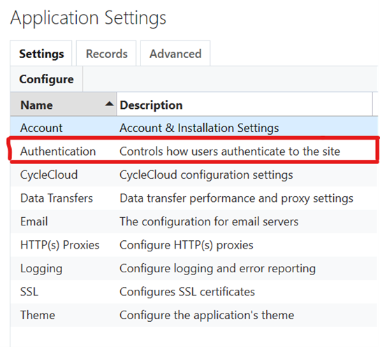
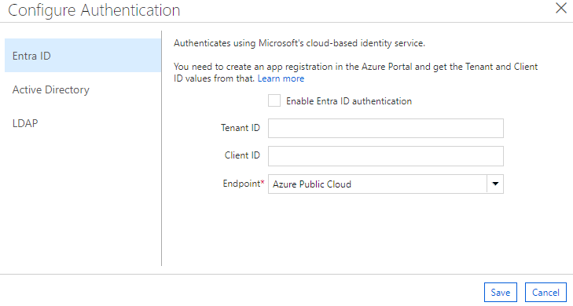

# User Authentication

Azure CycleCloud offers four methods of authentication: a built-in database with encryption, Active Directory, LDAP, or Entra ID. To select and setup your authentication method, open the **Settings** page from the Admin menu (top right of your screen) and double-click on **Authentication**. Choose your preferred authentication method and follow the instructions below.

## Built-In

By default, CycleCloud uses a simple database authorization scheme. The passwords are encrypted and stored in the database, and users authenticate against their stored username and password. To select this method, click the check box for Built-In on the Authentication page.

You can test a user's credentials by entering the username and password then clicking **Test** to verify the information.

## Active Directory

> [!CAUTION]
> It is possible to lock yourself out of your CycleCloud instance when changing from local to AD, LDAP or Entra ID authentication. Access will be granted to users that have both a local account and can authenticate to the server configured (local passwords will be ignored). The instructions below make effort to guard against lockout.

1. Click the check box to enable Active Directory.
2. Enter the URL for your Active Directory server (starting with _ldap://_ or _ldaps://_)
3. Enter the default domain in the form of "DOMAIN" or "@domain.com" depending on whether your users authenticate with names such as "DOMAIN\user" or "user@domain.com" (UPN). If this field is left blank, users must enter their fully-qualified name.
4. Click **Test** to ensure that CycleCloud can use the provided settings. Use an account that exists on your authentication server.
5. In a separate browser or incognito window, log in as the domain account you added in step 2.
6. If the login in step 4 is successful, you can log out of your first session. Authentication is correctly configured.

The example above shows a sample configuration for an Active Directory environment. Windows users
log in as **EXAMPLE\\username**, so "EXAMPLE" is entered as the Domain. Authentication is handled by
the server **ad.example.com**, so _ldaps://ad.example.com_ is entered as the URL.

> [!NOTE]
> After a failed authentication attempt, the "Authentication failed" message may still display in the **Authentication settings** window. Clicking **Cancel** and starting again will clear this message. Successful authentication will replace the "Authentication failed" message with "Authentication succeeded".

## LDAP

1. Click the check box to enable LDAP authentication.
2. Enter the appropriate LDAP settings.
3. Click "Test" to ensure that CycleCloud can use the provided settings. Use an account that exists on your authentication server.
4. In a separate browser or incognito window, log in as the domain account you added in step 2.
5. If the login in step 4 is successful, you can log out of your first session. Authentication is correctly configured.

## Entra ID **(PREVIEW)**

### Configuring CycleCloud for Entra Authentication and Authorization

> [!NOTE]
> You must first create a Microsoft Entra application. If you have not yet created one, then [create one now](./create-app-registration.md#creating-the-cyclecloud-app-registration)

#### GUI Configuration

To enable Entra ID Authentication:
1. Launch Cyclecloud, and then navigate to **Settings** in the upper right-hand corner
1. Select the table row named **Authentication** and click **Configure** or double-click on the row. In the pop-up dialog, select the **Entra ID** section.

1. Then, you will see a window with three sections. Stay in the **Entra ID** section.

1. Check the **Enable Entra ID authentication** checkbox. 
1. Find the **Overview** page for your Microsoft Entra application in the Azure Portal and fill in the Tenant ID and Client ID based off those values.
1. By default, the endpoint is set to https://login.microsoftonline.com (the Public endpoint). However, you may also set a custom endpoint, such as one for a government cloud environment.
1. Hit **Save** to save your changes.

### Configuring Access to Cluster Nodes
The CycleCloud User Management feature for Linux clusters requires an SSH Public Key for Users with login access to cluster nodes. When Entra ID authentication and authorization is enabled, Users should log in to the CycleCloud at least once to initialize their User account record and then edit their Profile to add their public SSH key.

CycleCloud will autogenerate a UID and GID for Users. But if a cluster will be accessing persistent storage resources, it may be required for an Administrator to set the UID/GID for users explicitly to match the existing users on the filesystem.

These User profile updates may also be performed by pre-creating User records as an alternative to GUI operation. See [User Management](/azure/cyclecloud/concepts/user-management) for more details.

### Using Entra ID Authentication with CycleCloud

An attempt to authenticate with CycleCloud using Entra ID has the following supported scenarios: 
1. Successful authentication always resets User roles to match the ones set up in Entra ID. Note that, since the default lifespan of an access token is an hour, it might be required for you to log out and log back in for the new roles to be set.
1. If the user you are authenticating as has been pre-created, it is possible for the Tenant ID and Object ID to not be set to anything prior to the first login. This will result in a warning message going to the logs and these values being set to match the ones coming from Entra ID token.
1. If for any reason the Object ID and/or Tenant ID do not match the ones in the access token, it is treated as authentication error. The old User record will have to be manually removed before this user can authenticate.
1. If you lock yourself out of the Super User account by forgetting to create one that can be authenticated using your Entra ID, you can disable the Entra ID authentication through the console by running `./cycle_server reset_access`
1. Users created through Entra ID authentication do not have public ssh keys configured by default, so you will have to configure them manually to use User Management on nodes.

## Password Policy

Azure CycleCloud has an integrated password policy and security measures. Accounts that are created using the built-in authentication method must have passwords between 8 and 123 characters long, and meet at least 3 of the following 4 conditions:

* Contain at least one upper case letter
* Contain at least one lower case letter
* Contain at least one number
* Contain at least one special character: @ # $ % ^ & * - _ ! + = [ ] { } | \ : ' , . ?  ~ \" ( ) ;

Administrators can require users to update passwords to follow the new policy by selecting the "Force Password Change on Next Login" box within the **Edit Account** screen.

## Security Lock Out

Any account that detects 5 authorization failures within 60 seconds of each other will automatically be locked for 5 minutes. Accounts can manually be unlocked by an administrator, or just by waiting the five minutes.
