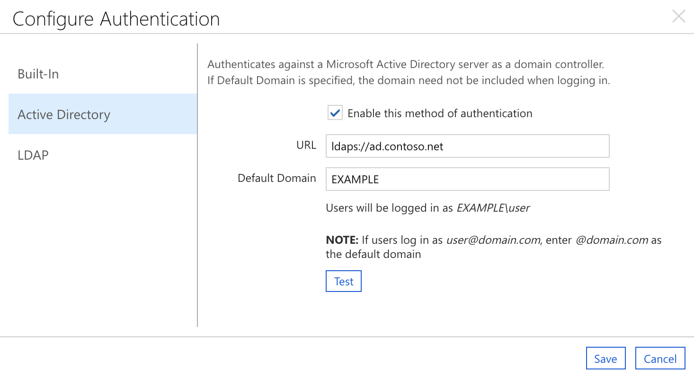

# User authentication

Azure CycleCloud offers four methods of authentication: a built-in database with encryption, Active Directory, LDAP, or Microsoft Entra ID. To select and set up your authentication method, open the **Settings** page from the Admin menu (top right of your screen) and double-click on **Authentication**. Choose your preferred authentication method and follow the instructions in the following sections.

## Built-in

By default, CycleCloud uses a simple database authorization scheme. The system encrypts passwords and stores them in the database. Users authenticate with their stored username and password. To use this method, select the check box for **Built-In** on the **Authentication** page.

You can test a user's credentials by entering the username and password, then selecting **Test** to verify the information.

## Active Directory

> [!CAUTION]
> When you change authentication from local to AD, LDAP, or Entra ID, you might lock yourself out of your CycleCloud instance. Access goes to users who have both a local account and can authenticate to the configured server (local passwords are ignored). The following instructions help protect against lockout.

1. Select the check box to enable Active Directory.
1. Enter the URL for your Active Directory server (starting with _ldap://_ or _ldaps://_).
1. Enter the default domain as "DOMAIN" or "@domain.com" depending on whether your users authenticate with names such as "DOMAIN\user" or "user@domain.com" (UPN). If you leave this field blank, users must enter their fully qualified name.
1. Select **Test** to make sure that CycleCloud can use the provided settings. Use an account that exists on your authentication server.
1. In a separate browser or incognito window, sign in as the domain account you added in step 2.
1. If the sign-in in step 4 succeeds, you can sign out of your first session. Authentication is correctly configured.

The preceding example shows a sample configuration for an Active Directory environment. Windows users
sign in as **EXAMPLE\\username**, so you enter "EXAMPLE" as the Domain. The server **ad.example.com** handles authentication, so you enter _ldaps://ad.example.com_ as the URL.

> [!NOTE]
> After a failed authentication attempt, the **Authentication settings** window might still display the "Authentication failed" message. Clicking **Cancel** and starting again clears this message. Successful authentication replaces the "Authentication failed" message with "Authentication succeeded".

## LDAP

1. Select the check box to enable LDAP authentication.
1. Enter the appropriate LDAP settings.
1. Select **Test** to ensure that CycleCloud can use the provided settings. Use an account that exists on your authentication server.
1. In a separate browser or incognito window, sign in as the domain account you added in step 2.
1. If the authentication in step 4 is successful, you can sign out of your first session. Authentication is correctly configured.

## Entra ID **(PREVIEW)**

### Configuring CycleCloud for Entra Authentication and Authorization

> [!NOTE]
> You must first create a Microsoft Entra application. If you didn't yet create one, see [create one now](./create-app-registration.md#creating-the-cyclecloud-app-registration).

#### GUI Configuration

To enable Entra ID Authentication:
1. Launch CycleCloud, and then navigate to **Settings** in the upper right-hand corner.
1. Select the table row named **Authentication** and select **Configure** or double-click on the row. In the pop-up dialog, select the **Entra ID** section.

1. You see a window with three sections. Stay in the **Entra ID** section.

1. Select the **Enable Entra ID authentication** checkbox.
1. Go to the **Overview** page for your Microsoft Entra application in the Azure portal and enter the Tenant ID and Client ID based on those values.
1. By default, the endpoint is set to https://login.microsoftonline.com (the public endpoint). However, you can also set a custom endpoint, such as one for a government cloud environment.
1. Select **Save** to save your changes.

### Configuring access to cluster nodes
The CycleCloud User Management feature for Linux clusters requires an SSH public key for users with authentication access to cluster nodes. When you enable Microsoft Entra ID authentication and authorization, users sign in to CycleCloud at least once to initialize their user account record. Then, they edit their profile to add their public SSH key.

CycleCloud autogenerates a UID and GID for users. But if a cluster accesses persistent storage resources, an administrator might need to set the UID and GID for users explicitly to match the existing users on the filesystem.

You can also perform these user profile updates by pre-creating user records as an alternative to GUI operation. For more information, see [User Management](/azure/cyclecloud/concepts/user-management).

### Using Entra ID Authentication with CycleCloud

When you authenticate with CycleCloud using Entra ID, the system supports the following scenarios: 
1. Successful authentication always resets user roles to match the ones set up in Entra ID. Since the default lifespan of an access token is an hour, you might need to sign out and sign back in for the new roles to take effect.
1. If you authenticate as a user that you pre-created, the tenant ID and object ID might be missing before the first sign in. In this case, CycleCloud sends a warning message to the logs and sets these values to match the ones coming from the Entra ID token.
1. If the object ID or tenant ID don't match the ones in the access token, CycleCloud treats it as an authentication error. You must manually remove the old user record before you can authenticate.
1. If you lock yourself out of the Super User account by forgetting to create one that you can authenticate with your Entra ID, you can disable the Entra ID authentication through the console by running `./cycle_server reset_access`.
1. When you create users through Entra ID authentication, they don't have public SSH keys configured by default. To use User Management on nodes, you need to configure the keys manually.

## Password policy

Azure CycleCloud has an integrated password policy and security measures. Accounts that you create with the built-in authentication method must have passwords between 8 and 123 characters long. Passwords must meet at least three of the following four conditions:

* Contain at least one uppercase letter
* Contain at least one lowercase letter
* Contain at least one number
* Contain at least one special character: `@ # $ % ^ & * - _ ! + = [ ] { } | \ : ' , . ?  ~ " ( ) ;`

Administrators can require users to update passwords to follow the new policy by selecting the **Force Password Change on Next Login** box within the **Edit Account** screen.

## Security lockout

Any account that detects five authorization failures within 60 seconds of each other automatically locks for five minutes. Administrators can manually unlock accounts, or users can wait the five minutes.
