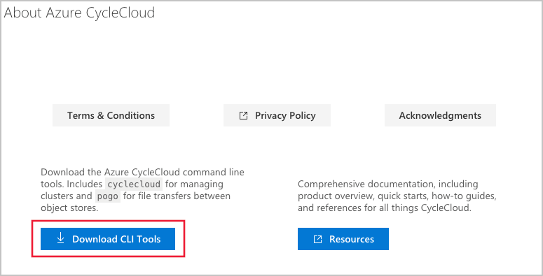

# Install Azure CycleCloud CLI

The Azure CycleCloud Command Line Interface (CLI) provides console access to the CycleCloud application, making functions seen in the GUI available from the command line. It can be used to control CycleCloud and CycleCloud Clusters directly or via script. CycleCloud's file transfer tool, [pogo](pogo-overview.md), is packaged with the CLI and will be installed at the same time.

## Pre-Requisites

The CycleCloud CLI requires an existing installation of Python 2.7. While most Linux and Mac systems already have a valid Python 2.7 installation, you will need to [install Python for Windows](https://docs.python-guide.org/en/latest/starting/install/win/).

## CycleCloud CLI Installer File

The CLI installer is distributed as part of the CycleCloud installation package. Click on the **?** in the upper-right corner of the UI to access the **about** page. Use the **Download CLI Tools** button to perform an in-browser download.



Alternatively, it can be downloaded directly from the command line using this command.

```bash
wget https://<your CycleCloud domain name>/download/tools/cyclecloud-cli.zip
```

## CycleCloud CLI Installation for Linux

Extract the contents of _cyclecloud-cli.zip_ to a temporary directory:

```bash
cd /tmp
unzip /opt/cycle_server/tools/cyclecloud-cli.zip
```

This will create a sub-directory named _cyclecloud-cli-installer_. To complete the installation, run the _install.sh_ script within the directory:

```bash
cd /tmp/cyclecloud-cli-installer
./install.sh
```

The CycleCloud CLI will be installed to _${HOME}/bin_. Optionally, after installing the CLI, add the _${HOME}/bin_ directory to the PATH environment variable in your profile.

```bash
export PATH=$PATH:${HOME}/bin
```

## CycleCloud CLI Installation for Windows

In Windows Explorer, copy the CLI installer zip file to a temporary directory such as _Downloads_ or _$env:TMP_. Right click on the copy of _cyclecloud-cli.zip_ and select **Extract All**. This will create a sub-folder named `cyclecloud-cli-installer-<VERSION>`.

Inside the `cyclecloud-cli-installer-<VERSION>` sub-folder, you will find a PowerShell script named _install.ps1_. Double click on the _install.ps1_ script to complete the CLI installation.

The CycleCloud CLI should now be available in the system PATH for new PowerShell or Command Prompt sessions.

## Initialize CycleCloud CLI

Once the CLI has been installed, you'll need to connect it to your Azure CycleCloud server. The Azure CycleCloud CLI communicates with the server using a REST API and must be initialized with your Azure CycleCloud server URL:

1. Initialize the server with `cyclecloud initialize`. You will be prompted for the CycleServer URL, which is the FQDN of your application server. Enter it in the format `https://FQDN`.
2. The installed Azure CycleCloud server uses either a Let's Encrypt SSL certificate, or a self-signed certificate. Type `yes` when asked to allow the certificate.
3. Log in with the same username and password used for the CycleCloud web interface.
4. Test that the CycleCloud CLI is working with `cyclecloud show_cluster`.