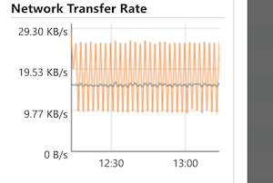

# What is Azure CycleCloud?

Azure CycleCloud is an enterprise-friendly tool for orchestrating and managing High Performance Computing (HPC) environments on Azure. With CycleCloud, you can provision infrastructure for HPC systems, deploy familiar HPC schedulers, and automatically scale the infrastructure to run jobs efficiently at any scale. Through CycleCloud, you can create different types of file systems and mount them to the compute cluster nodes to support HPC workloads.

HPC admins and users who want to set up an HPC environment with a specific scheduler use Azure CycleCloud. It supports popular schedulers like Slurm, PBSPro, LSF, Grid Engine, and HT-Condor. CycleCloud is the sister product to [Azure Batch](/azure/batch/batch-technical-overview), which provides a Scheduler as a Service on Azure.

For information about how CycleCloud compares with other Azure HPC solutions, see [High Performance Computing (HPC) on Azure](/azure/architecture/topics/high-performance-computing/).

> [!VIDEO https://www.youtube.com/embed/qkiGJWGM6Ew]

## Why use Azure CycleCloud?

Organizations with long-standing HPC environments often build deep expertise and custom tools around a specific scheduler. Moving or redesigning these setups on Azure can feel overwhelming. CycleCloud simplifies the basic Azure building blocks such as virtual machines (VMs), scale sets, network interfaces, and disks. This simplification lets an HPC administrator focus on what's familiar: an HPC cluster that includes nodes and a scheduler they can configure as they like.

CycleCloud adds autoscaling plugins to supported schedulers. With this feature, users don't need to build complex autoscaling routines. They just work with the scheduler settings they already know.

With a rich, declarative templating format, CycleCloud provides powerful tooling to construct complete HPC environments on Azure. Users can deploy environments that include NFS servers, parallel file systems, authentication hosts, license servers, and directory services - essentially all the components needed in an HPC system - through a single management plane.

CycleCloud integrates with Azure services such as [Azure Monitor](/azure/azure-monitor/overview) and [Microsoft Cost Management tools](/azure/cost-management/overview-cost-mgt).

### CycleCloud capabilities

::: moniker range="=cyclecloud-7"

|Capability|Image|
|---|---|
| [**Scheduler Agnostic**](./concepts/scheduling.md) Use standard HPC schedulers such as Slurm, PBS Pro, LSF, Grid Engine, and HTCondor, or extend CycleCloud autoscaling plugins to work with your own scheduler  |   |
| [**Manage Compute Resources**](./how-to/start-cluster.md) Manage virtual machines and scale sets to provide a flexible set of compute resources that meet your dynamic workload requirements |  |
| [**Autoscale Resources**](./concepts/scheduling.md) Automatically adjust cluster size and components based on job load, availability, and time requirements |  |
| [**Monitor and Analyze**](./concepts/monitoring.md) Collect and analyze performance data using visualization tools |  |
| [**Template Clusters**](./download-cluster-templates.md) Use CycleCloud templates to share cluster topologies with the community |  |
| [**Customize and Extend Functionality**](./api.md) Use the comprehensive RESTful API to customize and extend functionality, deploy your own scheduler, and support into existing workload managers |  |
| [**Integrate into Existing Workflows**](./how-to/install-cyclecloud-cli.md) Integrate into existing workflows and tools using the built-in CLI |  |

::: moniker-end

::: moniker range=">=cyclecloud-8"

|Capability|Image|
|---|---|
| [**Scheduler Agnostic**](./concepts/scheduling.md) Use standard HPC schedulers such as Slurm, PBS Pro, LSF, Grid Engine, and HTCondor, or extend CycleCloud autoscaling plugins to work with your own scheduler  |   |
| [**Manage Compute Resources**](./how-to/start-cluster.md) Manage virtual machines and scale sets to provide a flexible set of compute resources that meet your dynamic workload requirements |  |
| [**Autoscale Resources**](./concepts/scheduling.md) Automatically adjust cluster size and components based on job load, availability, and time requirements |  |
| [**Monitor and Analyze**](./concepts/monitoring.md) Collect and analyze performance data using visualization tools |  |
| [**Template Clusters**](./download-cluster-templates.md) Use CycleCloud templates to share cluster topologies with the community |  |
| [**Customize and Extend Functionality**](./api.md) Use the comprehensive RESTful API to customize and extend functionality, deploy your own scheduler, and support into existing workload managers |  |
| [**Integrate into Existing Workflows**](./how-to/install-cyclecloud-cli.md) Integrate into existing workflows and tools using the built-in CLI |  |

::: moniker-end

## How do I use Azure CycleCloud?

Azure CycleCloud is an installable web application that you can run on premise or in an Azure VM. Once installed, you can configure CycleCloud to use compute and data resources in your prepared Azure subscription. CycleCloud provides many official cluster templates for schedulers (PBSPro, LSF, Grid Engine, Slurm, HTCondor) and filesystems (NFS, BeeGFS). The CycleCloud community also provides cluster templates. You can use these cluster templates unmodified or customize them for your specific needs.

When you create a cluster, it autoscales to handle the computational jobs that you send to the scheduler. CycleCloud administrative features govern access to the CycleCloud cluster for other users in your organization.

With tooling that includes templates and configuration scripts, you can quickly build complex HPC environments and replicate these setups for different teams across your organization.

[//]: # (## What cluster types are available?)

## What CycleCloud isn't

CycleCloud doesn't include job scheduling functionality. In other words, CycleCloud isn't a scheduler. Instead, it's a platform that enables you to deploy your own scheduler into Azure. CycleCloud has built-in support for several commonly used schedulers, including PBSPro, Slurm, IBM LSF, Grid Engine, and HTCondor. However, CycleCloud users often implement their own scheduler on top of the provided autoscaling API.

CycleCloud doesn't lock you into a specific cluster topology. It includes templates that help you quickly launch HPC systems on Azure, and you can customize these templates to fit your needs. The Azure HPC community provides opinionated templates that are optimized for different types of workloads and industries.

## What a CycleCloud deployed environment looks like

You can deploy an entire CycleCloud HPC system on Azure infrastructure. You install CycleCloud as an application server on a VM in Azure that requires outbound access to Azure Resource Provider APIs. CycleCloud starts and manages the VMs that make up your HPC system. These VMs usually include scheduler head nodes and compute nodes. You can also add other components like NFS servers, BeeGFS clusters, authentication nodes, or bastion hosts, depending on your needs. You define the full setup in CycleCloud templates. You can also connect to Azure services like NetApp Files, HPC Cache, and Microsoft Entra ID Services.

## Next steps

* [Try Azure CycleCloud using a Marketplace VM](qs-install-marketplace.md)
* [Install Azure CycleCloud using an ARM template](~/articles/cyclecloud/how-to/install-arm.md)
* [Install CycleCloud manually](~/articles/cyclecloud/how-to/install-manual.md)
* [Explore CycleCloud features with the tutorial](./tutorials/tutorial.md)
* [Plan your Production Deployment](/azure/cyclecloud/how-to/plan-prod-deployment)
