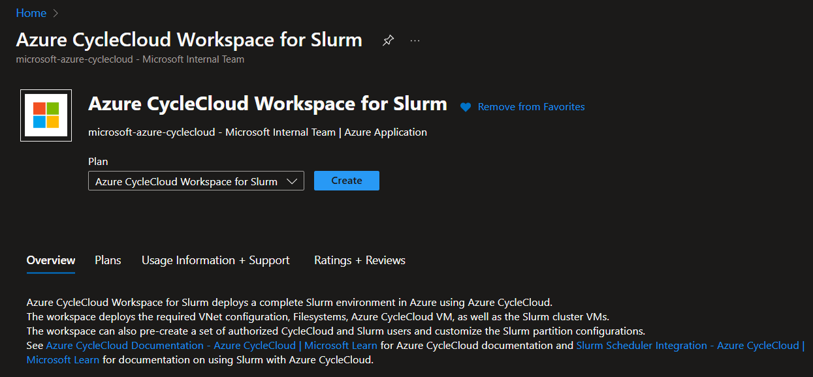
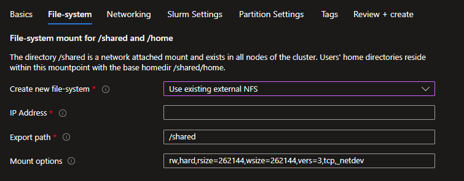
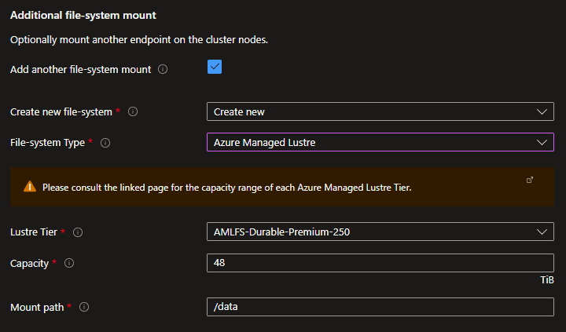
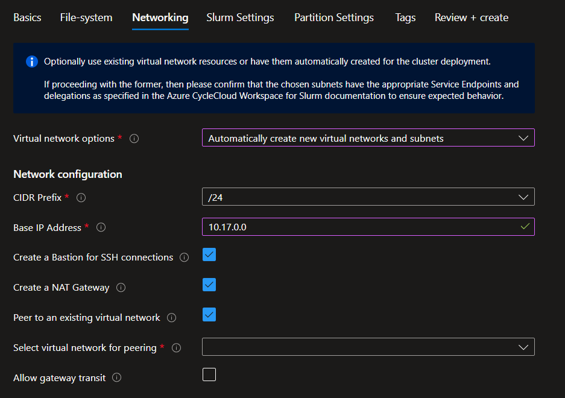
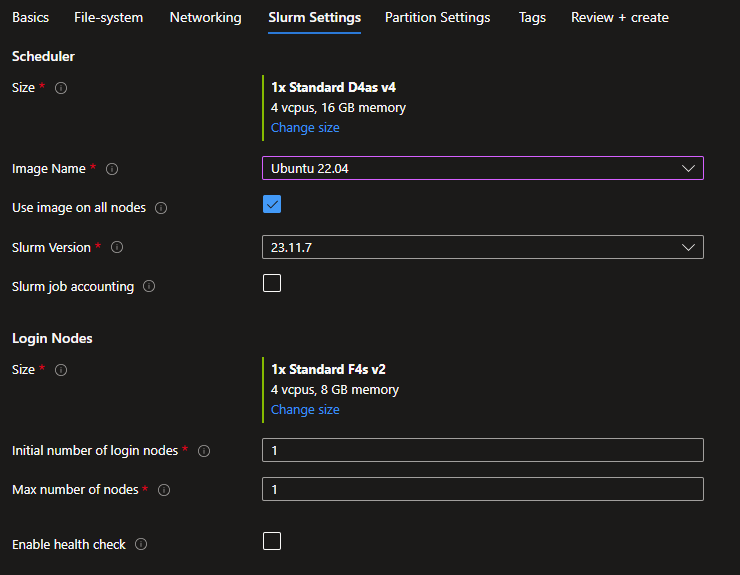
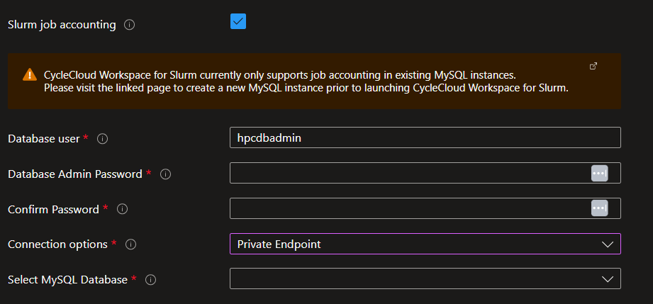
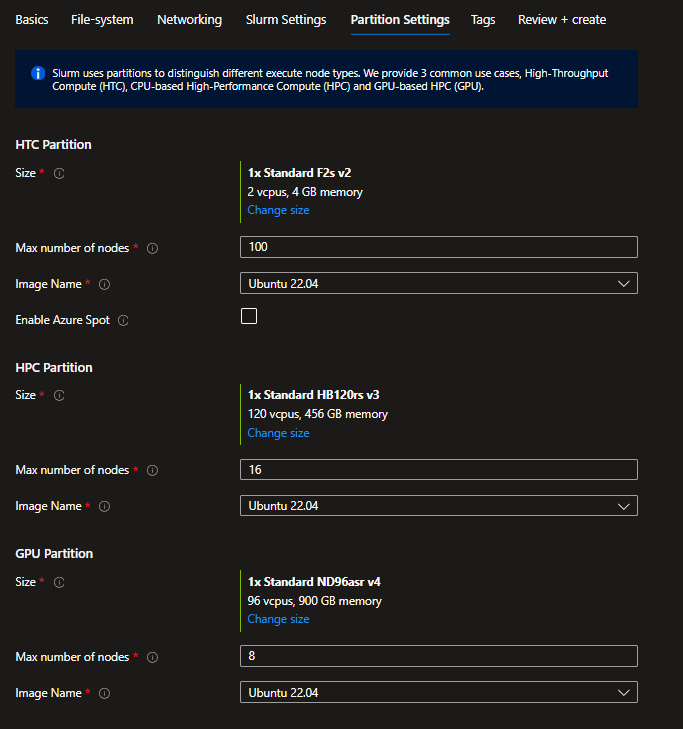
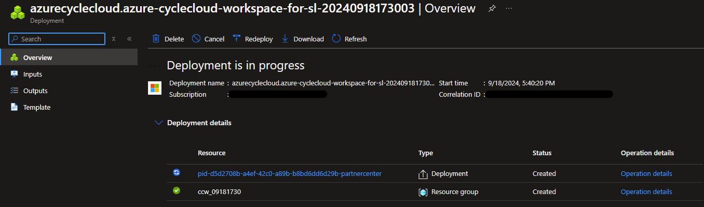

# Quickstart - Deploy Azure CycleCloud Workspace for Slurm using the Marketplace

Azure CycleCloud Workspace for Slurm is a free Marketplace application that provides a simple, secure, and scalable way to manage compute and storage resources for HPC and AI workloads. In this quickstart, you will install CycleCloud Workspace for Slurm using the Marketplace application. 

## Prerequisites

For this quickstart, you will need:

1. An Azure account with an active subscription
1. The **Contributor** and **User Access Administrator** roles at the subscription level

## How to deploy ?

* Sign in to the [Azure portal](https://portal.azure.com).
* Click on the upper left `+ Create a Resource` option
* In the `Search services and marketplace` box, enter **Slurm** and then select **Azure CycleCloud Workspace for Slurm**.
* On the **Azure CycleCloud Workspace for Slurm** page, select **Create**.



### Basics
* On the **New Azure CycleCloud Workspace for Slurm account** page, enter or select the following details.
   - **Subscription**: Select the subscription to use if not already selected.
   - **Region**: Select the Azure region in which you want to deploy your CycleCloud Workspace for Slurm environment.
   - **Resource group**: Select the resource group for the Azure CycleCloud Workspace for Slurm account, or create a new one.
   - **CycleCloud VM Size**: Choose a new VM Size or keep the default one 
   - **Admin User**: Enter a name and a password for the CycleCloud administrator account.
   - **Admin SSH Public Key**: Select the public SSH key of the administrator account directly or if stored in an SSH key resource in Azure.
 


### File-system
#### Users' home directory - Create New
Specify where the users' home directory should be located. Create a new **Builtin NFS** will use the scheduler VM as an NFS server with an attached datadisk.


Create a new **Azure NetApp Files** will create an ANF account, pool and, volume of the specified capacity and service level.


#### Users' home directory - Use Existing
If you have an existing NFS mount point, then select the **Use Existing** option and specify the settings to mount it.


#### Additional file-system mount - Create New
If you need to mount an additional file-system for your project data, you can either create a new one or specify an existing one. You can create a new Azure NetApp Files volume or an Azure Managed Lustre Filesystem.




#### Additional file-system mount - Use Existing
If you have an existing external NFS mount point or an Azure Managed Lustre Filesystem, you can specify the mount options.


### Networking
Specify here if you want to create a new Virtual Network and subnets or use an existing one.

#### Create a new Virtual Network



- Pick the CIDR that will match with the number of compute nodes you are targeting and specify a base IP address,
- It is a best practice to create a Bastion if you don't have direct connectivity provided by your corporate IT,
- Creating a NAT Gateway is required to provide outbound connectivity to internet. This will become mandatory in 2025 and is already enforced thought policies by some companies,
- Peer to an existing Virtual Network if you already have a HUB to which you want to peer that can deliver services like Bastion and a VPN gateway. Be careful to pick a base IP address that is compatible with your peered VNET. Check the Allow gateway transit if the peered VNET has a gateway.

#### Use existing Virtual Network
Before using an existing virtual network, check for the pre-requisites in [Plan your CycleCloud Workspace for Slurm Deployment](./how-to/ccws/plan-your-deployment.md#brownfield-deployment)


### Slurm Settings
Specify the VM size and image to use for the Scheduler and the Login nodes. Images are the HPC Images provided in the Azure Marketplace with the associated URIs:

| Image Name | URI |
|------------|-----|
| Alma Linux 8.7 | almalinux:almalinux-hpc:8_7-hpc-gen2:latest |
| Ubuntu 20.04 | microsoft-dsvm:ubuntu-hpc:2004:latest |
| Ubuntu 22.04 | microsoft-dsvm:ubuntu-hpc:2204:latest |
| Custom Image | You will have to specify an image URN or image ID |

If you choose `Custom Image` you must then specify an image URN for an existing marketplace image or and image ID for an image in an Azure Compute Gallery.

You can also check the `Use image on all nodes` if you want the Scheduler, Login Nodes, and compute nodes to use the same image.

Set how many login nodes you want to provision at start and the maximum number.
Finally, enabling health checks will execute node health checks for the HPC and the GPU partitions to automatically remove unhealthy nodes when they start.



If you want to enable Slurm Job Accounting, check the check box to display the connectivity options. Please note that you need to have a previously-deployed Azure Database for MySQL flexible server resource. Connection through providing a FQDN or private IP is available if you choose to supply your own virtual network or use VNET peering when creating a new virtual network as part of your deployment. Additionally, connection via Private Endpoint is available if you choose to create a new virtual network.




### Partition Settings
Azure CycleCloud Workspace for Slurm comes with 3 defined Slurm partitions:
- HTC : for embarassingly non-MPI jobs,
- HPC : for tightly coupled MPI jobs mostly using VM types with InfiniBand support,
- GPU : for MPI and non-MPI GPU jobs

You can set the image and the maximum number of nodes to be dynamically provisioned by CycleCloud for each partition. Only the HTC partition will allow the use of Spot instances as it's usually not a best practice to use Spot instances for HPC and GPU jobs. However these settings can be overriden after deployment in the CycleCloud UI.



### Tags
Set the relevant tags for the resources needed. `Node Array` tags will be applied to Virtual Machines dynamically provisioned by CycleCloud.


### Review+Create
Review your options. This step will also process to some validations. 


When passed, click on the **Create** button to initialize the deployment


Follow the deployment status and steps.

## Check your deployment
Connect to the `ccw-cyclecloud-vm` using Bastion with the username and SSH keys specified during the deployment.


When connected, check the cloud-init logs to verify everything is correct.

```bash
$tail -f -n 25 /var/log/cloud-init-output.log
Waiting for Azure.MachineType to be populated...
Waiting for Azure.MachineType to be populated...
Waiting for Azure.MachineType to be populated...
Waiting for Azure.MachineType to be populated...
Waiting for Azure.MachineType to be populated...
Waiting for Azure.MachineType to be populated...
Waiting for Azure.MachineType to be populated...
Waiting for Azure.MachineType to be populated...
Waiting for Azure.MachineType to be populated...
Waiting for Azure.MachineType to be populated...
Waiting for Azure.MachineType to be populated...
Waiting for Azure.MachineType to be populated...
Starting cluster ccws....
----------------------------
ccws : allocation -> started
----------------------------
Resource group: 
Cluster nodes:
    scheduler: Off -- --  
Total nodes: 1
CC start_cluster successful
/
exiting after install
Cloud-init v. 23.4-7.el8_10.alma.1 running 'modules:final' at Wed, 12 Jun 2024 10:15:53 +0000. Up 11.84 seconds.
Cloud-init v. 23.4-7.el8_10.alma.1 finished at Wed, 12 Jun 2024 10:28:15 +0000. Datasource DataSourceAzure [seed=/dev/sr0].  Up 754.29 seconds
```

Then establish the connectivity between your client machine and the CycleCloud VM. This can be from your corporate IT, a VPN, a Bastion tunnelling, an attached public IP if your company allows it. Connect to the web interface by browsing to [https://<cycleccloud_ip>](), and authenticate with the username and password provided during the deployment. Confirm that both the Scheduler and the Login node are running.

## Connect to the login node
When using the Bastion, use one of the utility scripts __util/ssh_thru_bastion.sh__ or __util/tunnel_thru_bastion.sh__ to connect, provided [here](https://github.com/Azure/cyclecloud-slurm-workspace/tree/main/util).
If not using a Bastion, you have to establish the direct connectivity yourself.

