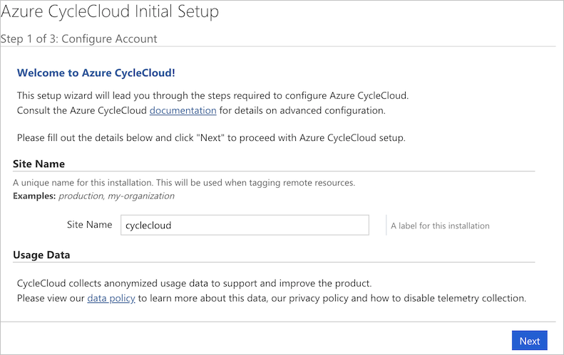
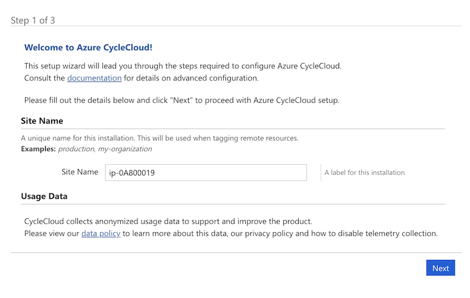
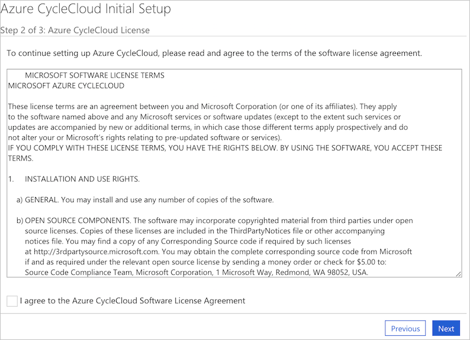
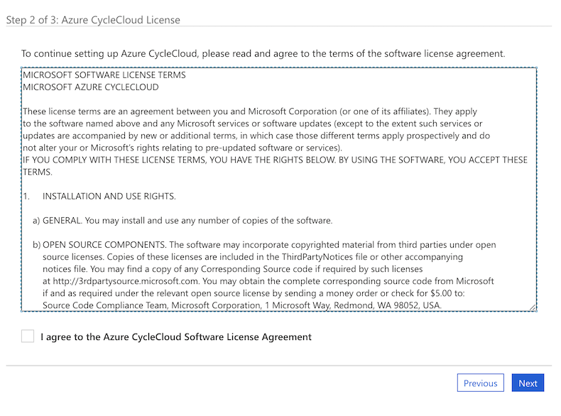
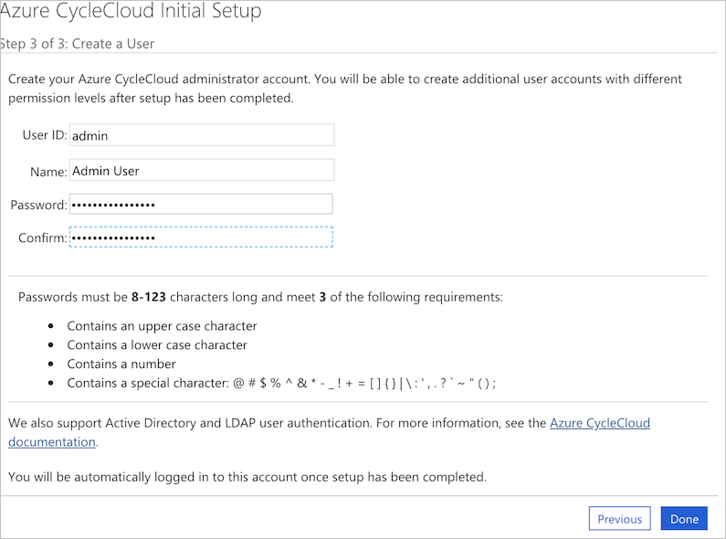
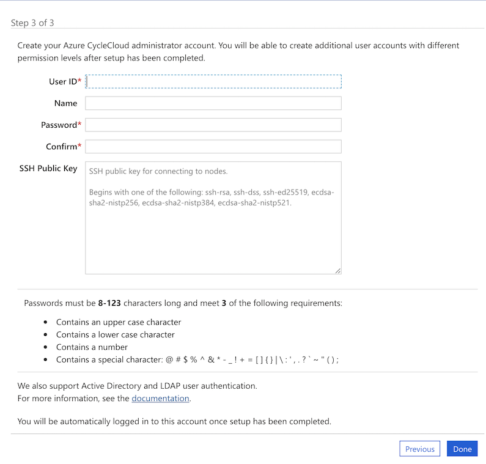

# Quickstart - Install CycleCloud using the Marketplace image

Azure CycleCloud is a free application that provides a simple, secure, and scalable way to manage compute and storage resources for HPC and Big Compute workloads. In this quickstart, you will install CycleCloud on Azure resources using the Marketplace image. 

The CycleCloud Marketplace image is the recommended way of installing CycleCloud and it is the easiest way to quickly get a working version of CycleCloud that will allow you to start and scale clusters. CycleCloud can also be installed manually, providing greater control over the installation and configuration process. For more information, see the [Manual CycleCloud Installation Quickstart](./how-to/install-manual.md)

## Prerequisites

For this quickstart, you will need:

1. An Azure account with an active subscription.
1. A SSH key

[!INCLUDE [cloud-shell-try-it.md](~/includes/cloud-shell-try-it.md)]

### SSH Keypair

An SSH key is needed to log into the CycleCloud VM and clusters. Generate an SSH keypair:

```azurecli-interactive
ssh-keygen -f ~/.ssh/id_rsa -m pem -t rsa -N "" -b 4096
```

Retrieve the SSH public key with:

```azurecli-interactive
cat ~/.ssh/id_rsa.pub
```

The output will begin with ssh-rsa followed by a long string of characters. Copy and save this key now.

On Linux, follow [these instructions on GitHub](https://help.github.com/articles/generating-a-new-ssh-key-and-adding-it-to-the-ssh-agent/) to generate a new SSH keypair.

## Create Virtual Machine

1. Log into the [Azure Portal](https://ms.portal.azure.com)
1. In the search bar, enter "CycleCloud" and select "Azure CycleCloud" from under the **Marketplace** category
1. Click on the **Create** button to bring up the Create Virtual Machine form.


### Customize CycleCloud instance

1. Choose your subscription from the **Subscription** dropdown
1. Select or create a new **Resource Group** that your CycleCloud instance will run in.
1. Name your CycleCloud instance using **Virtual Machine name**
1. Select the **Region**
1. Create the **Username** that you will use to log into the instance
1. Add your **SSH public key**
1. If you are planning on using [Managed Identities](/azure/active-directory/managed-identities-azure-resources/overview) (recommended), Select the **Management** tab and enable **System assigned managed identity**.
1. Click on the **Review** button and then the **Create** button

The image has a number of recommended default settings including **Size** and built-in **Network Security Groups**. These can be modified if necessary.


## Assign Managed Identity

If you are using Managed Identities for authentication, you should follow the [Managed Identities Guide](./how-to/managed-identities.md) to assign the system managed identity to the newly created application VM.

## Log into the CycleCloud Application Server

To connect to the CycleCloud webserver, retrieve the public IP address of the CycleServer VM from the Azure Portal.


Browse to `https://<public IP>/`. The installation uses a self-signed SSL certificate, which may show up with a warning in your browser.

Create a **Site Name** for your installation. You can use any name here:


::: moniker range="=cyclecloud-7"

::: moniker-end

::: moniker range=">=cyclecloud-8"

::: moniker-end

The Azure CycleCloud End User License Agreement will be displayed - click to accept it. 

::: moniker range="=cyclecloud-7"

::: moniker-end

::: moniker range=">=cyclecloud-8"

::: moniker-end

You will then need to create a CycleCloud admin user for the application server. We recommend using the same username used above. Ensure the password you enter meets the requirements listed. Click **Done** to continue.

::: moniker range="=cyclecloud-7"

::: moniker-end

::: moniker range=">=cyclecloud-8"

::: moniker-end

Once you have created your user, you may want to set your SSH key so that you can more easily access any Linux VMs created by CycleCloud. To add an SSH key, edit your profile by clicking on your name in the upper right hand corner of the screen.

You will need to set up you Azure provider account in CycleCloud. You can either use [Managed Identities](./how-to/managed-identities.md) or [Service Principals](./how-to/service-principals.md).

You should now have a running CycleCloud application that allows you to create and run clusters.

> [!NOTE]
> The default CycleCloud configuration may be customized for specific environments using settings in the _$CS_HOME/config/cycle_server.properties_ file.

## Further Reading

* [Plan your Production Deployment](/azure/cyclecloud/how-to/plan-prod-deployment)
* [Install CycleCloud manually](./how-to/install-manual.md)
* [Explore CycleCloud features with the tutorial](./tutorials/tutorial.md)
* [Use Managed Identities for account](./how-to/managed-identities.md)
* [Use Service Principals for account](./how-to/service-principals.md)