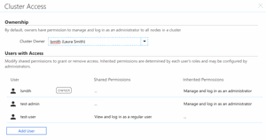
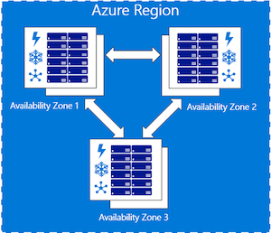

# Azure CycleCloud 7.8

The current release is 7.8.0.

## Azure CycleCloud 7.8 Release Highlights

|  |  |
| --- | --- |
| [**Improved User Management**](user-management.md) The major milestone in this release is the addition of an oft-requested feature -- supporting multiple user accounts per cluster.    - User accounts are now dynamically added or removed from cluster nodes based on cluster privileges.     - These user accounts are created locally on every node, with the option of delegating admin privileges.     - User authentication is SSH-key based using a public key assigned to the user profile.     - This user management is enabled via a site-wide setting. |   |
| [**Updated Slurm Integration**](https://github.com/Azure/cyclecloud-slurm) The integration between the Slurm scheduler and CycleCloud has been re-written to use the new autoscaling API. This brings the following autoscaling capabilities to Slurm clusters:    - Slurm clusters can now autoscale across different VM families.     - Autoscaling for MPI jobs in Slurm are now placement group aware. | |
| [**Larger Clusters**](custom-images.md) Improvements in the provisioning and orchestration layer in this release increases the size of clusters CycleCloud is able to manage. Cluster sizes of up to 5000 nodes and over 150,000 cores are now possible. | |
| [**Availability Zones**](cluster-references/cluster-template-reference.md) CycleCloud now supports the use of [availability zones](https://docs.microsoft.com/azure/availability-zones/az-overview). This allows users to pin cluster nodes to specific AZs. By pinning cluster nodes to a single AZ, a user is able to specify that the VMs in the cluster nodes are started within the same zone to improve latency. |  |

## Release Notes

Comprehensive release notes for the individual 7.8.x releases are listed below

* [**7.8.0 Release Notes**](release-notes/7-8-0.md) - released on 7/18/19

Release notes from [older versions](release-notes-archive.md) are also available.