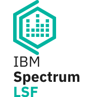
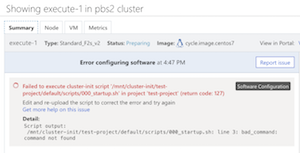

# Azure CycleCloud 7.9

The current release is 7.9.11.

## Azure CycleCloud 7.9 Release Highlights

|  |  |
| --- | --- |
| [**IBM Spectrum LSF Support**](lsf.md) The official LSF resource connector plugin for CycleCloud is included in IBM LSF version 10.1 fp 9, and this release includes a LSF cluster template.  |   |
| [**Node Management**](~/cluster-references/configuration-reference.md) The user interface now has explicit control over operating nodes.    - It is now possible to add nodes to a cluster and specify the placement groups that the nodes should be in. This gives a user a measure of control over node proximity, which is invaluable for creating an MPI ring for building or debugging MPI code.    - A keep-alive toggle on each node also gives users control over a node's lifespan independently from a scheduler's autoscaling policies. This feature is useful for users who need to access a node locally for troubleshooting applications or jobs.  |  |
| [**Issue Reporting**](error_messages.md) A new issue reporting UI has been added that simplifies the diagnosis of issues that may occur in a running cluster.    - Errors in nodes are now reported back into CycleCloud and displayed to a user without requiring remote access into the virtual machine, making trouble shooting easier.    - The issues interface also provides links to documentation that improves self-supportability.|  |
| [**Ephemeral OS disks**](/azure/virtual-machines/windows/ephemeral-os-disks) Ephemeral OS disks can now be used to improve virtual machine and scale sets start-up performance and cost.    To use an ephemeral OS disk, add `EphemeralOSDisk = true` to a node in your cluster template.| |

## Release Notes

Comprehensive release notes for the individual 7.9.x releases are listed below

* [**7.9.11 Release Notes**](release-notes/7-9-11.md) - released on 11/02/22
* [**7.9.10 Release Notes**](release-notes/7-9-10.md) - released on 06/29/21
* [**7.9.9 Release Notes**](release-notes/7-9-9.md) - released on 01/29/21
* [**7.9.8 Release Notes**](release-notes/7-9-8.md) - released on 09/14/20
* [**7.9.7 Release Notes**](release-notes/7-9-7.md) - released on 08/20/20
* [**7.9.6 Release Notes**](release-notes/7-9-6.md) - released on 06/05/20
* [**7.9.5 Release Notes**](release-notes/7-9-5.md) - released on 04/20/20
* [**7.9.4 Release Notes**](release-notes/7-9-4.md) - released on 03/17/20
* [**7.9.3 Release Notes**](release-notes/7-9-3.md) - released on 03/12/20
* [**7.9.2 Release Notes**](release-notes/7-9-2.md) - released on 01/13/20
* [**7.9.1 Release Notes**](release-notes/7-9-1.md) - released on 12/09/19
* [**7.9.0 Release Notes**](release-notes/7-9-0.md) - released on 11/15/19

Release notes from the [previous major releases](release-notes-previous.md) and [older versions](release-notes-archive.md) are also available.
