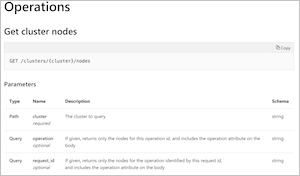
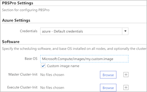
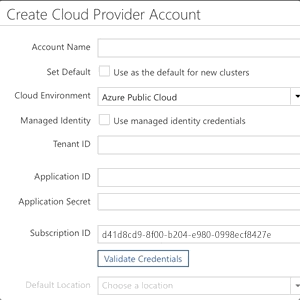

# Azure CycleCloud 7.7

The current release is 7.7.3.

## Azure CycleCloud 7.7 Release Highlights

|  |  |
| --- | --- |
| [**Revamped autoscale API**](autoscale-api.md) This release brings a significant change to the CycleCloud autoscaling API, pivoting from a core-centric API to one that is node-oriented. With these change:    - Clusters can autoscale across different VM families    - For MPI jobs where node proximity is crucial, schedulers will now be able to implement autoscaling strategies that ensure nodes in an MPI ring are in the same placement group.    - With the node-oriented API, scheduler implementations can now autoscale by other resource requirements such as memory, GPU or swap space.  This new autoscaling API has been implemented for the default PBSPro and LSF clusters, with the other schedulers to follow in subsequent releases.| |
| [**Specify custom images or marketplace images in the Cluster UI**](custom-images.md) Custom images are now easier to use in CycleCloud. Default cluster templates now allow a user to specify a resource URL for a custom image or marketplace image URN in the template. Gallery images can also be defined in custom templates. |  |
| [**Use a Managed Identity in CycleCloud**](managed-identities.md) Managed Identities is a feature of the Azure Active Directory service for allocating privileges without having to pass secrets or credentials. This release allows a user to configure CycleCloud with the Managed Identity attached to the underlying VM. The privileges assigned to CycleCloud are determined by roles assigned to the Managed Identity. |  |

## Release Notes

Comprehensive release notes for the individual 7.7.x releases are listed below

* [**7.7.3 Release Notes**](release-notes/7-7-3.md) - released on 4/1/19
* [**7.7.2 Release Notes**](release-notes/7-7-2.md) - released on 3/5/19
* [**7.7.1 Release Notes**](release-notes/7-7-1.md) - released on 2/14/19
* [**7.7.0 Release Notes**](release-notes/7-7-0.md) - released on 2/11/19

Release notes from the [previous major releases](release-notes-previous.md) and [older versions](release-notes-archive.md) are also available.
