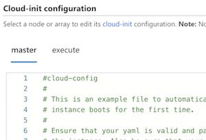

# Azure CycleCloud 8.x

The current version is 8.7.1.

## Azure CycleCloud 8.x release highlights

CycleCloud 8.7 is the seventh GA release of the CycleCloud 8.x platform. It adds expanded scheduler support and security improvements.

| Note | Image |
| --- | --- |
|[**CycleCloud can use Managed Identity for more secure access to Azure Storage**](./how-to/managed-identities.md)  CycleCloud now supports replacing Shared Access Key access to Azure Storage with Identity-based access for both the CycleCloud orchestrator and CycleCloud Locker access for cluster nodes. |  |
| [**OpenPBS is supported by azpbs agent**](~/articles/cyclecloud/openpbs.md)  Introducing `azpbs` a configuration-based agent for managing heterogeneous OpenPBS cluster including on-premises/cloud hybrid. `azpbs` is a more general and precise matching framework for job and VM resources. |  |
| [**Altair Grid Engine is a Supported Scheduler Type**](~/articles/cyclecloud/gridengine.md)  A free demo version of Altair Grid Engine is available in CycleCloud 8.2, with a simple path to full end-to-end enterprise support for Altair clusters running on Azure. [Learn more about Altair + Azure here](https://techcommunity.microsoft.com/t5/azure-compute/univa-grid-engine-cluster-arrives-in-azure-cyclecloud-8-1/ba-p/1863043) |  |
| [**HPC Pack is a Supported Scheduler Type**](~/articles/cyclecloud/hpcpack.md)  The Microsoft HPC Pack scheduler is now integrated with Azure CycleCloud 8.2. With Azure CycleCloud and the HPC Pack scheduler, you can scale your environment from zero to thousands of VM Scale Set nodes for each job—without managing any permanent nodes. |  |
| [**Improved Cost Tracking**](~/articles/cyclecloud/concepts/usage-tracking.md)  CycleCloud 8.2 now shows approximate ongoing cluster costs and provides a [REST API](~/articles/cyclecloud/api.md#clusters_getclusterusage) for fetching cost data programmatically. Also, CycleCloud now tags VMs so that cluster and node costs appear in [Microsoft Cost Management](https://azure.microsoft.com/services/cost-management/). | |
| [**Slurm Cluster Updates**](~/articles/cyclecloud/slurm.md)  Slurm clusters deployed in CycleCloud 8.1 can now be configured to do [Slurm job accounting](https://slurm.schedmd.com/accounting.html). Additionally, GPU resources on nodes are now recognized automatically, with node partitions autoscaling based on GPU resource requests. |  |
| [**Autoscaling Library**](https://github.com/Azure/cyclecloud-scalelib)  A new open-source autoscaling library is now implemented in CycleCloud 8.1, simplifying autoscaler development for any scheduler in Azure. This new autoscaling library drives the Altair Grid Engine scaling on Azure, and is also used in the open-source Grid Engine clusters. |  |
| [**NAS Options in Default Cluster Templates**](~/articles/cyclecloud/how-to/mount-fileserver.md)  Default cluster templates shipped in CycleCloud 8.1 now include a section for configuring network filesystem mounts. With this feature, mounting NFS shares no longer requires changes to a cluster template. |  |
| [**Azure Event Grid Integration**](~/articles/cyclecloud/events.md) CycleCloud 8.0 generates events when certain node or cluster changes occur, and these events can now be published to Azure Event Grid. With this integration, you can create triggers to events like Spot VM evictions or node allocation failures. |  |
| [**Cloud-Init Support**](~/articles/cyclecloud/how-to/cloud-init.md) CycleCloud 8.0 now supports cloud-init as a way of customizing virtual machines as they boot up. Users can now specify a cloud-init config that's processed before the CycleCloud configuration occurs, allowing users to baseline a VM by configuring volumes, mounts, networking, or OS before the scheduler stack is set up. |  |

## Release notes

The following table lists the release notes for the individual 8.x releases:

| CycleCloud Release Notes Version  | Release date  |
| :-------------------------------: | :-----------: |
| [**8.7.1**](release-notes/8-7-1.md) | 02/11/25 |
| [**8.7.0**](release-notes/8-7-0.md) | 12/18/24 |
| [**8.6.5**](release-notes/8-6-5.md) | 10/24/24 |
| [**8.6.4**](release-notes/8-6-4.md) | 08/30/24 |
| [**8.6.3**](release-notes/8-6-3.md) | 07/18/24 |
| [**8.6.2**](release-notes/8-6-2.md) | 05/31/24 |
| [**8.6.1**](release-notes/8-6-1.md) | 04/04/24 |
| [**8.6.0**](release-notes/8-6-0.md) | 02/22/24 |
| [**8.5.0**](release-notes/8-5-0.md) | 11/20/23 |
| [**8.4.2**](release-notes/8-4-2.md) | 09/29/23 |
| [**8.4.1**](release-notes/8-4-1.md) | 08/14/23 |
| [**8.4.0**](release-notes/8-4-0.md) | 04/10/23 |
| [**8.3.0**](release-notes/8-3-0.md) | 11/05/22 |
| [**8.2.2**](release-notes/8-2-2.md) | 03/18/22 |
| [**8.2.1**](release-notes/8-2-1.md) | 11/11/21 |
| [**8.2.0**](release-notes/8-2-0.md) | 08/04/21 |
| [**8.1.1**](release-notes/8-1-1.md) | 03/26/21 |
| [**8.1.0**](release-notes/8-1-0.md) | 11/16/20 |
| [**8.0.2**](release-notes/8-0-2.md) | 10/16/20 |
| [**8.0.1**](release-notes/8-0-1.md) | 07/02/20 |
| [**8.0.0**](release-notes/8-0-0.md) | 05/29/20 |

You can also view release notes for the [previous major releases](release-notes-previous.md) and [older versions](release-notes-archive.md).
