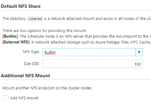

# Azure CycleCloud 8.x

The current release is 8.3.0.

## Azure CycleCloud 8.x Release Highlights

CycleCloud 8.3 is the third GA release of the CycleCloud 8.x platform and continues to add expanded scheduler support and improvements.

|  |  |
| --- | --- |
| [**OpenPBS is supported by azpbs agent**](~/openpbs.md)  Introducing `azpbs` a configuration-based agent for managing heterogeneous OpenPBS cluster including on-prem/cloud hybrid. `azpbs` is a more general and precise matching framework for job and VM resources. |  |
| [**Altair Grid Engine is a Supported Scheduler Type**](~/gridengine.md)  A free, demo version of Altair Grid Engine is available in CycleCloud 8.2, with a simple path to full end-to-end enterprise support for Altair clusters running on Azure. [Learn more about Altair + Azure here](https://techcommunity.microsoft.com/t5/azure-compute/univa-grid-engine-cluster-arrives-in-azure-cyclecloud-8-1/ba-p/1863043) |  |
| [**HPC Pack is a Supported Scheduler Type**](~/hpcpack.md)  The Microsoft HPC Pack scheduler is now integrated with Azure CycleCloud 8.2. The combination of Azure CycleCloud and HPC Pack scheduler allows the user to fully scale their environment with VM Scale Set nodes from zero to thousands of nodes and back each job with no permanent nodes to manage and maintain. |  |
| [**Improved Cost Tracking**](~/concepts/usage-tracking.md)  CycleCloud 8.2 now shows approximate on-going cluster costs and provides a [REST API](~/api.md#clusters_getclusterusage) for fetching cost data programmatically. Additionally, CycleCloud now tags VMs so that cluster and node costs can be shown in [Azure Cost Management](https://azure.microsoft.com/services/cost-management/). | |
| [**Slurm Cluster Updates**](~/slurm.md)  Slurm clusters deployed in CycleCloud 8.1 can now be configured to do [Slurm job accounting](https://slurm.schedmd.com/accounting.html). Additionally, GPU resources on nodes are now recognized automatically, with node partitions autoscaling based on GPU resource requests. |  |
| [**Autoscaling Library**](https://github.com/Azure/cyclecloud-scalelib)  A new, open-source, autoscaling library is now implemented in CycleCloud 8.1, simplifying autoscaler development for any scheduler in Azure. This new autoscaling library drives the Altair Grid Engine scaling on Azure, and is also used in the open-source Grid Engine clusters. |  |
| [**NAS Options in Default Cluster Templates**](~/how-to/mount-fileserver.md)  Default cluster templates shipped in CycleCloud 8.1 now include a section for configuring network filesystem mounts. With this, mounting NFS shares no longer requires changes to a cluster template. |  |
| [**Azure Event Grid Integration**](~/events.md) CycleCloud 8.0 generates events when certain node or cluster changes occur, and these events can now be published to Azure Event Grid. With this integration, you can create triggers to events like Spot VM evictions or node allocation failures. |  |
| [**Cloud-Init Support**](~/how-to/cloud-init.md) CycleCloud 8.0 now supports cloud-init as a way of customizing virtual machines as they boot up. Users can now specify a cloud-init config that will be processed before the CycleCloud configuration occurs. This allows users to baseline a VM by configuring volumes, mounts, networking, or OS before the scheduler stack is set up. |  |

## Release Notes

Comprehensive release notes for the individual 8.x releases are listed below

* [**8.3.0 Release Notes**](release-notes/8-3-0.md) - released on 11/05/22
* [**8.2.2 Release Notes**](release-notes/8-2-2.md) - released on 03/18/22
* [**8.2.1 Release Notes**](release-notes/8-2-1.md) - released on 11/11/21
* [**8.2.0 Release Notes**](release-notes/8-2-0.md) - released on 08/04/21
* [**8.1.1 Release Notes**](release-notes/8-1-1.md) - released on 03/26/21
* [**8.1.0 Release Notes**](release-notes/8-1-0.md) - released on 11/16/20
* [**8.0.2 Release Notes**](release-notes/8-0-2.md) - released on 10/16/20
* [**8.0.1 Release Notes**](release-notes/8-0-1.md) - released on 07/02/20
* [**8.0.0 Release Notes**](release-notes/8-0-0.md) - released on 05/29/20

Release notes from the [previous major releases](release-notes-previous.md) and [older versions](release-notes-archive.md) are also available.
