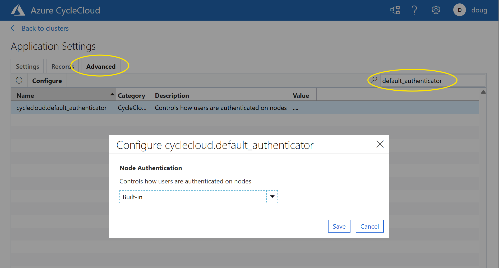

# CycleCloud version 8.6.4

## New Features:

* Azure CycleCloud now supports the use of Workload ID in addition to Managed Identity and Service Principal to permission CycleCloud for your subscription. 
* Lustre mount point permissions are now configurable 
* Ubuntu users installing CycleCloud using apt, should use the apt “stable” repository rather than “bionic” (“bionic” is deprecated) to install the cyclecloud8 package. Packages are compatible across “bionic” and “stable” distribution channels.

## Resolved Issues:

* Importing a template with cloud-init containing $ then editing it in the UI caused the value to revert to the template’s value on cluster restart 
* Let's Encrypt certificates did not automatically renew properly 
* Download Remote Desktop files for Windows nodes did not work when Entra ID Authentication was enabled 
* The ‘Export’ button for records did not work when Entra ID Authentication was enabled 
* Slurm clusters would fail to converge with "Unable to find a match: epel-release" or "Unknown repo: 'powertools'" errors in certain RHEL distros. 
* Centos 7 is no longer supported for azslurm and slurm packages. 
* Jetpack installation failed to retry the initial CycleCloud connection leading to occasional extension failures under load 
* Resolved [CVE-2017-1000487](https://nvd.nist.gov/vuln/detail/CVE-2017-1000487), [CVE-2024-30105](https://nvd.nist.gov/vuln/detail/CVE-2024-30105), [CVE-2024-38095](https://nvd.nist.gov/vuln/detail/CVE-2024-38095), [CVE-2024-39338](https://nvd.nist.gov/vuln/detail/CVE-2024-39338), [CVE-2024-34750](https://nvd.nist.gov/vuln/detail/CVE-2024-34750), [CVE-2024-23672](https://nvd.nist.gov/vuln/detail/CVE-2024-23672), and [CVE-2024-24549](https://nvd.nist.gov/vuln/detail/CVE-2024-24549) 

## Known Issues:

* Configuring "CycleCloud" under the `Settings` page displays an error stating "Invalid form arguments". The workaround is to go to the Advanced tab and configure the `cyclecloud.default_authenticator`, `cyclecloud.eventgrid_topic`, `cyclecloud.single_cluster`, `cyclecloud.force_delete.vm`, and `cyclecloud.force_delete.vmss` settings directly, for example:

