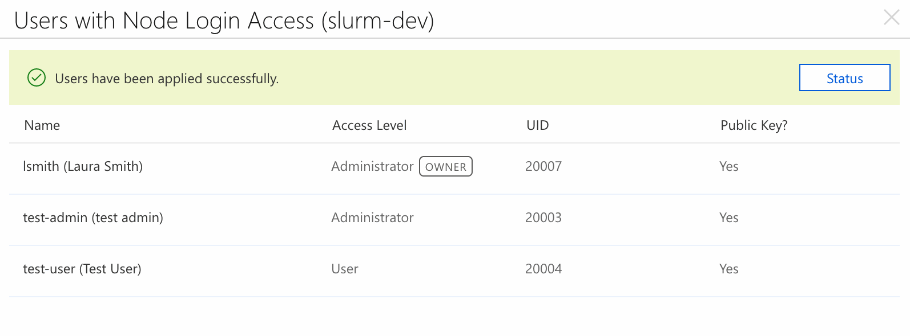

# Cluster User Management

There are primarily two mechanisms for enabling login access to cluster nodes -- through the CycleCloud built-in user management feature, or integrating the nodes with a third-party directory service such as Active Directory or an LDAP server.

## The VM Agent User

Every Azure VM started and managed through CycleCloud has an admin user that is created by the [VM agent](https://docs.microsoft.com/en-us/azure/virtual-machines/extensions/agent-linux). This user's username is `cyclecloud` and the SSH private key for this user can be found at */opt/cycle_server/.ssh/cyclecloud.pem* in the CycleCloud application server. This key is generated during the installation process and is unique to each site.

This user account exists locally on each VM and should be treated as a service user with admin access. However, this user account may come in useful for troubleshooting purposes.

To connect to a cluster node with this user:

    $ ssh -i /opt/cycle_server/.ssh/cyclecloud.pem cyclecloud@${NODE-IP-Address}

Alternatively, the CycleCloud CLI can be used to access a cluster node.

``` 
cp /opt/cycle_server/.ssh/cyclecloud.pem ~/.ssh 
cyclecloud connect [node] -c [cluster] -u cyclecloud
```

## Built-In User Management

CycleCloud comes with a built-in user management system that creates local user accounts on every VM. These local user accounts are created for each user with log in permissions to the cluster. Additionally, users with the node admin permission will have administrator (sudo) privileges on each VM in the cluster. These permissions may be granted through ownership of the cluster, by the user's role, or by explicit sharing. See [CycleCloud User Management](user-management.md) for more information on granting permissions to users through roles and sharing.

The list of regular users and administrators that will be added to nodes is visible on the cluster page in the CycleCloud UI under `Users`. Selecting the `show` link will open a dialog with more information.



This dialog shows each individual user as well as the status of user management on each individual node in the cluster. Any errors or warnings when configuring users (such as a UID conflict or a disallowed user name) will display in this dialog. Users are managed via the `jetpackd` daemon on each node, so it is possible to make changes to running clusters.

### Logging in to Nodes

User authentication is SSH-key based. The public key for each user with login access is obtained from the corresponding user in CycleCloud and staged into each VM. If the user does not have a public key, the local user account is still created but the user will not be able to log in until a key is staged manually.

For clusters with an NFS server, the home directory for each user is available on the NAS with the base home directory */shared/home*. For clusters without an NFS server, the base home directory is */home* and that is local to each VM of the cluster.

### Revoking Access

If the user was granted login access via a shared permission, simply remove those shared permissions using the "Access" link on the cluster page. If the user has the "Global Node Admin" or "Global Node User" role, an administrator must remove those roles on the users tab of the **Settings** page. Note that user accounts are not deleted on running nodes; instead the login shell for these revoked user accounts is changed to */sbin/nologin*.

## Disabling the Built-In User Management System

The built-in user management system is enabled by default on every CycleCloud installation and is an installation-wide setting -- all clusters managed by the CycleCloud server will have this enabled. To disable, navigate to the **CycleCloud** section of the **Settings** page. The pop-up box contains an option for **Node Authentication** and selecting **Disabled** from the drop down will ensure that no local user accounts aside from the VM agent user will be created.

## Third-Party User Management Systems

For enterprise production clusters, it is recommended that user access be managed through a directory service such as LDAP, Active Directory, or NIS. This integration can be implemented by configuring PAM and NSS in the VM images used on each node, or creating CycleCloud projects that are executed during the software installation phase of each node.

The [Azure Active Directory Domain Service](https://azure.microsoft.com/en-us/services/active-directory-ds/) provides a managed service for Active Directory servers, and instructions for joining a Linux domain can be found [here](https://docs.microsoft.com/en-us/azure/active-directory-domain-services/active-directory-ds-join-rhel-linux-vm).

