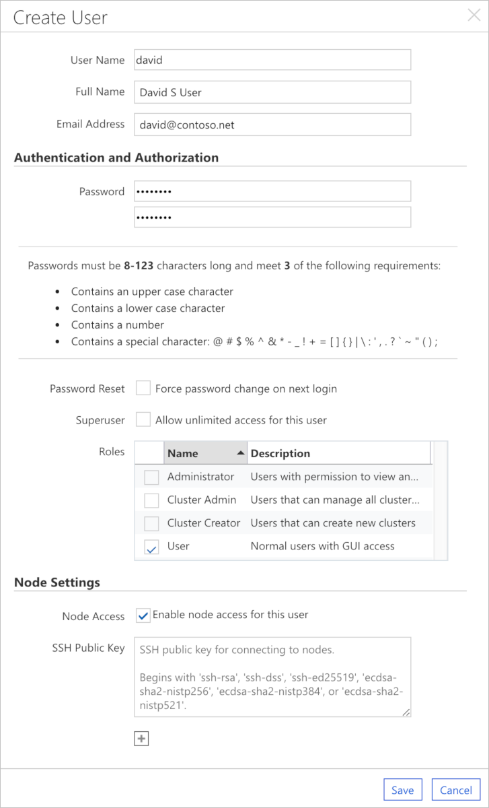
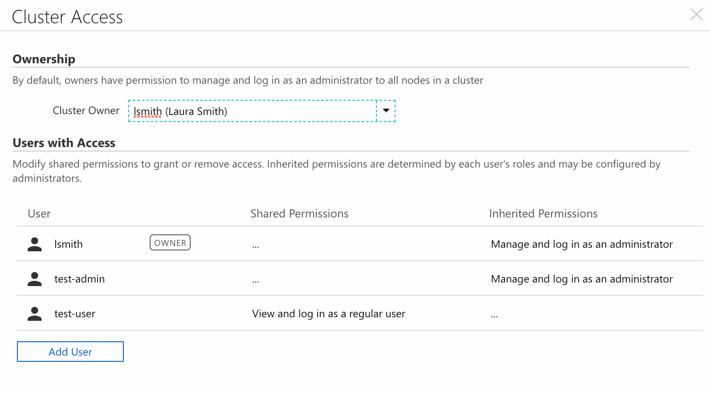

# User Management

## CycleCloud Users vs Cluster Users

There are two separate but intertwined user access notions that are relevant to CycleCloud: users that have access to the CycleCloud application, and users that have login access to cluster nodes orchestrated by CycleCloud. These two sets of users may be mutually exclusive. This document describes the facilities provided for managing the CycleCloud application server users.

For managing user access into cluster nodes please refer to the page [Cluster User Access](user-cluster-access.md).

## Adding New Users to CycleCloud

The user management page in CycleCloud can be accessed through the **Settings** link on the left panel, followed by the **Users** tab in the resulting page. Click on the **Create** button to add a new user.

A pop-up will appear for adding a new user account. Pay attention to the password requirements and select the **Password Reset** box to force the user to change their password on first login.

The **Superuser** checkbox will assign site administrator privileges to a user. This grants the user access to all the data and Azure account information that is stored in CycleCloud, but does not grant log in access to nodes in any cluster.

Select the appropriate roles to assign privileges to the user. The [Roles](#user-roles) section below lists the privileges for each of the built-in roles.

The **Node Settings** section contains settings for providing users access to cluster nodes. To allow CycleCloud to create and manage this user on nodes, select **Enable node access for this user** and optionally supply the SSH public key that corresponds to the private key that the user will use to connect. Enabling node access will not grant any permissions to connect to nodes, it simply indicates that CycleCloud should create and manage the user when log in access is granted. See the [Cluster User Management](user-cluster-access.md) page for more information.

## Edit User

The **Edit** button on the user management page allows an administrator to modify roles and user properties. The administrator can also set the Unix **UID** for the user's local account on the cluster nodes. By default, CycleCloud will reserve UIDs 20000 and above for node users. Note that changing the UID here will not affect running nodes or change any existing file permissions on persistent storage. See [Cluster User Management](user-cluster-access.md) for details.

## User Roles

Each user can be assigned to one or more of the following roles that are built-in to the CycleCloud application server:

| Role              | Privileges |
| ----------------- | -----------------------------------------------------------------------------------------------------------------|
| User              | Log in to the CycleCloud web interface, view and manage own clusters but not create new clusters                 |
| Cluster Creator   | Contains all of the permissions of the `User` role and adds the ability to create new clusters                   |
| Administrator     | Create and edit all clusters and manage CycleCloud application settings                                          |
| Global Node User  | Log in to every cluster node managed by this CycleCloud installation                                             |
| Global Node Admin | Log in with administrator privileges (sudo access) to every cluster node managed by this CycleCloud installation |

Note also that the **Superuser** checkbox described in the previous section grants supersedes all roles assigned to a user except for the `Global Node User` and `Global Node Admin` roles (for more information about those two roles, see [Cluster User Management](user-cluster-access.md)). All `Superusers` are `Administrators` with additional privileges to view and edit all data in the system.

## Groups

The **Settings** page also includes a tab for managing user groups in CycleCloud. User Groups are logical sets of user accounts and help simplify assigning login access or management privileges to clusters.

Create a new group using the **Create** button. Enter a group name and a description for the group. Use the **Add Member** button to add members to the group. The **Add Member** dialog box includes a check-box for making the user a `Group Administrator`. `Group Administrators` have permissions to view and manage all clusters assigned to the group.

## Cluster Access, Ownership, and Sharing

When viewing a cluster, select the "Access" button to see a list of which users have permissions to the cluster.

This dialog shows a comprehensive list of every CycleCloud user with access to the cluster. By default, the owner is the user who created the cluster and has full permission to manage and log in to all nodes with administrator (sudo) privileges. Shared permissions grant explicit access to only the current cluster and may be modified by selecting each row. To share permissions with a new user, use the `Add User` button at the bottom of the list and select the permissions to share.

See [Cluster User Management](user-cluster-access.md) for more information about managing cluster node access.

## User Authentication

User authentication is provided by either the built-in authentication system or by integrating with a third-party authentication service. [See User Authentication](user-authentication.md) for more information.

