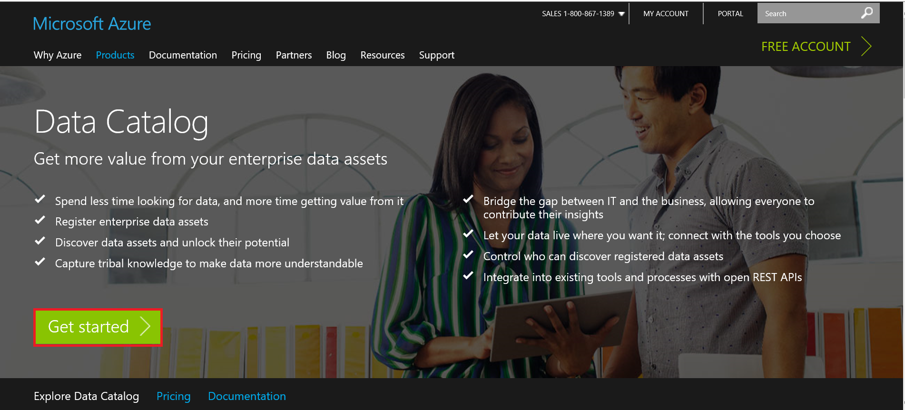
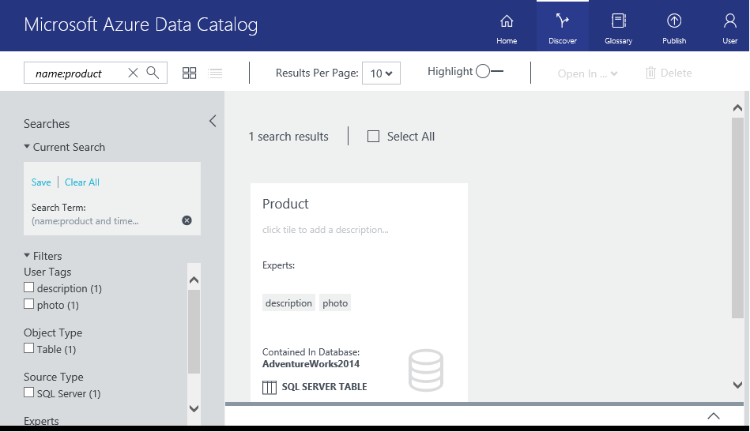
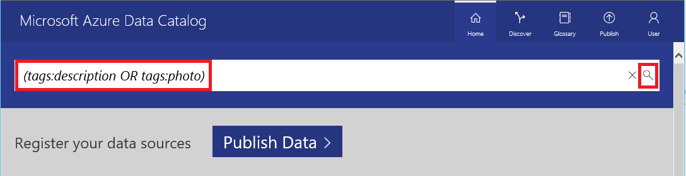
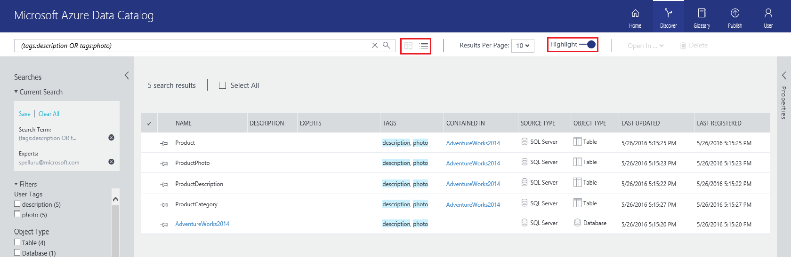
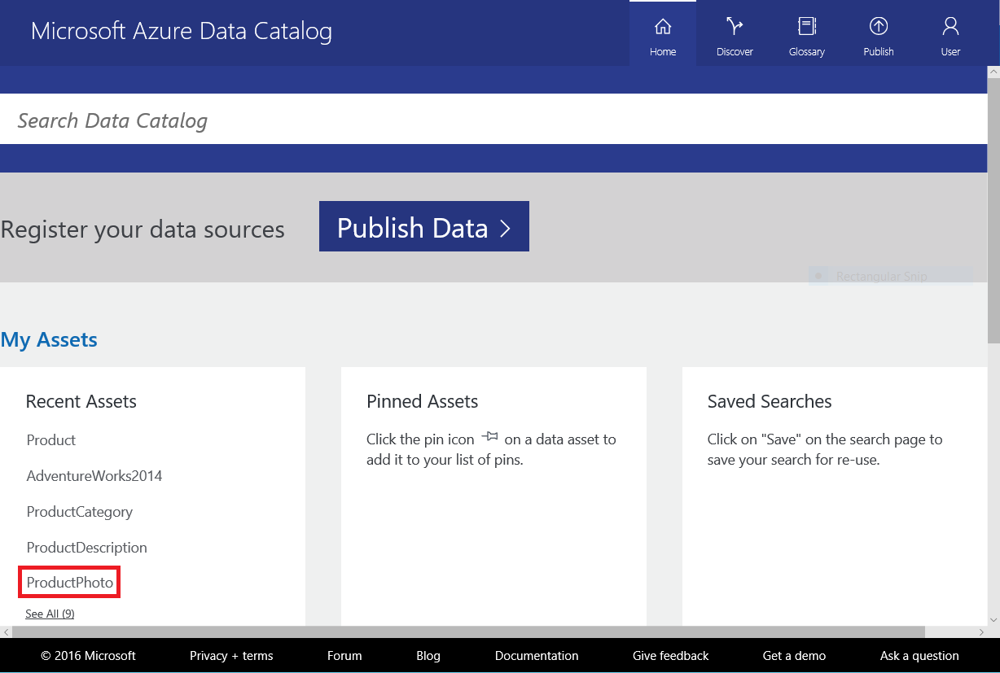

<properties
	pageTitle="Get started with Data Catalog | Microsoft Azure"
	description="End-to-end tutorial presenting the scenarios and capabilities of Azure Data Catalog."
	documentationCenter=""
	services="data-catalog"
	authors="steelanddata"
	manager=""
	editor=""
	tags=""/>
<tags
	ms.service="data-catalog"
	ms.devlang="NA"
	ms.topic="get-started-article"
	ms.tgt_pltfrm="NA"
	ms.workload="data-catalog"
	ms.date="05/06/2016"
	ms.author="maroche"/>

# Tutorial: Get started with Azure Data Catalog
Azure Data Catalog is a fully managed cloud service that serves as a system of registration and system of discovery for enterprise data assets. For a detailed overview, see [What is Azure Data Catalog](data-catalog-what-is-data-catalog.md). 

This tutorial helps you get started with Azure Data Catalog. You will perform the following steps in this tutorial: 

- [Register data assets](#register-data-assets) 
- [Discover data assets](#discover-data-assets) 
- [Annotate data assets](#annotate-data-assets)
- [Connect to data assets](#connect-to-data-assets)
- [Manage data assets](#manage-data-assets)
- [Remove data assets](#remove-data-assets)   
 
## Tutorial prerequisites

Before you begin this tutorial you must have the following:

### Azure Subscription
To set up Azure Data Catalog, you must be the owner or co-owner of an Azure subscription.

Azure subscriptions help you organize access to cloud service resources like Azure Data Catalog. They also help you control how resource usage is reported, billed, and paid for. Each subscription can have a different billing and payment setup, so you can have different subscriptions and different plans by department, project, regional office, and so on. Every cloud service belongs to a subscription, and you need to have a subscription before setting up Azure Data Catalog. To learn more, see [Manage Accounts, Subscriptions, and Administrative Roles](../active-directory/active-directory-assign-admin-roles.md).

If you don't have a subscription, you can create a free trial account in just a couple of minutes. See [Free Trial](https://azure.microsoft.com/pricing/free-trial/) for details.

### Azure Active Directory
To set up Azure Data Catalog, you must be logged in using an Azure Active Directory user account.

Azure Active Directory (Azure AD) provides an easy way for your business to manage identity and access, both in the cloud and on-premises. Users can use a single work or school account for single sign-on to any cloud and on-premises web application. Azure Data Catalog uses Azure AD to authenticate sign-on. To learn more, see [What is Azure Active Directory](../active-directory/active-directory-whatis.md).

### Active Directory policy configuration

In some situations, users may encounter a situation where they can log on to the Azure Data Catalog portal, but when they attempt to log on to the data source registration tool they encounter an error message that prevents them from logging on. This problem behavior may occur only when the user is on the company network, or may occur only when the user is connecting from outside the company network.

The data source registration tool uses Forms Authentication to validate user logons against Active Directory. For successful logon, Forms Authentication must be enabled in the Global Authentication Policy by an Active Directory administrator.

The Global Authentication Policy allows authentication methods to be enabled separately for intranet and extranet connections, as illustrated below. Logon errors may occur if Forms Authentication is not enabled for the network from which the user is connecting.

 

For more information, see [Configuring Authentication Policies](https://technet.microsoft.com/library/dn486781.aspx).

### Adventure Works sample database 
This tutorial uses the Adventure Works sample database for SQL Server Database Engine, but you can use any supported data source if you would prefer to work with data that is familiar and relevant to your role. For a list of supported data sources, see [Supported data sources](data-catalog-dsr.md).

### Install the Adventure Works 2014 OLTP database
The Adventure Works database supports standard online transaction processing scenarios for a fictitious bicycle manufacturer (Adventure Works Cycles) which includes Products, Sales, and Purchasing. In this tutorial you register information about products into **Azure Data Catalog**.

Here's how to install the Adventure Works sample database:

1. Download [Adventure Works 2014 Full Database Backup.zip](https://msftdbprodsamples.codeplex.com/downloads/get/880661) on CodePlex.
2. Follow instructions in this article: [Restore a Database Backup using SQL Server Management Studio](http://msdn.microsoft.com/library/ms177429.aspx) to restore the database on your machine. 

	**Quick steps**: In SQL Server Management Studio, right-click Databases, select Restore Database. In the Restore Database dialog box, select Device option, add AdventureWorks2014.bak file, click OK to close the dialog box and then click OK to start the restore database operation.   

Now, let's see how to register data assets from the Adventure Works sample database with **Azure Data Catalog**.

## Register data assets

In this exercise you use the **Azure Data Catalog** publishing tool to register data assets from the Adventure Works database with the catalog. Registration is the process of extracting key structural metadata – such as names, types, and locations – from the data source and the assets it contains, and copying that metadata to the catalog. The data source and data assets remain where they are, but the metadata is used by the catalog to make them more easily discoverable and understandable.

### Here’s how to register a data source

1.	Go to [https://azure.microsoft.com/services/data-catalog](https://azure.microsoft.com/services/data-catalog), and click **Get started**.

	
2.	Click **Publish data** on the home page. 

    

3.	Click **Launch Application** to download, install, and run the **publishing tool** on your computer.

    

4. In the **Welcome** page, click **Sign in**, and enter your credentials.	 The user account must be owner or co-owner of the Azure subscription.

	

5. In the **Microsoft Azure Data Catalog** page, double click **SQL Server**, or click **SQL Server**, and **Next**.

    

6.	Enter the SQL Server connection properties for **AdventureWorks2014** (see example below), and click **CONNECT**.

    

7.	The next page is where you register the metadata of your data asset. In this example, you register **Production/Product** objects from the AdventureWorks Production namespace. Here’s how to do it:
    
	1. In the **Server Hierarchy** tree, click **Production**.
	2. Ctrl+click **Product**, **ProductCategory**, **ProductDescription**, and **ProductPhoto**.
	3. Click the **move selected arrow** (**>**). This will move all selected Product objects into the **Objects to be registered** list.
			
    	
	4. Select **Include a Preview** for users to be able to preview data before they consume it.
	5. Select **Include Data Profile** for users to be able see profiling of the data (for example: minimum, maximum, and average values for a column, number of rows etc...).
	5. In the **Add tags**, enter **adventure works, cycles**. This will add search tags for these data assets. Tags are a great way to help users find a registered data source.
	6. (optional) Specify name of an expert on this data. You are automatically added as an expert. 

    	

    f.	Click **REGISTER**. Azure Data Catalog registers your selected objects. In this exercise, the selected objects from Adventure Works are registered.
	
		

    g.	To see your registered data source objects, click **View Portal**. In the **Azure Data Catalog** portal, you can view data source objects in **Tiles** or a **List**.

    

	In this exercise you registered objects from the Adventure Works sample database so that they can be easily discovered by users across your organization. In the next exercise you learn how to discover registered data assets.

## Discover data assets

In this exercise you will use the **Azure Data Catalog** portal to discover registered data assets and view their metadata. **Azure Data Catalog** has a simple but powerful search syntax that enables you to easily build queries that return data users need. **Azure Data Catalog** has the following search options:

- Simple keyword search
- Interactive filters
- Advanced search syntax for power users

For details about **Azure Data Catalog** search, see [Data Catalog Search syntax reference](https://msdn.microsoft.com/library/azure/mt267594.aspx). Let's look at a few examples for searching for data assets in the catalog.  

### Basic search
1. Click **Home** button in the Azure Data Catalog portal. If you have closed it, navigate to [https://www.azuredatacatalog.com](https://www.azuredatacatalog.com).
2. In the search box at the top, enter **adventure works cycles** and click the **search** icon (or) press **Enter**.
3. Confirm that you see all the four tables and the database (AdventureWorks2014) **Product** table from **AdventureWorks2014** database in the results. 

	You can switch between tile view and grid view by clicking buttons at the top as shown in the following image. 

	Notice that the tags are highlighted in the search results as the Highlight option at the top is ON. 
4. You can also filter the results by using Filters on the left. For example, click Table for Object Type and you should see only the four tables, not the database.

### Property scoping
3. In the search box at the top, enter **tags:cycles** and click the **search** icon (or) press **Enter**. See all the properties you can use at https://msdn.microsoft.com/library/azure/mt267594.aspx.
3. Confirm that you see all the four tables and the database (AdventureWorks2014) **Product** table from **AdventureWorks2014** database in the results. 

### Boolean operators
2. **tags:cycles AND objectType:table**
3. You should see only four tables.

### Grouping with parenthesis
1. name:product AND (tags:cycles AND objectType:table)
2. You should see only product table now. 

### Comparison operators
1. Clear all filters
2. lastRegisteredTime:>"06/09/2016"

### Property scoping query
1. Click **Home** button in the Azure Data Catalog portal. If you have closed it, navigate to [https://www.azuredatacatalog.com](https://www.azuredatacatalog.com).
2. In the search box at the top, enter **tags:photo** and click the **search** icon (or) press **Enter**.
2. Confirm that you see all the four tables and the database (AdventureWorks2014) **Product** table from **AdventureWorks2014** database in the results. 

    

### Use grouping query
In this example, you do a **grouping** search for data assets.

2. In the **Search Data Catalog** box, enter a **grouping** query: **name:product AND (tags:description or tags:photo)**. Click the **search** icon, or press **Enter**. These are the tags you added in the first exercise when publishing the data assets. 

	
	
3. **Azure Data Catalog** will display data assets for this search query.

    

4. Switch between **tiled view** and **list view** by clicking the buttons next to the search button. You can also enable **search keyword highlighting** by using the slider bar and select the **number of results per page** from the drop-down list. 

	

In this exercise you used the **Azure Data Catalog** portal to discover and view Adventure Works data assets registered with the catalog.

### Comparison operators query
1. In the search box at the top, enter **timestamp > "5/25/2016"** and click the **search** icon (or) press **Enter**.
2. Confirm that you see all the data assets you published today. 

<a name="annotating"/>
## Annotate data assets
In this exercise you use the **Azure Data Catalog** portal to annotate data assets that you have previously registered in the catalog. The annotations you provide will supplement and enhance the structural metadata extracted from the data source during registration and will make the data assets much easier to discover and understand. 

### Here’s how you annotate data assets

1. Navigate to [https://www.azurecatalog.com](https://www.azuredatacatalog.com).
2. Click **ProductPhoto** under **My Assets**. 

	
3. Enter **Product photos** for **friendly name** and **Product photos for marketing materials** for the **Description** field.

	

	The **Description** will help others discover and understand why and how to use the selected data asset. You can also add more tags, and view columns. Now you can try searching and filtering to discover data assets using the descriptive metadata you’ve added to the catalog.

Note that you can also do the following on this page:

- Add experts for the data asset. Click **Add...** under **Experts:** in the right pane. 
- Add tags at the dataset level. Click **Add...** under **Tags:** in the right pane. A tag can be a user tag or a glossary tag. The Standard Edition of Data Catalog includes a business glossary that allows catalog administrators to define a central business taxonomy. Catalog users can then annotate data assets with glossary terms. For more information see  [How to set up the Business Glossary for Governed Tagging](data-catalog-how-to-business-glossary.md)
- Add tags at the column level. In the bottom pane in the middle, click **Add...** under **Tags** for the column you want to annotate. 
- Add description at the column level. In the bottom pane in the middle, enter **Description** for a column. You can also view the description metadata extracted from the data source. 
- Add **Request access** information that specifies users how to request access to the data asset. 

Azure Data Catalog supports crowd sourcing approach to annotations allows any user to add tags (user or glossary), descriptions, and other metadata, so that any user with a perspective on a data asset and its use can have that perspective captured and available to other users.

See [How to annotate data assets](data-catalog-how-to-annotate.md) for detailed information about annotating data assets.
 
## Connect to data assets

In this exercise you will use the **Azure Data Catalog** portal to connect to a data source using Microsoft Excel.

> [AZURE.NOTE] It’s important to remember that **Azure Data Catalog** doesn’t give users access to the actual data source – it simply makes it easier for users to discover and understand them. When users connect to a data source, the client application they choose will use their Windows credentials or will prompt them for credentials as necessary. If the user has not previously been granted access to the data source, he will need to be granted access before he can connect.

### Here’s how to connect to a data asset from Excel

1. Click **Open In** on the toolbar and select **Excel**.
 
    	
5. Click **Open** in the download pop-up window at the bottom (this experience may vary depending on the browser). 

	
6. In the **Microsoft Excel Security Notice** window, click **Enable**.

	
7. In the **Import Data** dialog box, keep the defaults, and click **OK**.

	 
8. The data source is opened in Excel.

    

In this exercise you connected to data assets discovered using **Azure Data Catalog**. The **Azure Data Catalog** portal allows users to connect directly using the client applications integrated into its **Open in…** menu, and allows users to connect using any application they choose using the connection location information included in the asset metadata.

## Manage data assets

In this exercise you will use the management capabilities of **Azure Data Catalog** to take ownership of data assets and to control what users can discover and how users manage those assets.

> [AZURE.NOTE] The management capabilities described in this exercise are available only in the **Standard Edition of Azure Data Catalog**, and not in the **Free Edition**.
In **Azure Data Catalog**, you can take ownership of data assets, add co-owners to data assets, and set the visibility of data assets.

### Here’s how to take ownership of data assets and restrict visibility

1. Navigate to [https://www.azuredatacatalog.com](https://www.azuredatacatalog.com).
2. In the Search text box, enter **(**tags:description AND timestamp > "5/22/2016"**)** and press **ENTER**. 
	
	> [AZURE.NOTE] Replace the date with the yesterday's date.
3. Select an item in the result list, for example, **Product** by clicking the check box in the top-right corner and click Take Ownership on the toolbar as shown in the following image. 
4. In the **Properties** panel, **Management** section, click **Take Ownership** under **Management** section in the right pane. 

	
5. To restrict visibility, click **Owners & These Users** in the **Visibility** section and click **Add**. Enter user email address in the text box and press ENTER. 

    

## Remove data assets

In this exercise you will use the **Azure Data Catalog** portal to remove preview data from registered data assets, and to delete data assets from the catalog.

In **Azure Data Catalog**, you can delete an individual asset or delete multiple assets.

### Here’s how to delete multiple data assets

1. Navigate to [https://www.azuredatacatalog.com](https://www.azuredatacatalog.com).
2. In the Search text box, enter **(**tags:description AND timestamp > "5/22/2016"**)** and press **ENTER**. 
	
	> [AZURE.NOTE] Replace the date with the yesterday's date.
3. Select an item in the result list, for example, ProductDescription by clicking the check box in the top-right corner and click Delete on the toolbar as shown in the following image. 

	
	
	If you are using the list view (instead of grid view), check box is to the left of the item as shown in the following image. 

	

> [AZURE.NOTE] The default behavior of the catalog is to allow any user to register any data source, and to allow any user to delete any data asset that has been registered. The management capabilities included in the **Standard Edition of Azure Data Catalog** provide additional options for taking ownership of assets, restricting who can discover assets, and restricting who can delete assets.

## Summary

In this tutorial you explored essential capabilities of **Azure Data Catalog**, including registering, annotating, discovering, and managing enterprise data sources. Now that you’ve completed the tutorial, it’s time to get started. You can begin today by registering the data sources you and your team rely on, and by inviting colleagues to use the catalog.
