<properties
	pageTitle="Get started with Data Catalog | Microsoft Azure"
	description="End-to-end tutorial presenting the scenarios and capabilities of Azure Data Catalog."
	documentationCenter=""
	services="data-catalog"
	authors="steelanddata"
	manager=""
	editor=""
	tags=""/>
<tags
	ms.service="data-catalog"
	ms.devlang="NA"
	ms.topic="get-started-article"
	ms.tgt_pltfrm="NA"
	ms.workload="data-catalog"
	ms.date="07/06/2016"
	ms.author="spelluru"/>

# Tutorial: Get started with Azure Data Catalog
Azure Data Catalog is a fully managed cloud service that serves as a system of registration and system of discovery for enterprise data assets. For a detailed overview, see [What is Azure Data Catalog](data-catalog-what-is-data-catalog.md). 

This tutorial helps you get started with Azure Data Catalog. You will perform the following steps in this tutorial: 

| Step | Description |
| :--- | :---------- |
| [Provision data catalog](#provision-data-catalog) | In this step, you will provision/setup Azure Data Catalog. You will do this step only if the catalog has not been set up before. You can only have one data catalog per organization (Azure Active Directory Domain) even though there are multiple subscriptions associated with your Azure account. | 
| [Register data assets](#register-data-assets) | In this step, you will register data assets from the AdventureWorks2014 sample database with the data catalog. Registration is the process of extracting key structural metadata such as names, types, and locations from the data source and copying that metadata to the catalog. The data source and data assets remain where they are but the metadata is used by catalog to make them more easily discoverable and understandable. |
| [Discover data assets](#discover-data-assets) | In this step, you will use Azure Data Catalog portal to discover data assets that were registered in the previous step. Once a data source has been registered with Azure Data Catalog, its metadata is indexed by the service, so that users can easily search to discover the data they need. |
| [Annotate data assets](#annotate-data-assets) | In this step, you will provide annotations (descriptions, tags, documentation, experts etc...) for the data assets to supplement the metadata extracted from the data source, and to make the data source more understandable to more people. | 
| [Connect to data assets](#connect-to-data-assets) | In this step, you will open data assets in integrated client tools such as Excel and SQL Server Data Tools as well as a non-integrated tool (SQL Server Management Studio) using connection information. |
| [Manage data assets](#manage-data-assets) | In this step, you will see how to set up security for your data assets. Data Catalog does not give users access to the data itself. Data access is controlled by the owner of the data source.   Data Catalog allows users to discover data sources and to view the **metadata** related to the sources registered in the catalog. There may be situations, however, where data sources should only be visible to specific users, or to members of specific groups. For these scenarios, Data Catalog allows users to take ownership of registered data assets within the catalog, and to then control the visibility of the assets they own. | 
| [Remove data assets](#remove-data-assets) | In this step, you will learn how to remove data assets from the data catalog. |  
 
## Tutorial prerequisites

Before you begin this tutorial you must have the following:

### Azure Subscription
To set up Azure Data Catalog, you must be the **owner or co-owner** of an Azure subscription.

Azure subscriptions help you organize access to cloud service resources like Azure Data Catalog. They also help you control how resource usage is reported, billed, and paid for. Each subscription can have a different billing and payment setup, so you can have different subscriptions and different plans by department, project, regional office, and so on. Every cloud service belongs to a subscription, and you need to have a subscription before setting up Azure Data Catalog. To learn more, see [Manage Accounts, Subscriptions, and Administrative Roles](../active-directory/active-directory-how-subscriptions-associated-directory.md).

If you don't have a subscription, you can create a free trial account in just a couple of minutes. See [Free Trial](https://azure.microsoft.com/pricing/free-trial/) for details.

### Azure Active Directory
To set up Azure Data Catalog, you must be logged in using an **Azure Active Directory user account** and the user must be the owner or co-owner of an Azure subscription.  

Azure Active Directory (Azure AD) provides an easy way for your business to manage identity and access, both in the cloud and on-premises. Users can use a single work or school account for single sign-on to any cloud and on-premises web application. Azure Data Catalog uses Azure AD to authenticate sign-on. To learn more, see [What is Azure Active Directory](../active-directory/active-directory-whatis.md).

### Active Directory policy configuration

In some situations, users may encounter a situation where they can log on to the Azure Data Catalog portal, but when they attempt to log on to the data source registration tool they encounter an error message that prevents them from logging on. This problem behavior may occur only when the user is on the company network, or may occur only when the user is connecting from outside the company network.

The registration tool uses **Forms Authentication** to validate user logons against Active Directory. For successful logon, Forms Authentication must be enabled in the **Global Authentication Policy** by an Active Directory administrator.

The Global Authentication Policy allows authentication methods to be enabled separately for intranet and extranet connections, as illustrated below. Logon errors may occur if Forms Authentication is not enabled for the network from which the user is connecting.

 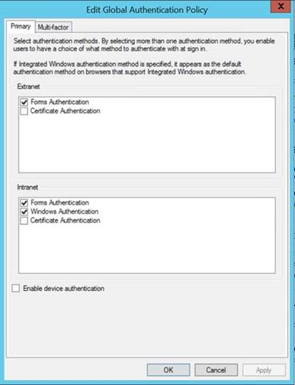

For more information, see [Configuring Authentication Policies](https://technet.microsoft.com/library/dn486781.aspx).

## Provision data catalog
You can provision only one data catalog per organization (Azure Active Directory Domain). Therefore, if the owner or co-owner of an Azure subscription who belong to this Active Directory domain has already created a catalog, you will not be able to create a catalog again even if you have multiple Azure subscriptions. To test whether a data catalog has been created by a user in your active directory domain, navigate to http://azuredatacatalog.com and verify whether you see the catalog. Skip the following procedure and go to the next section if a catalog has already been created for you.    

1. Navigate to [https://azure.microsoft.com/services/data-catalog](https://azure.microsoft.com/services/data-catalog). 

	 and click **Get started**.
2. Login using a user account that is the **owner or co-owner** of an Azure subscription. You should see the following page after logging in successfully.

	 
2. Specify a **name** for the data catalog, **subscription** you want to use, and the **location** for the catalog. 
3. Expand **Pricing** and specify that Azure Data Catalog **edition** (free and standard).
	
4. Expand **Catalog Users**, click **Add** to add users for the data catalog. You are automatically added to this group. 
	 
5. Expand **Catalog Administrators**, click **Add** to add additional administrators for the data catalog. You are automatically added to this group. 
	 
6. Click **Create Catalog** button to create the data catalog for your organization. You should see home page for the data catalog after it is created successfully. 
	    

### Find data catalog in Azure Portal
1. On a separate tab in the web browser or in a separate web browser window, navigate to [https://portal.azure.com](https://portal.azure.com) and login using the same account that you used to create the data catalog in the previous step.
2. Click **Browse** and then click **Data Catalog**.

		
3. You should see the data catalog you created.

	
4.  Click the catalog you created and you should see the **Data Catalog** blade in the portal.

	 
5. You can view properties of the data catalog as well as update them. For example, click **Pricing tier** and change the edition.

	

### Adventure Works sample database 
In this tutorial, you will register data assets (tables) from the AdventureWorks2014 sample database for SQL Server Database Engine, but you can use any supported data source if you would prefer to work with data that is familiar and relevant to your role. For a list of supported data sources, see [Supported data sources](data-catalog-dsr.md).

### Install the Adventure Works 2014 OLTP database
The Adventure Works database supports standard online transaction processing scenarios for a fictitious bicycle manufacturer (Adventure Works Cycles) which includes Products, Sales, and Purchasing. In this tutorial you register information about products into **Azure Data Catalog**.

Here's how to install the Adventure Works sample database:

1. Download [Adventure Works 2014 Full Database Backup.zip](https://msftdbprodsamples.codeplex.com/downloads/get/880661) on CodePlex.
2. Follow instructions in this article: [Restore a Database Backup using SQL Server Management Studio](http://msdn.microsoft.com/library/ms177429.aspx) to restore the database on your machine. **Quick steps**: 
	1. Launch SQL Server Management Studio and connect to SQL Server database engine.
	2. Right-click **Databases**, select **Restore Database**. 
	3. In the **Restore Database** dialog box, select **Device** option for **Source**, and click **Browse (...)**.
	4. In the **Select backup devices** dialog box, click **Add**.
	5. Navigate to the folder where you have the **AdventureWorks2014.bak** file, select the file, and click **OK** to close the **Locate Backup File** dialog box.
	6. Click **OK** to close the **Select backup devices** dialog box.    
	7. Click **OK** to close the **Restore Database** dialog box. 

Now, let's see how to register data assets from the Adventure Works sample database with **Azure Data Catalog**.

## Register data assets

In this exercise you use the registration tool to register data assets from the Adventure Works database with the catalog. Registration is the process of extracting key structural metadata – such as names, types, and locations – from the data source and the assets it contains, and copying that metadata to the catalog. The data source and data assets remain where they are, but the metadata is used by the catalog to make them more easily discoverable and understandable.

### Here’s how to register a data source

1.	Navigate to [https://azuredatacatalog.com](https://azuredatacatlog.com) and click **Publish data** on the home page.

    

3.	Click **Launch Application** to download, install, and run the **registration tool** on your computer.

    

4. In the **Welcome** page, click **Sign in**, and enter your credentials.	 

	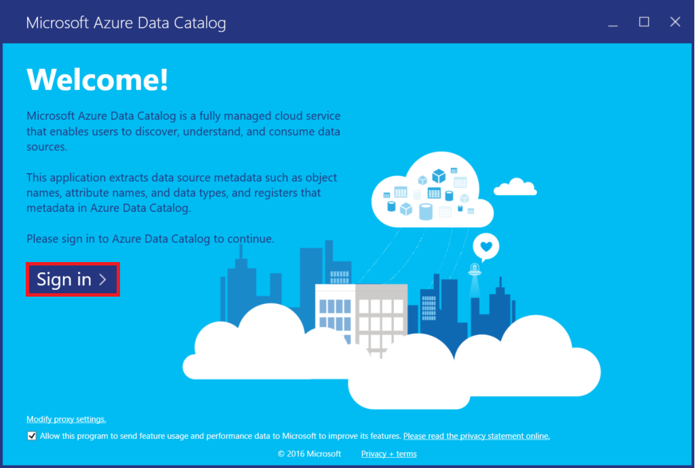

5. In the **Microsoft Azure Data Catalog** page, double click **SQL Server**, or click **SQL Server**, and **Next**.

    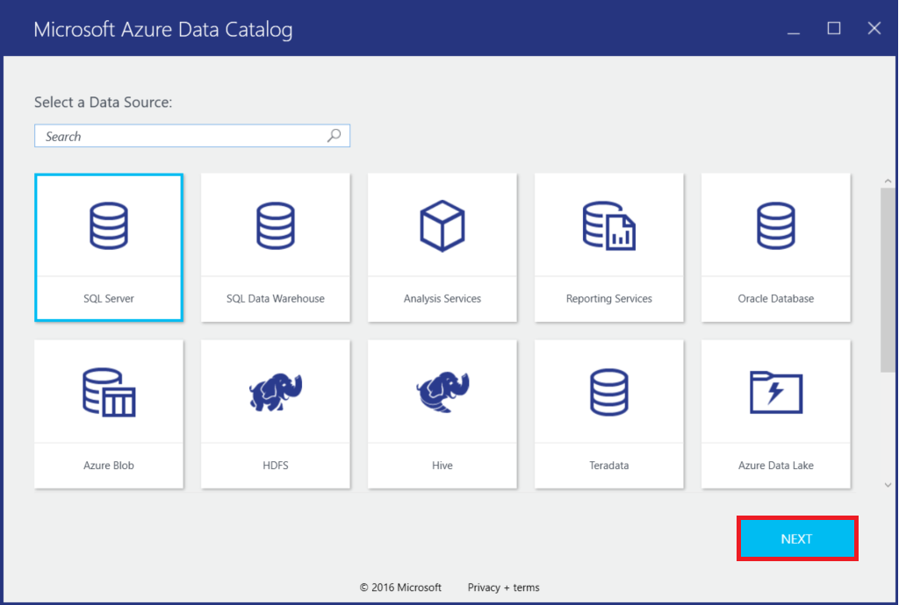

6.	Enter the SQL Server connection properties for **AdventureWorks2014** (see example below), and click **CONNECT**.

    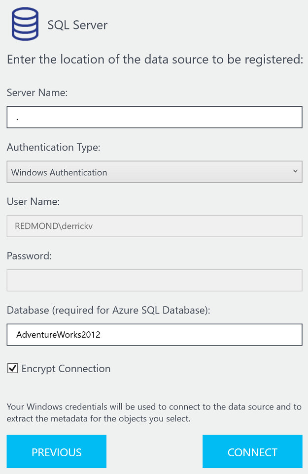

7.	The next page is where you register the metadata of your data asset. In this example, you register **Production/Product** objects from the AdventureWorks Production namespace. Here’s how to do it:
    
	1. In the **Server Hierarchy** tree, expand **AdventureWorks2014**, and click **Production**.
	2. Ctrl+click **Product**, **ProductCategory**, **ProductDescription**, and **ProductPhoto**.
	3. Click the **move selected arrow** (**>**). This will move all selected Product objects into the **Objects to be registered** list.
			
    	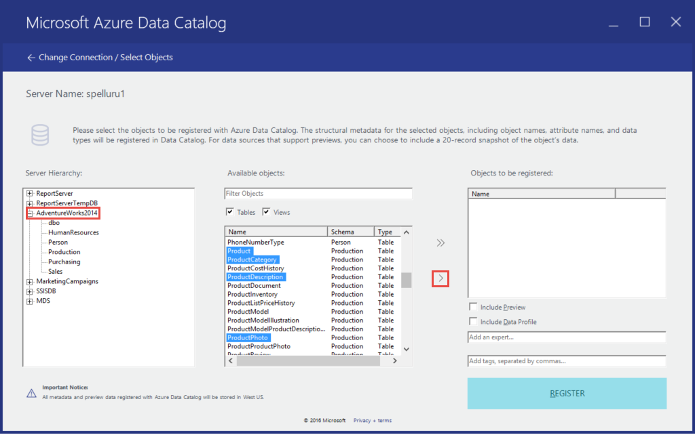
	4. Select **Include a Preview** to include a snapshot preview of the data. The snapshot includes up to 20 records from each table and it is copied into the catalog. 
	5. Select **Include Data Profile** to include a snapshot of the object statistics for the data profile (for example: minimum, maximum, and average values for a column, number of rows etc...).
	5. In the **Add tags**, enter **adventure works, cycles**. This will add search tags for these data assets. Tags are a great way to help users find a registered data source.
	6. (optional) Specify name of an **expert** on this data.
	
    	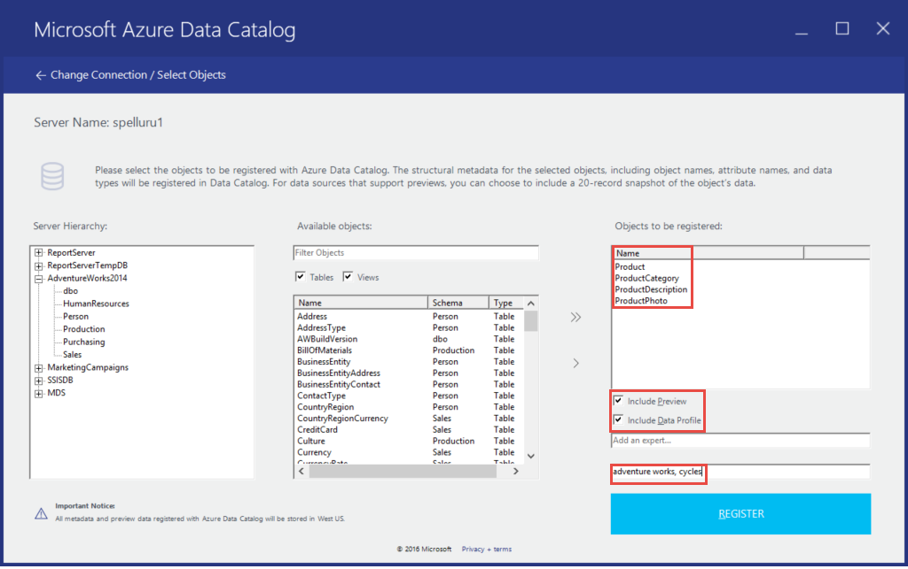
    
	7. Click **REGISTER**. Azure Data Catalog registers your selected objects. In this exercise, the selected objects from Adventure Works are registered. The registration tool extracts metadata from the data asset and copies that data into the Azure Data Catalog service. The data remains where it currently resides, and remains under the control of the administrators and policies of the current system.
	
		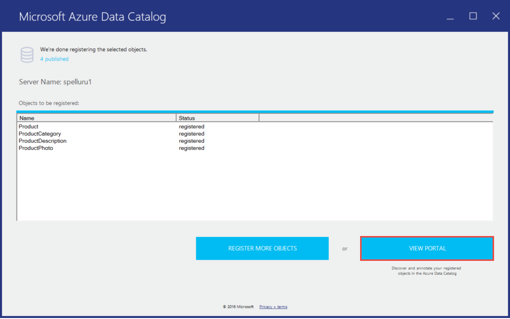

	8. To see your registered data source objects, click **View Portal**. In the **Azure Data Catalog** portal, confirm that you see all the four tables and the database in the grid view . 
 
    	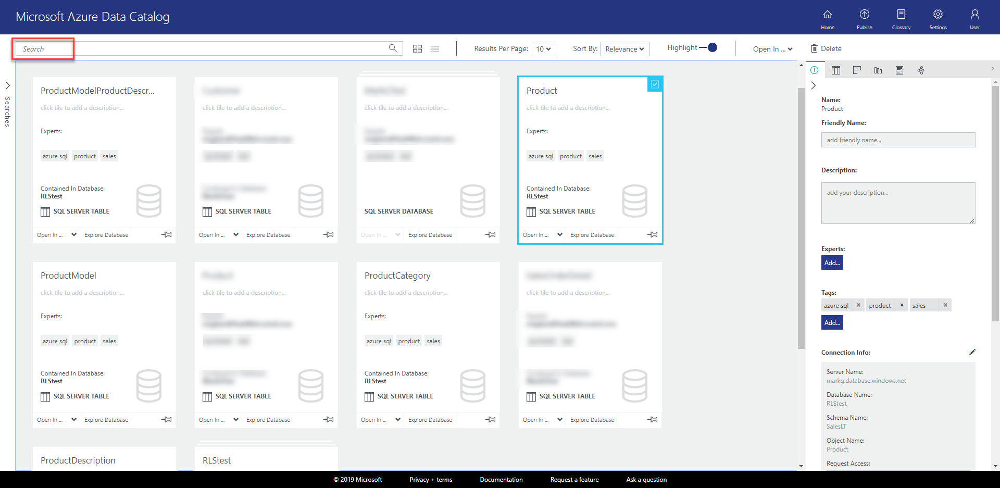
  
	
In this exercise you registered objects from the Adventure Works sample database so that they can be easily discovered by users across your organization. In the next exercise you learn how to discover registered data assets.

## Discover data assets
Discovery in Azure Data Catalog uses two primary mechanisms: searching and filtering.

**Searching** is designed to be both intuitive and powerful – by default, search terms are matched against any property in the catalog, including user-provided annotations.

**Filtering** is designed to complement searching. You can select specific characteristics such as experts, data source type, object type, and tags, to view only matching data assets, and to constrain search results to matching assets as well.

By using a combination of searching and filtering, you can quickly navigate the data sources that have been registered with Azure Data Catalog to discover the data assets you need.

In this exercise you will use the **Azure Data Catalog** portal to discover  data assets you registered in the previous exercise. See [Data Catalog Search syntax reference](https://msdn.microsoft.com/library/azure/mt267594.aspx) for details about search syntax. 

Let's look at a few examples for discovering data assets in the catalog.  

### Basic search
Basic search allows you to search catalog using one or more search terms. Results are any assets that match on any property with one or more of the terms specified.

1. Click **Home** button in the Azure Data Catalog portal. If you have closed the web browser, navigate to [https://www.azuredatacatalog.com](https://www.azuredatacatalog.com).
2. In the search box at the top, enter **cycles** and click the **search** icon (or) press **ENTER**.
	
	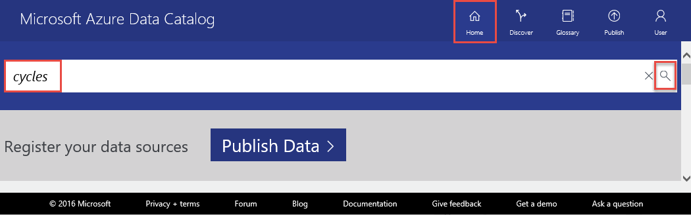
3. Confirm that you see all the four tables and the database (AdventureWorks2014) in the results. You can switch between **grid view** and **list view** by clicking buttons at the top as shown in the following image. Notice that the search keyword is highlighted in the search results as the **Highlight** option at the top is **ON**. You can also specify the number of **results per page** in search results. 

	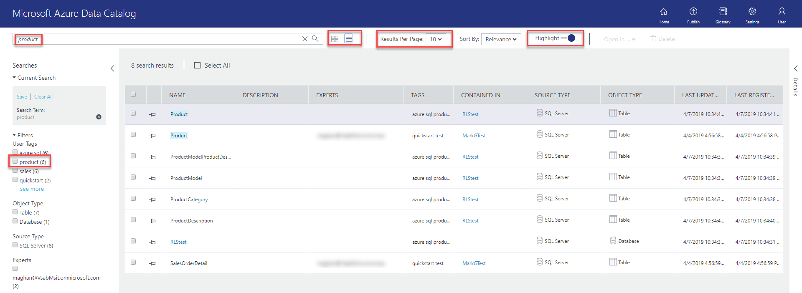
	
	You see the **Searches** panel on the left and **Properties** panel on the right. The Search panel allows you to change search criteria and filter results. The Properties panel displays properties of a selected object in the grid/list. 

4. Click on **Product** in the search results. Click on tabs titled **Preview**, **Columns**, **Data Profile**, and **Documentation** (or) use the **UP** arrow to expand the bottom pane in the middle.  
 
	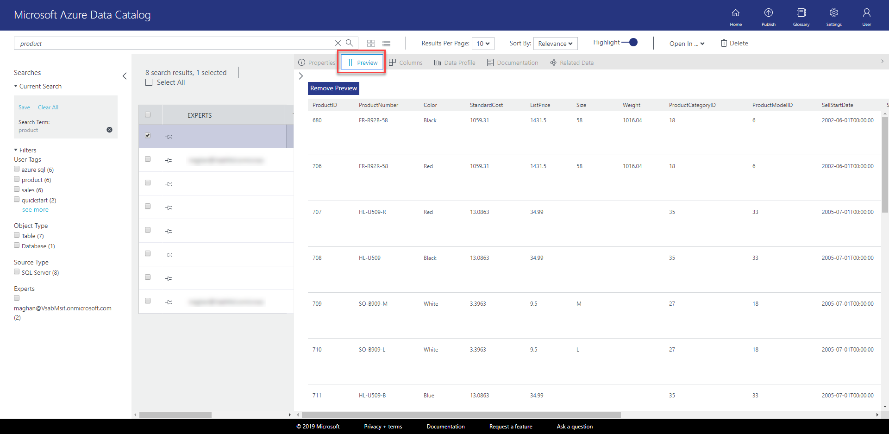
	
	On the **Preview** tab, you should see preview of the data in the Product table.  
5. Click **Columns** tab to find details about columns (such as **name** and **data type**) in the data asset. 
6. Click **Data Profile** tab to see the profiling of data (for example: number of rows, size of data, minimum value in a column, etc...) in the data asset. 
6. Filter the results by using **Filters** on the left. For example, click **Table** for **Object Type** and you should see only the four tables, not the database.

	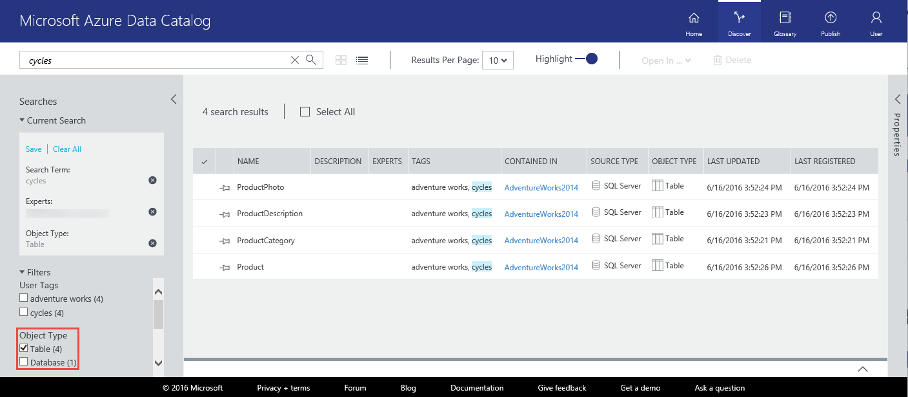 

### Property scoping
Property scoping allows you to discover data assets where the search term is matched with the specified property.

3. Clear the **Table** filter for **Object Type** in **Filters**.  
4. In the search box, enter **tags:cycles** and click the **search** icon (or) press **ENTER**. See [Data Catalog Search syntax reference](https://msdn.microsoft.com/library/azure/mt267594.aspx) for all the properties you can use for searching data catalog. 
3. Confirm that you see all the four tables and the database (AdventureWorks2014) in the results.  

	

### Save the search 
1. In the Searches pane to the left, in the Current Search section, click Save to save the current search criteria. Enter a name for the search and click Save.
	
	
2. Confirm that the saved search shows up under Saved Searches.

	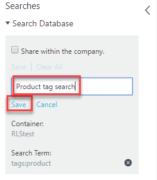 
3. Click down arrow to see the actions you can take on the saved search (rename, delete, set as default search).
	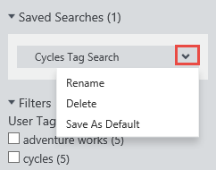

### Boolean operators
Boolean operators allow you to broaden or narrow a search.

2. In the search box, enter **tags:cycles AND objectType:table**, and click the **search** icon or press **ENTER**. 
3. Confirm that you see only tables, not the database in the results.  

	

### Grouping with parenthesis
Grouping with parenthesis allows you to use parentheses to group parts of the query to achieve logical isolation, especially in conjunction with Boolean operators.

1. In the search box, enter **name:product AND (tags:cycles AND objectType:table)**, and click the **search** icon or press **ENTER**.
2. Confirm that you see only **Product** table in the search results now.

	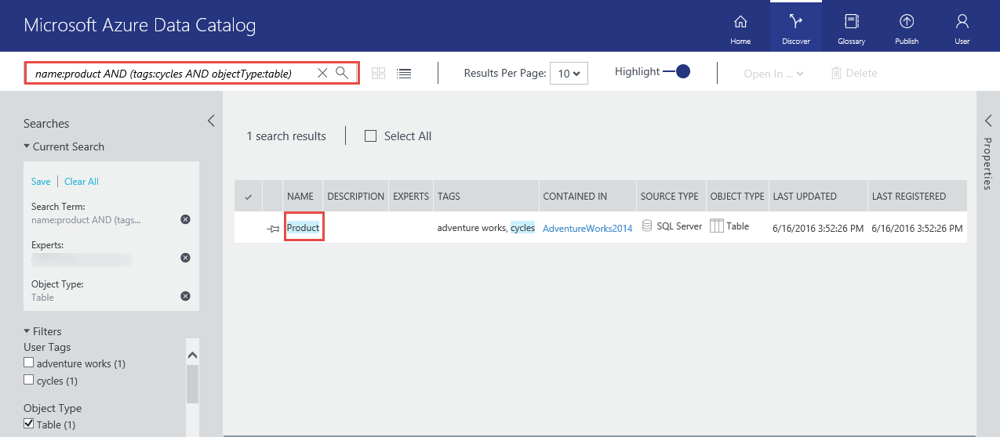   

### Comparison operators
Comparison operators allows you to use comparisons other than equality for properties that have numeric and date data types.

1. In the search box, enter **lastRegisteredTime:>"06/09/2016"**.
2. Clear **Table** filter for **Object Type** on the left. 
3. Click the **search** icon or press **ENTER**. 
2. Confirm that you see Product, ProductCategory, ProductDescription, and ProductPhoto tables, and AdventureWorks2014 database you registered in search results. 

	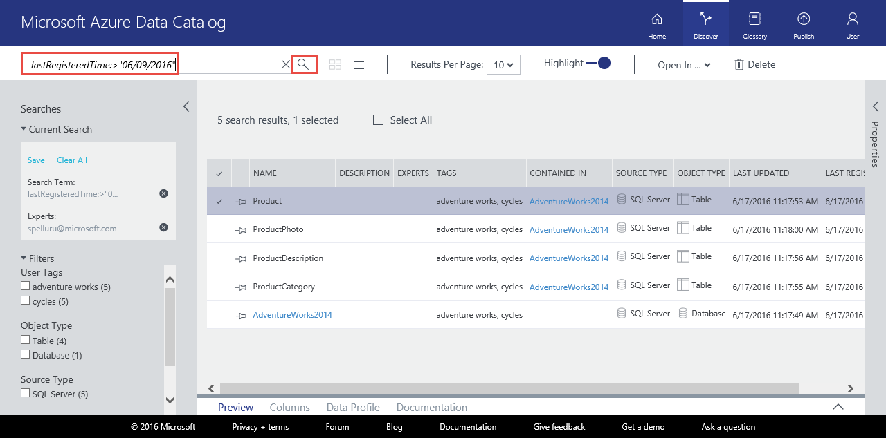

See [How to discover data assets](data-catalog-how-to-discover.md) for detailed information about discovering data assets and [Data Catalog Search syntax reference](https://msdn.microsoft.com/library/azure/mt267594.aspx) for search syntax. 

## Annotate data assets
In this exercise, you use the **Azure Data Catalog** portal to annotate (add descriptions, tags, experts, etc... to) data assets you have previously registered in the catalog. The annotations you provide will supplement and enhance the structural metadata extracted from the data source during registration and will make the data assets much easier to discover and understand. 

### Here’s how you annotate data assets
In this step, you will annotate a single dataset (ProductPhoto). You will add a friendly name, description, etc... to the ProductPhoto data asset.  

1.  If you have closed the browser, navigate to [https://www.azuredatacatalog.com](https://www.azuredatacatalog.com) and search with **tags:cycles** to find the data assets you have registered.  
2. Click **ProductPhoto** in search results.  
3. Enter **Product images** for **friendly name** and **Product photos for marketing materials** for the **Description** field.

	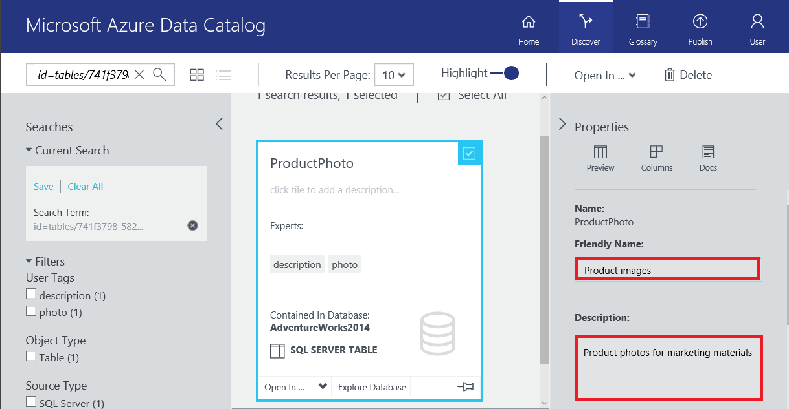

	The **Description** will help others discover and understand why and how to use the selected data asset. You can also add more tags, and view columns. Now you can try searching and filtering to discover data assets using the descriptive metadata you’ve added to the catalog.

Note that you can also do the following on this page:

- Add experts for the data asset. Click **Add...** under **Experts:** in the right pane. 
- Add tags at the dataset level. Click **Add...** under **Tags:** in the right pane. A tag can be a user tag or a glossary tag. The Standard Edition of Data Catalog includes a business glossary that allows catalog administrators to define a central business taxonomy. Catalog users can then annotate data assets with glossary terms. For more information see  [How to set up the Business Glossary for Governed Tagging](data-catalog-how-to-business-glossary.md)
- Add tags at the column level. In the bottom pane in the middle, click **Add...** under **Tags** for the column you want to annotate. 
- Add description at the column level. In the bottom pane in the middle, enter **Description** for a column. You can also view the description metadata extracted from the data source. 
- Add **Request access** information that specifies users how to request access to the data asset.

	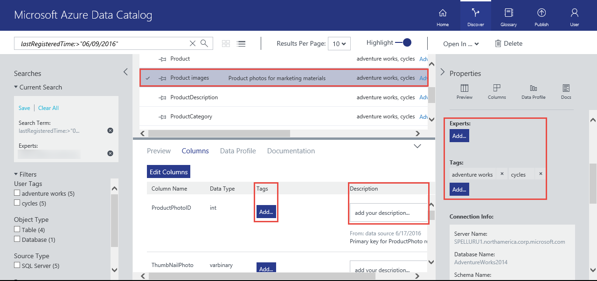
  
- Click **Documentation** tab in the bottom-middle pane and provide documentation for the data asset. Azure Data Catalog documentation allows you to use your Data Catalog as a content repository to create a complete narrative of your data assets.

	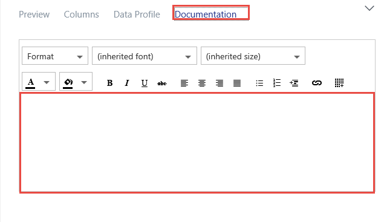 

You can also multi-select or select all and add an annotation  to multiple/all data assets. For example, you can select all the data assets you registered and specify an expert for them. 

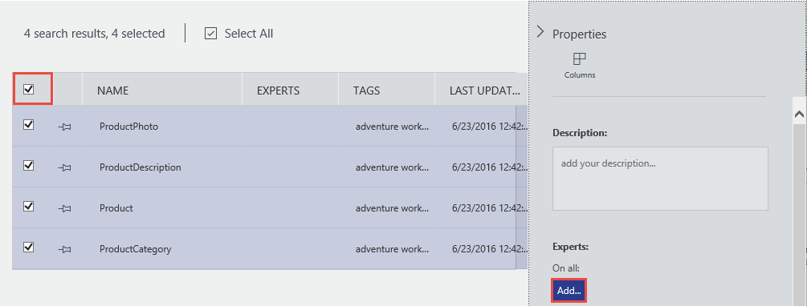 

Azure Data Catalog supports crowd sourcing approach to annotations allows any Data Catalog user to add tags (user or glossary), descriptions, and other metadata, so that any user with a perspective on a data asset and its use can have that perspective captured and available to other users.

See [How to annotate data assets](data-catalog-how-to-annotate.md) for detailed information about annotating data assets.
 
## Connect to data assets
In this exercise, you will open data assets in an integrated client tool (Excel) as well as a non-integrated tool (SQL Server Management Studio) using connection information. 

> [AZURE.NOTE] It’s important to remember that **Azure Data Catalog** doesn’t give users access to the actual data source – it simply makes it easier for users to discover and understand them. When users connect to a data source, the client application they choose will use their Windows credentials or will prompt them for credentials as necessary. If the user has not previously been granted access to the data source, he will need to be granted access before he can connect.

### Here’s how to connect to a data asset from Excel

1. Select **Product** from search results. Click **Open In** on the toolbar and select **Excel**.
 
    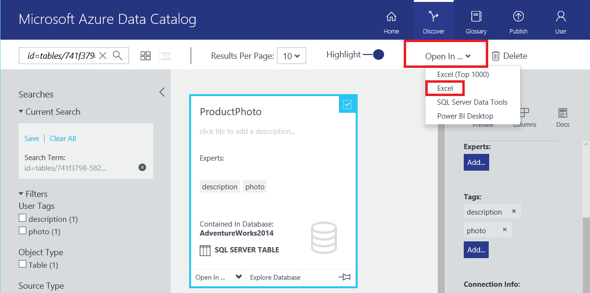	
5. Click **Open** in the download pop-up window at the bottom (this experience may vary depending on the browser). 

	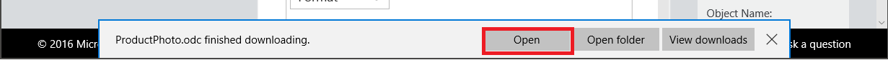
6. In the **Microsoft Excel Security Notice** window, click **Enable**.

	
7. In the **Import Data** dialog box, keep the defaults, and click **OK**.

	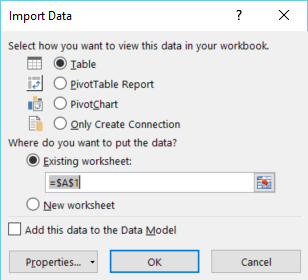 
8. The data source is opened in Excel.

    

In this exercise you connected to data assets discovered using **Azure Data Catalog**. The **Azure Data Catalog** portal allows users to connect directly using the client applications integrated into its **Open in…** menu, and allows users to connect using any application they choose using the connection location information included in the asset metadata. For example: you can use SQL Server Management Studio to connect to the AdventureWorks2014 database to access the data in the data assets registered in this tutorial. 

1. Launch **SQL Server Management Studio**.
2. In the **Connect to Server** dialog box, enter the **server name** from the **Properties** pane in the Azure Data Catalog portal. 
3. Use appropriate **authentication** and **credentials** to access the data asset if you already have the access to the data asset. if you don't have the access, use  information in the Request Access field to get the access .

	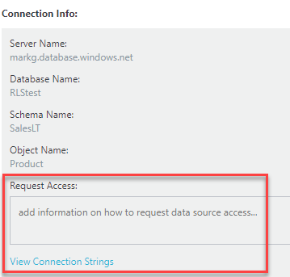 

Click **View Connection Strings** to view and copy ADF.NET, ODBC, and OLEDB connection strings to the clipboard for use in your application. 

## Manage data assets
In this step, you will see how to set up security for your data assets. Data Catalog does not give users access to the data itself. Data access is controlled by the owner of the data source. 

Data Catalog allows users to discover data sources and to view the **metadata** related to the sources registered in the catalog. There may be situations, however, where data sources should only be visible to specific users, or to members of specific groups. For these scenarios, Data Catalog allows users to take ownership of registered data assets within the catalog, and to then control the visibility of the assets they own.

> [AZURE.NOTE] The management capabilities described in this exercise are available only in the **Standard Edition of Azure Data Catalog**, and not in the **Free Edition**.
In **Azure Data Catalog**, you can take ownership of data assets, add co-owners to data assets, and set the visibility of data assets.

### Here’s how to take ownership of data assets and restrict visibility

1. Navigate to [https://www.azuredatacatalog.com](https://www.azuredatacatalog.com) if you have closed the web browser. In the Search text box, enter **tags:cycles** and press **ENTER**. 
3. Select an item in the result list, for example, **Product** by clicking the check box in the top-right corner and click **Take Ownership** on the toolbar as shown in the following image. 
4. In the **Properties** panel, **Management** section, click **Take Ownership** under **Management** section in the right pane. 

	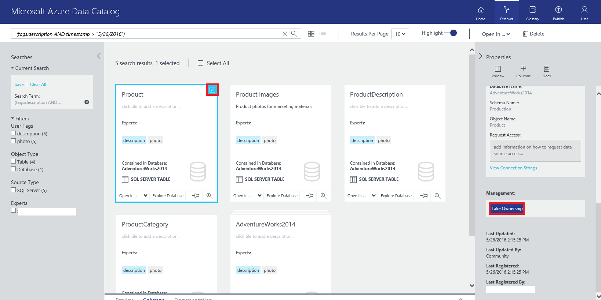
5. To restrict visibility, click **Owners & These Users** in the **Visibility** section and click **Add**. Enter user email address in the text box and press ENTER. 

    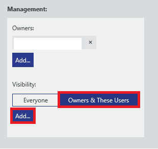

## Remove data assets

In this exercise you will use the **Azure Data Catalog** portal to remove preview data from registered data assets, and to delete data assets from the catalog.

In **Azure Data Catalog**, you can delete an individual asset or delete multiple assets.

### Here’s how to delete data asset(s)

1. Navigate to [https://www.azuredatacatalog.com](https://www.azuredatacatalog.com) if you have closed the web browser. 
2. In the search text box, enter **tags:cycles** and press **ENTER**.	
3. Select an item in the result list, for example, **ProductDescription** by clicking the check box in the top-right corner and click **Delete** on the toolbar as shown in the following image. 

	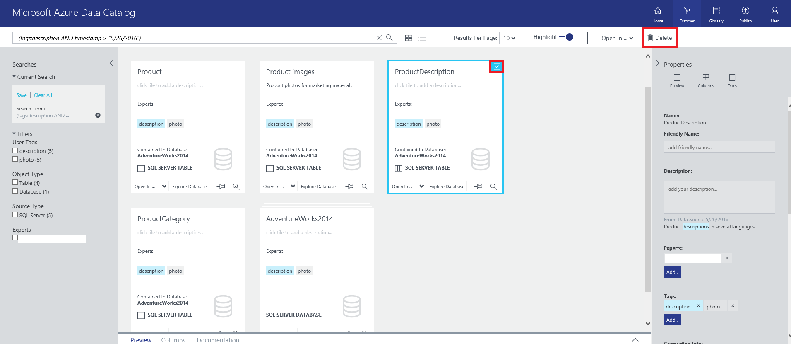
	
	If you are using the list view (instead of grid view), check box is to the left of the item as shown in the following image. 

	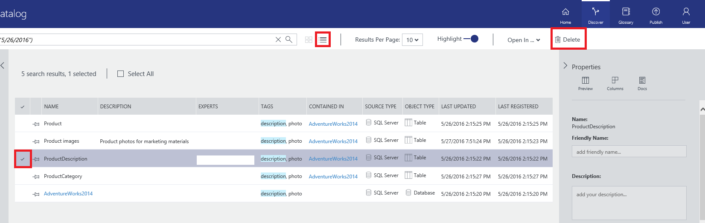

	You can also select multiple data assets and delete them as shown below: 

	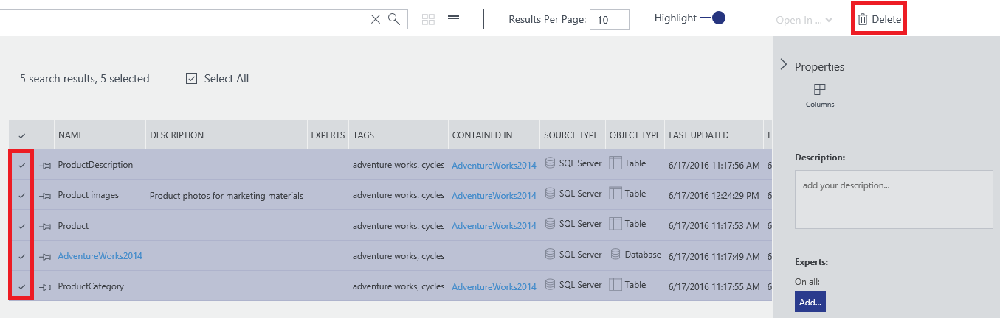

> [AZURE.NOTE] The default behavior of the catalog is to allow any user to register any data source, and to allow any user to delete any data asset that has been registered. The management capabilities included in the **Standard Edition of Azure Data Catalog** provide additional options for taking ownership of assets, restricting who can discover assets, and restricting who can delete assets.

## Summary

In this tutorial you explored essential capabilities of **Azure Data Catalog**, including registering, annotating, discovering, and managing enterprise data assets. Now that you’ve completed the tutorial, it’s time to get started. You can begin today by registering the data sources you and your team rely on, and by inviting colleagues to use the catalog.

## References

- [How to register data assets](data-catalog-how-to-register.md)
- [How to discover data assets](data-catalog-how-to-discover.md)
- [How to annotate data assets](data-catalog-how-to-annotate.md)
- [How to document data assets](data-catalog-how-to-documentation.md)
- [How to connect to data assets](data-catalog-how-to-connect.md)
- [How to manage data assets](data-catalog-how-to-manage.md)
