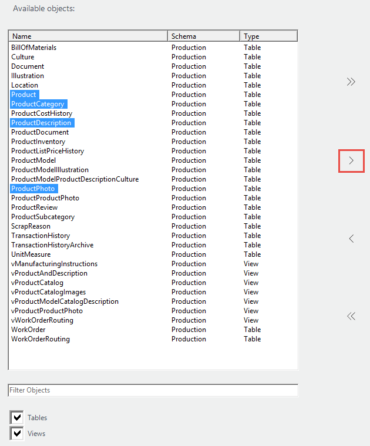
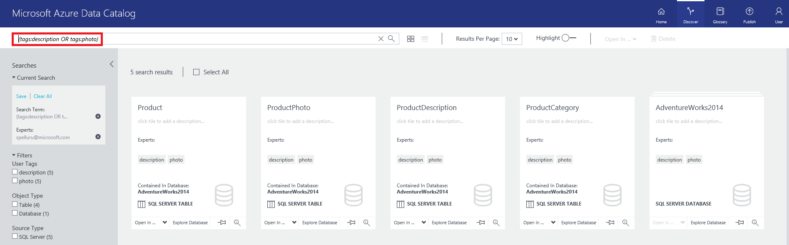
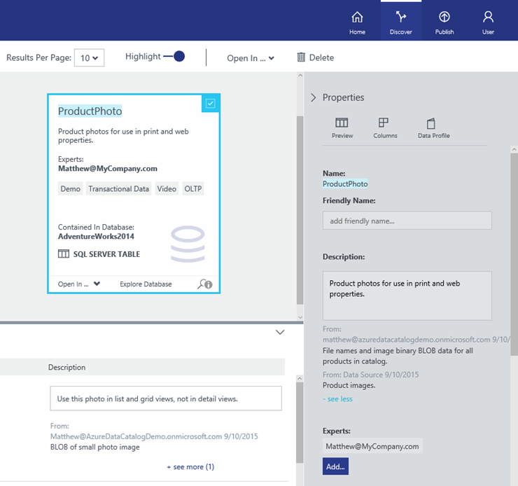

<properties
   pageTitle="Azure Data Catalog get started with data catalog | Microsoft Azure"
   description="End-to-end tutorial presenting the scenarios and capabilities of Azure Data Catalog."
   documentationCenter=""
   services="data-catalog"
   authors="dvana"
   manager="mblythe"
   editor=""
   tags=""/>
<tags
   ms.service="data-catalog"
   ms.devlang="NA"
   ms.topic="get-started-article"
   ms.tgt_pltfrm="NA"
   ms.workload="data-catalog"
   ms.date="03/03/2016"
   ms.author="derrickv"/>

# Get started with Azure Data Catalog

This article is an end-to-end overview of the scenarios and capabilities of **Azure Data Catalog**. Once you sign up for the service, follow these steps to create a Data Catalog, and register, annotate, and discover data sources.

## Tutorial prerequisites

Before you begin this tutorial you must have the following:

- **An Azure subscription** -  If you don't have a subscription, you can create a free trial account in just a couple of minutes. See [Free Trial](https://azure.microsoft.com/pricing/free-trial/) for details.
- **Azure Active Directory** -  Azure Data Catalog uses [Azure Active Directory](https://azure.microsoft.com/services/active-directory/) for identity and access management.
- **Data sources** - Azure Data Catalog has capabilities to discover data sources. This tutorial uses the Adventure Works sample database, but you can use any supported data source if you would prefer to work with data that is familiar and relevant to your role. For a list of supported data sources, see [Supported data sources](data-catalog-dsr.md).

Let's get started installing the Adventure Works sample database.

## Exercise 1: Install Adventure Works sample database

In this exercise, you install the Adventure Works sample for SQL Server Database Engine which is used in the exercises that follow.

### Install the Adventure Works 2014 OLTP database

The Adventure Works database supports standard online transaction processing scenarios for a fictitious bicycle manufacturer (Adventure Works Cycles) which includes Products, Sales, and Purchasing. In this tutorial you register information about products into **Azure Data Catalog**.

Here's how to install the Adventure Works sample database.

To install the Adventure Works sample database, you can restore an AdventureWorks2014 backup located in [Adventure Works 2014 Full Database Backup.zip](https://msftdbprodsamples.codeplex.com/downloads/get/880661) on CodePlex. One way to restore the database is to run a T-SQL script in SQL Server Management Studio.

**Install Adventure Works sample database with a T-SQL script**

1.	Create a folder named C:\DataCatalog_GetStarted. If you use another folder name, make sure you change the path in the T-SQL script below.
2.	Download [Adventure Works 2014 Full Database Backup.zip](https://msftdbprodsamples.codeplex.com/downloads/get/880661).
3.	Extract Adventure Works 2014 Full Database Backup.zip to C:\DataCatalog_GetStarted. The script below assumes that the backup file is located at C:\DataCatalog_GetStarted\Adventure Works 2014 Full Database Backup\AdventureWorks2014.bak.
4.	From **SQL Server Management Studio**, on the **Standard** toolbar, click **New Query**.
5.	Execute the following T-SQL code in the query window.

**Run this script to install Adventure Works 2014 database**

    USE [master]
    GO
    -- NOTE: This script is for sample purposes only. The default backup file path for this script is C:\DataCatalog_GetStarted. To run this script, create the default file path or change the file path, and copy AdventureWorks2014.bak into the path.

    -- IMPORTANT: In a production application, restore a SQL database to the data folder for your SQL Server instance.

    RESTORE DATABASE AdventureWorks2014
    	-- AdventureWorks2014.bak file location
    	FROM disk = 'C:\DataCatalog_GetStarted\Adventure Works 2014 Full Database Backup\AdventureWorks2014.bak'

    	-- AdventureWorks2014.mdf database location
    	WITH MOVE 'AdventureWorks2014_data' TO 'C:\DataCatalog_GetStarted\AdventureWorks2014.mdf',

    	-- AdventureWorks2014.ldf log location
    	MOVE 'AdventureWorks2014_Log' TO 'C:\DataCatalog_GetStarted\AdventureWorks2014.ldf'
    ,REPLACE
    GO

As an alternative to running a T-SQL script, you can restore the database using SQL Server Management Studio. See [Restore a Database Backup (SQL Server Management Studio)](http://msdn.microsoft.com/library/ms177429.aspx).

In this exercise you installed the Adventure Works sample database that is used in the remaining exercises. In the next exercise, you learn how to register **Azure Data Catalog** data sources from tables in the Adventure Works sample database.

## Exercise 2: Registering data sources

In this exercise you use the **Azure Data Catalog** registration tool to register Adventure Works data sources with the catalog. Registration is the process of extracting key structural metadata – such as names, types, and locations – from the data source and the assets it contains, and copying that metadata to the catalog. The data sources and their data remain where they are, but the metadata is used by the catalog to make them more easily discoverable and understandable.

### Here’s how to register a data source

1.	Go to https://azure.microsoft.com/services/data-catalog, and click **Get started**.
2.	Log into the **Azure Data Catalog** portal, and click **Publish data**.

    

3.	Click **Launch Application**.

    

4. In the **Welcome** page, click **Sign in**, and enter your credentials.
5. In the **Microsoft Azure Data Catalog** page, double click **SQL Server**, or click **SQL Server**, and **Next**.

    

6.	Enter the SQL Server connection properties for AdventureWorks2014 (see example below), and click **CONNECT**.

    

7.	The next page is where you register the metadata of your data source. In this example, you register **Production/Product** objects from the AdventureWorks Production namespace. Here’s how to do it:

    a. In the **Server Hierarchy** tree, click **Production**.

    

    b. Ctrl+click Product, ProductCategory, ProductDescription, and ProductPhoto.

    c. Click the move selected arrow (**>**). This will move all selected Product objects into the **Objects to be registered** list.

    

    d. In the **Add tags**, enter description, photo. This will add search tags for these data assets. Tags are a great way to help users find a registered data source.

    

    e.	**Optional**: You can **Include a Preview**, and **Add a data source expert**.

    f.	Click **REGISTER**. **Azure Data Catalog** registers your selected objects. In this exercise, the selected objects from Adventure Works are registered.

    g.	To see your registered data source objects, click **View Portal**. In the **Azure Data Catalog** portal, you can view data source objects in **Tiles** or a **List**.

    

In this exercise you registered objects from the Adventure Works sample database so that they can be easily discovered by users across your organization.
In the next exercise you learn how to discover registered data assets.

## Exercise 3: Discovering Registered Data Assets

In this exercise you will use the **Azure Data Catalog** portal to discover registered data assets and view their metadata. **Azure Data Catalog** provides multiple tools for discovering data assets, including simple keyword search, interactive filters, and an advanced search syntax for “power” users.

### Here’s how you discover registered data assets

**Azure Data Catalog** has a simple but powerful search syntax that enables you to easily build queries that return data users need. For details about **Azure Data Catalog** search, see [Data Catalog Search syntax reference](https://msdn.microsoft.com/library/azure/mt267594.aspx).

**Azure Data Catalog** has the following search options:

- Keyword search
- Filter
- Advanced search

You can also refine what data assets to view. **Azure Data Catalog** has the following view options:

- View properties
- View columns
- View preview

For this example, you will use a keyword search. **Azure Data Catalog** search has several query techniques. This example will use a **Grouping** search query.

**Query Techniques**

|Technique|Use|Example
|---|---|---
|Property Scoping|Only return data sources where the search term is matched in the specified property|name:product
|Logical Operators|Broaden or narrow a search using Boolean operations, as described in the Boolean Operators section on this page|finance NOT corporate
|Grouping with Parenthesis|Use parentheses to group parts of the query to achieve logical isolation, especially in conjunction with Boolean operators|name:product AND (tags:illustration OR tags:photo)
|Comparison Operators|Use comparisons other than equality for properties that have numeric and date data types|creationTime:>11/05/14

In this example, you do a **Grouping** search for data assets where name equals product and tags equal illustration or tags equal photo.

1. Go to https://azure.microsoft.com/services/data-catalog, click **Get started**, and log into the **Azure Data Catalog** portal.
2. In the **Search Data Catalog** box, enter a **Grouping** as: query: (tags:description OR tags:photo).
3. Click the search icon, or press Enter. **Azure Data Catalog** will display data assets for this search query.

    

In this exercise you used the **Azure Data Catalog** portal to discover and view Adventure Works data assets registered with the catalog.

<a name="annotating"/>
## Exercise 4: Annotating registered data sources

In this exercise you use the **Azure Data Catalog** portal to annotate data assets that have been previously registered in the catalog. The annotations you provide will supplement and enhance the structural metadata extracted from the data source during registration and will make the data assets much easier to discover and understand. Because each **Data Catalog** user can provide his own annotations, it’s easy for every user with a perspective on the data to share it.

### Here’s how you annotate data assets

1. Go to https://azure.microsoft.com/services/data-catalog, click **Get started**, and log into the **Azure Data Catalog** portal.
2. Click **Discover**.
3. Choose one or more **Data Assets**. In this example, choose **ProductPhoto**, and enter “Product photos for marketing materials.”
4. Enter a **Description** that will help others discover and understand why and how to use the selected data asset. For example, enter “Product images”. You can also add more tags, and view columns.
5. Now you can try searching and filtering to discover data assets using the descriptive metadata you’ve added to the catalog.

    

In this exercise you added descriptive information to registered data assets so that catalog users can discover data sources using terms they understand.

## Exercise 5: Crowdsourcing metadata

In this exercise you work with another user to add metadata to data assets in the catalog. **Azure Data Catalog’s** crowdsourced approach to annotations allows any user to add tags, descriptions, and other metadata, so that any user with a perspective on a data asset and its use can have that perspective captured and available to other users.

> [AZURE.NOTE] If you don’t have another user to work with on this tutorial, don’t worry! Any user who accesses the data catalog can add his own perspective when he chooses to do so. This crowdsourcing approach to metadata allows the contents of the catalog and the richness of the catalog’s metadata to grow over time.

### Here’s how you can Crowdsource metadata about data assets

Ask a colleague to repeat the [Annotating Registered Data Sources](#annotating) exercise above. After your colleagues add descriptions to a data asset, such as ProductPhoto, you will see multiple annotations.

In this exercise you explored **Azure Data Catalog’s** capabilities for crowdsourced metadata, where any catalog user can annotate the data assets he discovers.

## Exercise 6: Connecting to data sources

In this exercise you will use the **Azure Data Catalog** portal to connect to a data source using Microsoft Excel.

> [AZURE.NOTE] It’s important to remember that **Azure Data Catalog** doesn’t give users access to the actual data source – it simply makes it easier for users to discover and understand them. When users connect to a data source, the client application they choose will use their Windows credentials or will prompt them for credentials as necessary. If the user has not previously been granted access to the data source, he will need to be granted access before he can connect.

### Here’s how to connect to a data source from Excel

1. Go to https://azure.microsoft.com/services/data-catalog, click **Get started**, and log into the **Azure Data Catalog** portal.
2. Click **Discover**.
3. Choose a data asset. In this example, choose ProductCategory.
4. Choose **Open In** > **Excel**.

    

5. In the **Microsoft Excel Security Notice** window, click **Enable**.
6. Open the **ProductCategory.odc** file.
7. The data source is opened in Excel.

    

In this exercise you connected to data sources discovered using **Azure Data Catalog**. The **Azure Data Catalog** portal allows users to connect directly using the client applications integrated into its **Open in…** menu, and allows users to connect using any application they choose using the connection location information included in the asset metadata.

## Exercise 7: Removing data source metadata

In this exercise you will use the **Azure Data Catalog** portal to remove preview data from registered data assets, and to delete data assets from the catalog.

> [AZURE.NOTE] The default behavior of the catalog is to allow any user to register any data source, and to allow any user to delete any data asset that has been registered. The management capabilities included in the **Standard Edition of Azure Data Catalog** provide additional options for taking ownership of assets, restricting who can discover assets, and restricting who can delete assets.

In **Azure Data Catalog**, you can delete an individual asset or delete multiple assets.

### Here’s how to delete multiple data assets

1. Go to https://azure.microsoft.com/services/data-catalog, click **Get started**, and log into the **Azure Data Catalog** portal.
2. Click **Discover**.
3. Choose one or more data assets.
4. Click **Delete**.

In this exercise you removed registered data assets from the catalog.

## Exercise 8: Managing registered data sources

In this exercise you will use the management capabilities of **Azure Data Catalog** to take ownership of data assets and to control what users can discover and how users manage those assets.

> [AZURE.NOTE] The management capabilities described in this exercise are available only in the **Standard Edition of Azure Data Catalog**, and not in the **Free Edition**.
In **Azure Data Catalog**, you can take ownership of data assets, add co-owners to data assets, and set the visibility of data assets.

### Here’s how to take ownership of data assets and restrict visibility

1. Go to https://azure.microsoft.com/services/data-catalog, click **Get started**, and log into the **Azure Data Catalog** portal.
2. Click **Discover**.
3. Choose one or more data assets.
4. In the **Properties** panel, **Management** section, click **Take Ownership**.
5. To restrict visibility, click **Owners & These Users**.

    

In this exercise you explored the management capabilities of **Azure Data Catalog**, and restricted visibility on selected data assets.

## Summary

In this tutorial you explored essential capabilities of **Azure Data Catalog**, including registering, annotating, discovering, and managing enterprise data sources. Now that you’ve completed the tutorial, it’s time to get started. You can begin today by registering the data sources you and your team rely on, and by inviting colleagues to use the catalog.
