# Quickstart: Create an Azure Data Catalog

Azure Data Catalog is a fully managed cloud service that serves as a system of registration and system of discovery for enterprise data assets. For a detailed overview, see [What is Azure Data Catalog](overview.md).

This quickstart helps you get started with creating an Azure Data Catalog.

If you don’t have an Azure subscription, create a [free account](https://azure.microsoft.com/free/?WT.mc_id=A261C142F) before you begin.

## Prerequisites

To get started, you need to have:

* A [Microsoft Azure](https://azure.microsoft.com/) subscription.
* You need to have your own [Azure Active Directory tenant](../active-directory/fundamentals/active-directory-access-create-new-tenant.md).

To set up Data Catalog, you must be the owner or co-owner of an Azure subscription.

## Create a data catalog

You can provision only one data catalog per organization (Azure Active Directory domain). Therefore, if the owner or co-owner of an Azure subscription who belongs to this Azure Active Directory domain has already created a catalog, then you can't create a catalog again even if you have multiple Azure subscriptions. To test whether a data catalog has been created by a user in your Azure Active Directory domain, go to the [Azure Data Catalog home page](http://azuredatacatalog.com) and verify whether you see the catalog. If a catalog has already been created for you, skip the following procedure and go to the next section.

1. Go to the [Azure portal](https://portal.azure.com) > **Create a resource** and select **Data Catalog**.

    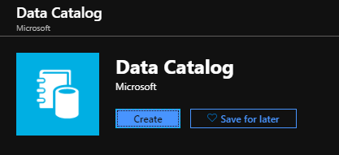

2. Specify a **name** for the data catalog, the **subscription** you want to use, the **location** for the catalog, and the **pricing tier**. Then select **Create**.

3. Go to the [Azure Data Catalog home page](http://azuredatacatalog.com) and click **Publish Data**.

   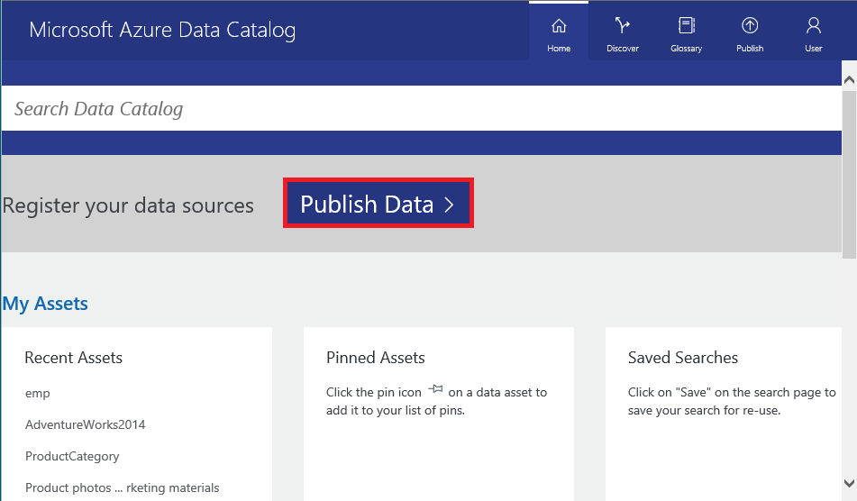

   You can also get to the Data Catalog home page from the [Data Catalog service page](https://azure.microsoft.com/services/data-catalog) by selecting **Get started**.

   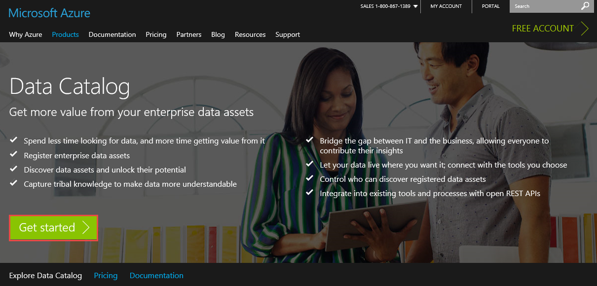

4. Go to the **Settings** page.

    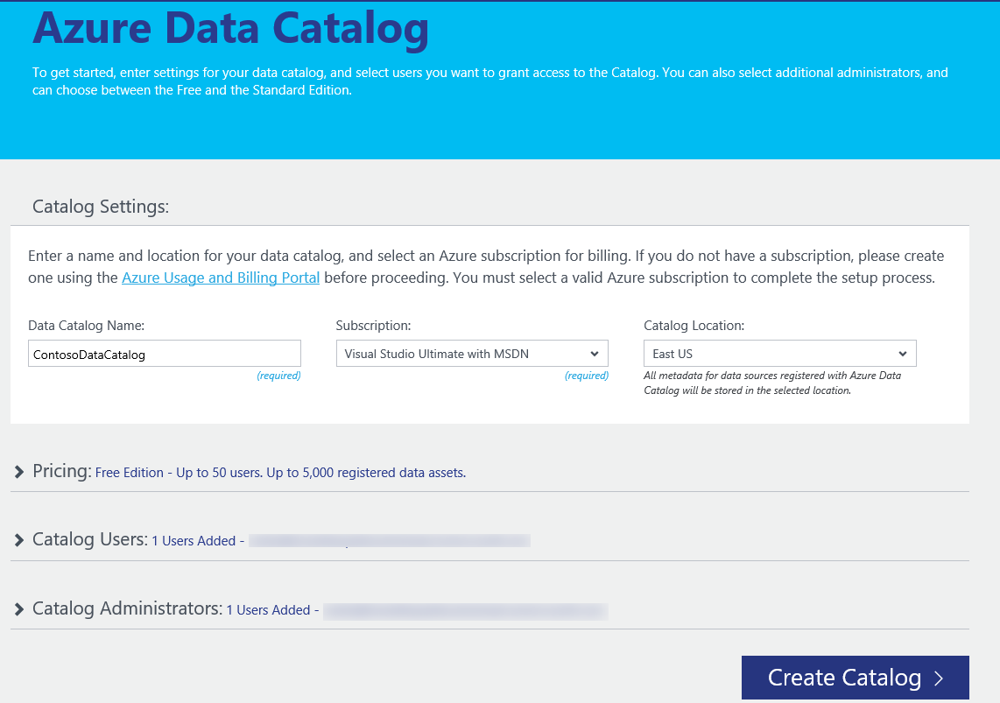

5. Expand **Pricing** and verify your Azure Data Catalog **edition** (Free or Standard).

    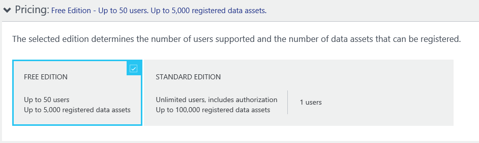

6. If you choose *Standard* edition as your pricing tier, you can expand **Security Groups** and enable authorizing Active Directory security groups to access Data Catalog and enable automatic adjustment of billing.

    

7. Expand **Catalog Users** and click **Add** to add users for the data catalog. You're automatically added to this group.

    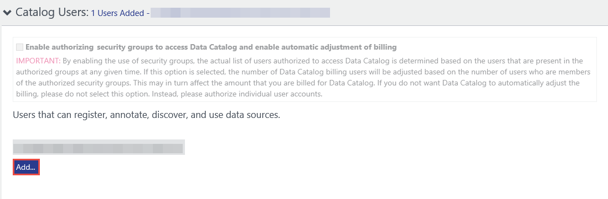

8. If you choose *Standard* edition as your pricing tier, you can expand **Glossary Administrators** and click **Add** to add glossary administrator users. You're automatically added to this group.

    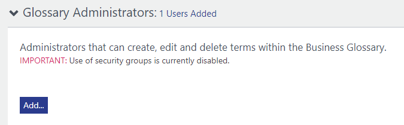

9. Expand **Catalog Administrators** and click **Add** to add additional administrators for the data catalog. You're automatically added to this group.

    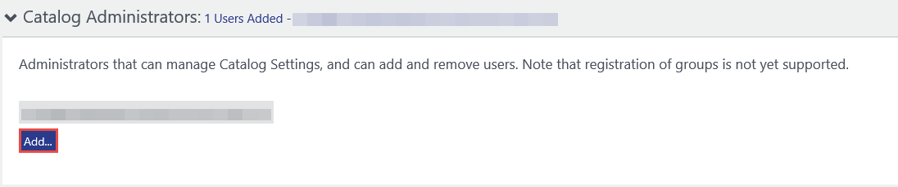

10. Expand **Portal Title** and add additional text that will be displayed in the portal title.

    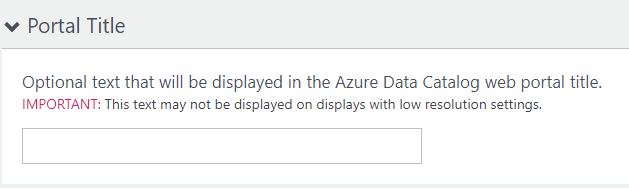

11. Once you complete the **Settings** page, next navigate to the **Publish** page.

    

## Find a data catalog in the Azure portal

1. On a separate tab in the web browser or in a separate web browser window, go to the [Azure portal](https://portal.azure.com) and sign in with the same account that you used to create the data catalog in the previous step.

2. Select **All services** and then click **Data Catalog**.

    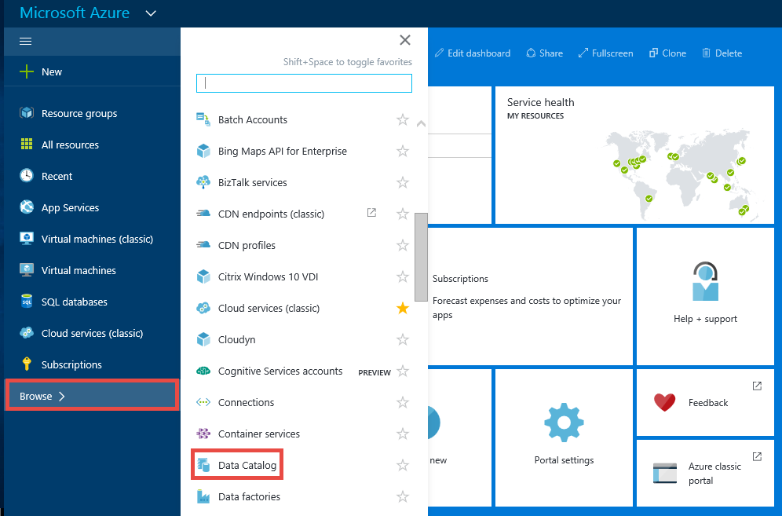

    You see the data catalog you created.

    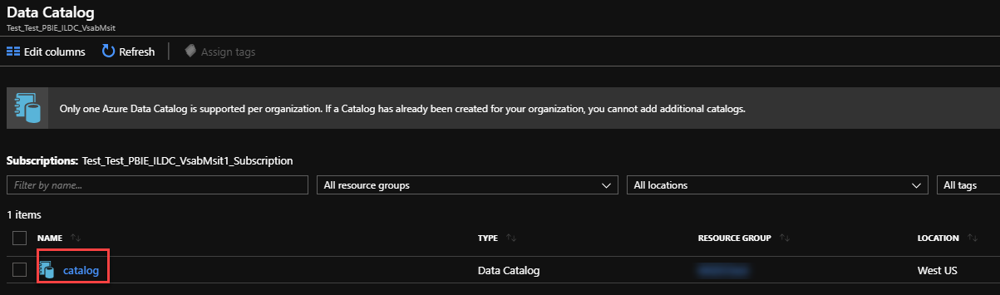

3. Click the catalog that you created. You see the **Data Catalog** blade in the portal.

   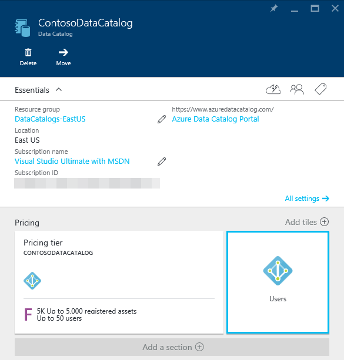

4. You can view properties of the data catalog and update them. For example, click **Pricing tier** and change the edition.

    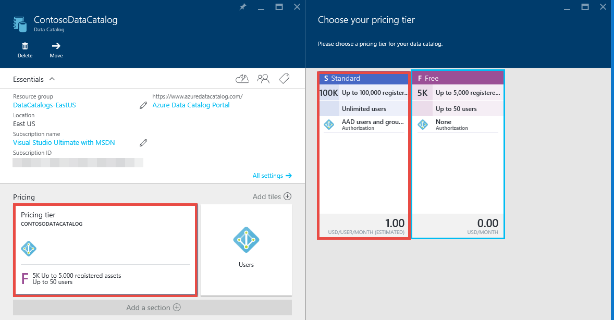

## Next steps

In this quickstart, you've learned how to create an Azure Data Catalog for your organization. You can now register data sources in your data catalog.

> [!div class="nextstepaction"]
> [Register data sources in Azure Data Catalog](data-catalog-how-to-register.md)
