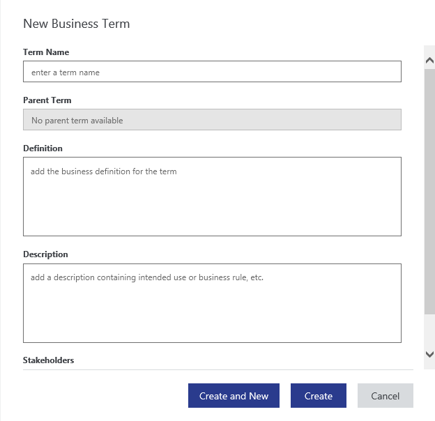
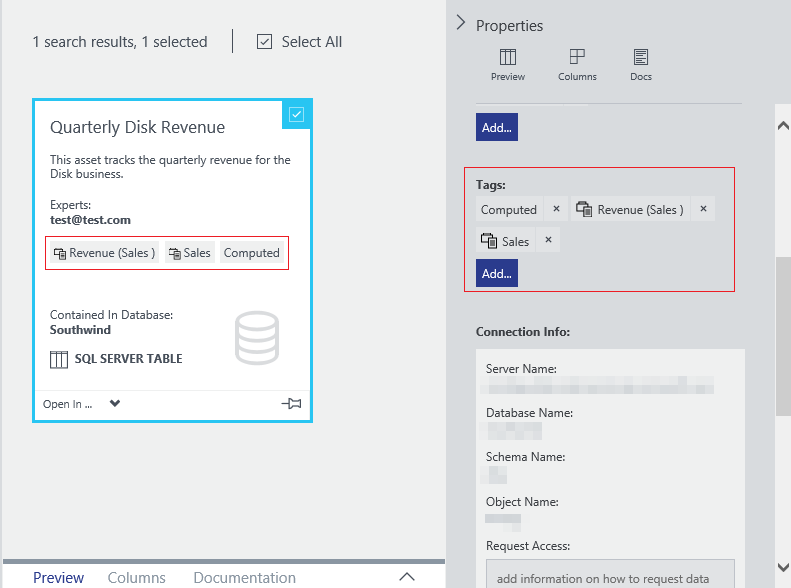

<properties
	pageTitle="How to set up the Business Glossary for governed tagging | Microsoft Azure"
	description="How-to article highlighting the business glossary in Azure Data Catalog for defining and using a common business vocabulary to tag registered data assets."
	services="data-catalog"
	documentationCenter=""
	authors="steelanddata"
	manager="NA"
	editor=""
	tags=""/>
<tags
	ms.service="data-catalog"
	ms.devlang="NA"
	ms.topic="article"
	ms.tgt_pltfrm="NA"
	ms.workload="data-catalog"
	ms.date="05/06/2016"
	ms.author="maroche"/>

# How to set up the Business Glossary for Governed Tagging

## Introduction

Azure Data Catalog provides capabilities for data source discovery, enabling users to easily discover and understand the data sources they need to perform analysis and make decisions. These discovery capabilities make the biggest impact when users can find and understand the broadest range of available data sources.

One Data Catalog feature that promotes greater understanding of assets data is tagging. Tagging allows users to associate keywords with an asset or a column, which in turn makes it easier to discover the asset via searching or browsing, and allows users to more easily understand the context and intent of the asset.

However, tagging can sometimes cause problems of its own. Some examples of problems that can be introduced by tagging are:

1.	Users using abbreviations on some assets and expanded text on others while tagging. This inconsistency hinders the discovery of assets even though the intent was to tag the assets with the same tag.
2.	Tags which mean different things in different contexts. For example, a tag called "Revenue" on a customer data set might mean revenue by customer, but the same tag on a quarterly sales dataset could mean quarterly revenue for the company.  

To help address these and other similar challenges, Data Catalog includes a Business Glossary.

The Data Catalog Business Glossary allows organizations to document key business terms and their definitions to create a common business vocabulary. This governance enables consistency in data usage across the organization. Once terms are defined in the business glossary, they can be assigned to data assets in the catalog, using the same approach as tagging, thereby enabling _governed tagging_.

> [AZURE.NOTE] The functionality described in this article are available only in the Standard Edition of Azure Data Catalog. The Free Edition does not provide capabilities for governed tagging or a business glossary.

## Glossary availability and privileges

/*The business glossary is available in the Standard Edition of Azure Data Catalog. The Free Edition of Data Catalog does not include a glossary.*/

The business glossary can be accessed via the "Glossary" option in the Data Catalog portal's navigation menu.  

Data Catalog administrators can create, edit and delete glossary terms in the business glossary. All Data Catalog users can view the term definitions, and can tag assets with glossary terms.

## Creating glossary terms

Data Catalog administrators can create new glossary terms by clicking on the New Term’ button to create glossary terms with the following fields:

* A business definition for the term
* A description which captures the intended use or business rules for the asset/column
* A list of stakeholders who know the most about the term
* The parent term, which defines the hierarchy in which the term is organized

## Glossary term hierarchies

The Data Catalog business glossary provides the ability to describe your business vocabulary as a hierarchy of terms. This allows organizations to create a classification of terms which better represents their business taxonomy.

The name of a term must be unique at a given level of hierarchy - duplicate names are not allowed. There is no limit to the number of levels in a hierarchy, but a hierarchy is often more easily understood when there are three levels or fewer.

The use of hierarchies in the business glossary is optional. Leaving the parent term field blank for glossary terms will create a flat (non-hierarchical) list of terms in the glossary.  

## Tagging assets with glossary terms

Once glossary terms have been defined within the catalog, the experience of tagging assets is optimized to search the glossary as the user types their tag. The Data Catalog portal displays a list of matching glossary terms for the user to choose from. If the user selects a glossary term from the list it is added to the asset as a tag (a.k.a. glossary tag). The user can also choose to create a new tag by typing a term which is not in the glossary (a.k.a. user tag).

> [AZURE.NOTE] User Tags are the only type of tag supported in the Free Edition of Data Catalog.

### Hover behavior on tags
In the Data Catalog portal the two types of tags are visually distinct, with different hover behaviors. When the user hovers over a user tag they can see the tag text and the user or users who have added the tag. When the user hovers over a glossary tag, they also see the definition of the glossary term and a link to open the business glossary to view the full definition of the term.

### Search filters for tags
Both glossary tags and user tags are searchable, and can be applied as filters in a search.

## Summary
The business glossary in Azure Data Catalog, and the governed tagging it enables, allow data assets to be identified, managed, and discovered in a consistent manner. The business glossary can promote learning of the business vocabulary amongst users of an organization and supports meaningful meta-data to be captured, making asset discovery and understanding a breeze.

## See Also

- [REST API documentation for business glossary operations](https://msdn.microsoft.com/library/mt708855.aspx)