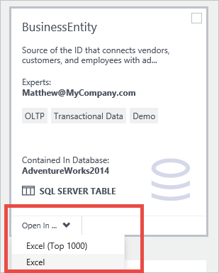
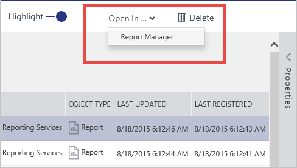
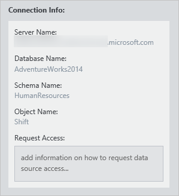
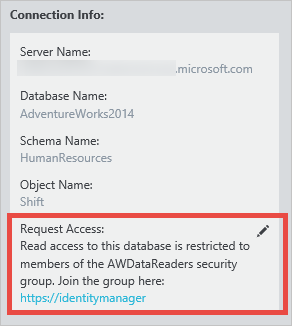

# How to connect to data sources
## Introduction
**Microsoft Azure Data Catalog** is a fully managed cloud service that serves as a system of registration and system of discovery for enterprise data sources. In other words, **Azure Data Catalog** is all about helping people discover, understand, and use data sources, and helping organizations to get more value from their existing data. A key aspect of this scenario is using the data – once a user discovers a data source and understands its purpose, the next step is to connect to the data source to put its data to use.

## Data source locations
During data source registration, **Azure Data Catalog** receives metadata about the data source. This metadata includes the details of the data source’s location. The details of the location will vary from data source to data source, but it will always contain the information needed to connect. For example, the location for a SQL Server table includes the server name, database name, schema name, and table name, while the location for a SQL Server Reporting Services report includes the server name and the path to the report. Other data source types will have locations that reflect the structure and capabilities of the source system.

## Integrated client tools
The simplest way to connect to a data source is to use the “Open in…” menu in the **Azure Data Catalog** portal. This menu displays a list of options for connecting to the selected data asset.
When using the default tile view, this menu is available on the each tile.

 

When using the list view, the menu is available in the search bar at the top of the portal window.

 

## Supported Client Applications
When using the “Open in…” menu for data sources in the Azure Data Catalog portal, the correct client application must be installed on the client computer.

| Open in application | File extension / protocol | Supported application versions |
| --- | --- | --- |
| Excel |.odc |Excel 2010 or later |
| Excel (Top 1000) |.odc |Excel 2010 or later |
| Power Query |.xlsx |Excel 2016 or Excel 2010 or Excel 2013 with the Power Query for Excel add-in installed |
| Power BI Desktop |.pbix |Power BI Desktop July 2016 or later |
| SQL Server Data Tools |vsweb:// |Visual Studio 2013 Update 4 or later with SQL Server tooling installed |
| Report Manager |http:// |See [browser requirements for SQL Server Reporting Services](https://technet.microsoft.com/library/ms156511.aspx) |

## Your data, your tools
The options available in the menu will depend on the type of data asset currently selected. Of course, not all possible tools will be included in the “Open in…” menu, but it is still easy to connect to the data source using any client tool. When a data asset is selected in the **Azure Data Catalog** portal, the complete location is displayed in the properties pane.

 

The connection information details will differ from data source type to data source type, but the information included in the portal will give you everything you need to connect to the data source in any client tool. Users can copy the connection details for the data sources that they have discovered using **Azure Data Catalog**, enabling them to work with the data in their tool of choice.

## Connecting and data source permissions
Although **Azure Data Catalog** makes data sources discoverable, access to the data itself remains under the control of the data source owner or administrator. Discovering a data source in **Azure Data Catalog** does not give a user any permissions to access the data source itself.

To make it easier for users who discover a data source but do not have permission to access its data, users can provide information in the Request Access property when annotating a data source. Information provided here – including links to the process or point of contact for gaining data source access – is presented alongside the data source location information in the portal.

 

## Summary
Registering a data source with **Azure Data Catalog** makes that data discoverable by copying structural and descriptive metadata from the data source into the Catalog service. Once a data source has been registered, and discovered, users can connect to the data source from the **Azure Data Catalog** portal “Open in…”” menu or using their data tools of choice.

## See also
* [Get Started with Azure Data Catalog](data-catalog-get-started.md) tutorial for step-by-step details about how to connect to data sources.
