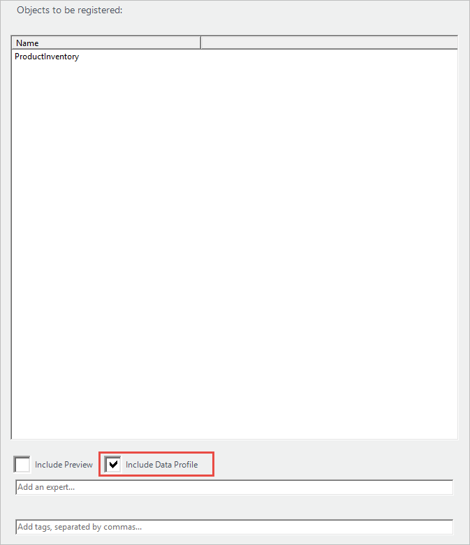
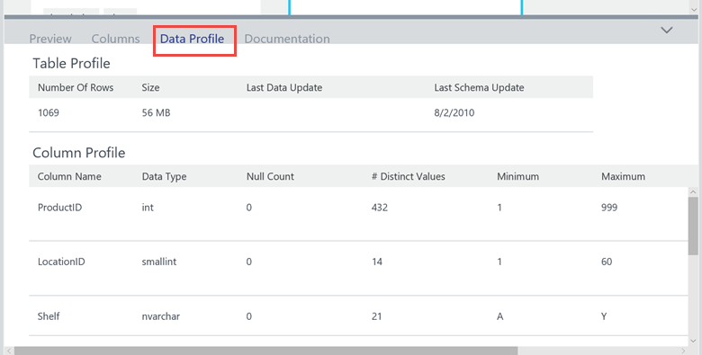

# Data profile data sources
## Introduction
**Microsoft Azure Data Catalog** is a fully managed cloud service that serves as a system of registration and system of discovery for enterprise data sources. In other words, **Azure Data Catalog** is all about helping people discover, understand, and use data sources, and helping organizations to get more value from their existing data. When a data source is registered with **Azure Data Catalog**, its metadata is copied and indexed by the service, but the story doesn’t end there.

The **Data Profiling** feature of **Azure Data Catalog** examines the data from supported data sources in your catalog and collects statistics and information about that data. It's easy to include a profile of your data assets. When you register a data asset, choose **Include Data Profile** in the data source registration tool.

## What is Data Profiling
Data profiling examines the data in the data source being registered, and collects statistics and information about that data. During data source discovery, these statistics can help you determine the suitability of the data to solve their business problem.

<!-- In [How to discover data sources](data-catalog-how-to-discover.md), you learn about **Azure Data Catalog's** extensive search capabilities including searching for data assets that have a profile. See [How to include a data profile when registering a data source](#howto). -->

The following data sources support data profiling:

* SQL Server (including Azure SQL DB and Azure SQL Data Warehouse) tables and views
* Oracle tables and views
* Teradata tables and views
* Hive tables

Including data profiles when registering data assets helps users answer questions about data sources, including:

* Can it be used to solve my business problem?
* Does the data conform to particular standards or patterns?
* What are some of the anomalies of the data source?
* What are possible challenges of integrating this data into my application?

> [!NOTE]
> You can also add documentation to an asset to describe how data could be integrated into an application. See [How to document data sources](data-catalog-how-to-documentation.md).
>
>

<a name="howto"/>

## How to include a data profile when registering a data source
It's easy to include a profile of your data source. When you register a data source, in the **Objects to be registered** panel of the data source registration tool, choose **Include Data Profile**.

To learn more about how to register data sources, see [How to register data sources](data-catalog-how-to-register.md) and [Get started with Azure Data Catalog](data-catalog-get-started.md).

## Filtering on data assets that include data profiles
To discover data assets that include a data profile, you can include `has:tableDataProfiles` or `has:columnsDataProfiles` as one of your search terms.

> [!NOTE]
> Selecting **Include Data Profile** in the data source registration tool includes both table and column-level profile information. However, the Data Catalog API allows data assets to be registered with only one set of profile information included.
>
>

## Viewing data profile information
Once you find a suitable data source with a profile, you can view the data profile details. To view the data profile, select a data asset and choose **Data Profile** in the Data Catalog portal window.

A data profile in **Azure Data Catalog** shows table and column profile information including:

### Object data profile
* Number of rows
* Table size
* When the object was last updated

### Column data profile
* Column data type
* Number of distinct values
* Number of rows with NULL values
* Minimum, maximum, average, and standard deviation for column values

## Summary
Data profiling provides statistics and information about registered data assets to help you determine the suitability of the data to solve business problems. Along with annotating, and documenting data sources, data profiles can give users a deeper understanding of your data.

## See Also
* [How to register data sources](data-catalog-how-to-register.md)
* [Get started with Azure Data Catalog](data-catalog-get-started.md)
